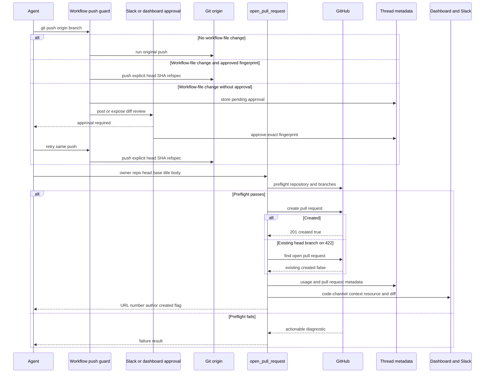

# Code delivery and pull-request creation

The delivery path is **commit → push → open or reuse PR → record the PR → observe CI and review feedback**. A new PR must go through `open_pull_request`, rather than a shell creation command, because the resolved credential intentionally determines who GitHub shows as its author. Separately, a push that changes GitHub Actions workflow files requires a human decision before it can reach `origin`.

Caption: the guarded delivery sequence, including approval of an exact workflow diff, attributed PR creation or reuse, and non-fatal metadata updates.

## Delivery invariants and entrypoint

Call `open_pull_request(owner, repo, head, base, title, body, draft=True, resolves_thread=True)` only after pushing the head branch to `origin`. It opens a new PR and returns a structured result with `url`, `number`, `author`, `token_kind`, and `created`. `created=False` means that an open PR already exists for the branch. Existing-PR operations—such as `gh pr edit`, marking ready for review, comments, and reads—remain shell `gh` operations.

`resolves_thread` is delivery lifecycle metadata: set it when closing or merging this PR completes the thread's work. A thread resolves automatically only after every PR it opened that is marked this way is merged or closed; use `False` while further PRs are intentionally expected.

### Attribution is a security and ownership boundary

The tool resolves an author token fresh for each call. For Slack, Linear, and dashboard runs with a mapped GitHub login, it prefers that user's valid OAuth token, so GitHub attributes the PR to the triggering person. It deliberately does not reuse a token cached in shared thread metadata: another person may subsequently trigger the same Slack conversation. GitHub-originated runs, absent mappings or user credentials, and bot-only deployments fall back to the GitHub App installation token, yielding `open-swe[bot]` attribution.

Hosted runs enforce this rule with `PullRequestCreationGuardMiddleware`; the middleware wraps `execute` and `background_execute` and rejects `gh pr create`, `gh api` creation of `/pulls`, and direct `curl` POST/body submissions to that endpoint. It recursively examines supported nested shells and blocks an over-depth expansion rather than permitting a bypass. The non-recoverable `pr_creation_fallback_blocked` error tells the agent to surface the actual `open_pull_request` failure. This guard is omitted for local runs, but the workflow push guard is always installed.

## Workflow-file pushes require human approval

`WorkflowPushGuardMiddleware` recognizes only conservative, standalone `git push origin <refspec>` forms, including selected `git -C`, `cd ... &&`, and `--set-upstream` variants. It does not attempt to reinterpret operator-bearing or unrelated commands. For an eligible current-branch push, it computes the diff from the remote branch or merge base and checks for paths under `.github/workflows/`. If none changed, it passes the original command through.

A workflow change is not pushable until a human approves its content fingerprint. The guard collects the binary diff, bounded preview, changed-file list and stats, base/head SHAs, normalized remote, and an SHA-256 fingerprint. It stores a pending record per thread in `workflow_push_approvals`; the record carries the review material, notification state, and eventual decision and actor. Retention is bounded to the 20 most recent records.

For an unapproved fingerprint, the guard blocks the tool call with `WorkflowPushApprovalRequired`, persists or refreshes the pending record, and sends a Slack interactive request only when that record has not already been notified. It marks notification only after Slack returns a timestamp without error. The dashboard API lists readable-thread records and lets a session user approve or reject; approval dispatches a follow-up instructing the agent to retry the blocked push without altering workflow files.

An approved fingerprint authorizes only that exact change. The retried command is rewritten to an explicit `<head_sha>:refs/heads/<branch>` refspec. Rejection remains blocked, while any workflow content or relevant ref change creates a different fingerprint and needs fresh human approval. This is intentional: workflow files can control CI jobs and access repository secrets. The guard can also identify a workflow diff inherited by a merge and presents that provenance rather than claiming the agent authored it.

## GitHub preflight, create-or-reuse, and PR content

After resolving the author credential, `open_pull_request` preflights the repository and base branch, then the head branch when it belongs to the target owner. It returns actionable failures instead of blindly POSTing: missing access or repository visibility uses `github_app_access_missing_or_repo_not_found`; an unseen branch uses `github_pr_branch_not_visible`; other checks use `github_pr_preflight_failed`. Diagnostics include GitHub's actual status, selected useful response headers, and a bounded response body, while structured logging records the failed step, token kind, and known push state.

On success it POSTs the title, head, base, body, and effective draft state. A 201 yields `created=True`. A 422 triggers a lookup for an open PR on that head branch; if found, the tool returns it with `created=False` and records it rather than duplicating it. If no existing PR can be established, the original creation failure is returned. The caller should use `gh pr edit` to update the reused PR.

The supplied `draft` argument is a default: a non-null `draft_prs` runtime preference overrides it for newly created PRs. The reuse path leaves the existing PR's draft state untouched.

Before POSTing, the tool may append one `## References` section. It adds a dashboard plan link when plan content and a plan URL exist. Origin references—Slack permalink, Linear ticket, or GitHub issue—are appended only after GitHub positively confirms that the target repository is private. Lookup errors and uncertain visibility fail closed, preventing private conversation links from being copied into a public PR.

## Metadata, status, CI, and review handoff

Both the created and reused paths invoke best-effort PR telemetry. It fetches details, records agent PR usage, normalizes and upserts a record in thread `pull_requests` by repository/number or URL, and also writes legacy fields and `pr_urls`. The normalized state is `draft`, `open`, `closed`, or `merged`; the record includes refs, author, creation time, diff statistics, and `resolves_thread`. In a Slack code-channel session it additionally updates the repository context bar, registers the PR resource, and displays a nonempty GitHub diff. Exceptions are logged and do not turn a successful PR result into a failure; because this is one protected sequence, a preceding telemetry error can skip later bookkeeping.

The dashboard uses tracked records to fetch live PR state, draft status, merge-conflict state, check runs, legacy statuses, and unresolved GraphQL review threads. Its per-field availability flags—`statusAvailable`, `checksAvailable`, and `commentsAvailable`—distinguish unavailable GitHub data from healthy data. Consumers must not interpret an unavailable section as a clean PR.

CI readers are best effort because GitHub App `Checks: Read` access can be unavailable. Auto-fix treats completed `failure`, `timed_out`, and `action_required` check runs as fixable, excludes Open SWE's own checks, and ignores check/status names already failing on the base SHA. The no-mention auto-fix path fails closed unless the requester has `write`, `maintain`, or `admin` permission. CI webhook helpers normalize branch, SHA, and completed-failure detection across `check_run`, `check_suite`, `workflow_run`, and legacy `status`; the baby-sit flow acts only when such a failure matches an active watch. See [Baby-sit CI](scheduling-and-baby-sit.md).

`request_pr_review` is a separate handoff, not a delivery fallback: it parses a GitHub PR URL, resolves the active Slack thread and triggering identity, then delegates to the webhook review trigger. For later feedback, PR comments, inline review comments, and nonempty reviews are merged chronologically. With one Open SWE mention the full history is returned; with repeat mentions, only events after the preceding mention are returned. Handle matching is configurable and boundary-aware, and untrusted comment bodies are sanitized/wrapped before entering agent context. See [PR Review](pr-review.md).

## Operations and focused verification

The most useful investigations start with the returned preflight diagnostic, the `open_pull_request_failed` log payload, the thread's `workflow_push_approvals` and `pull_requests` metadata, and the availability flags on the status response. For a blocked workflow push, approve or reject the displayed fingerprint in Slack or the dashboard, then retry the unchanged standalone push; do not modify workflow files after approval.

Focused coverage lives in `tests/github/test_open_pull_request.py` (credential choice, preflight diagnostics, duplicate reuse, references, and metadata), `tests/github/test_pr_creation_guard.py` (direct and nested fallback blocking), `tests/agent/test_workflow_push_guard.py` (parsing, diff/fingerprint, notification, inherited changes, and explicit-ref rewrite), `tests/dashboard/test_workflow_approval_api.py` (approval API shape), `tests/dashboard/test_pull_request_status.py` (availability and live health), and `tests/github/test_github_ci.py` (CI classification and permission behavior).
