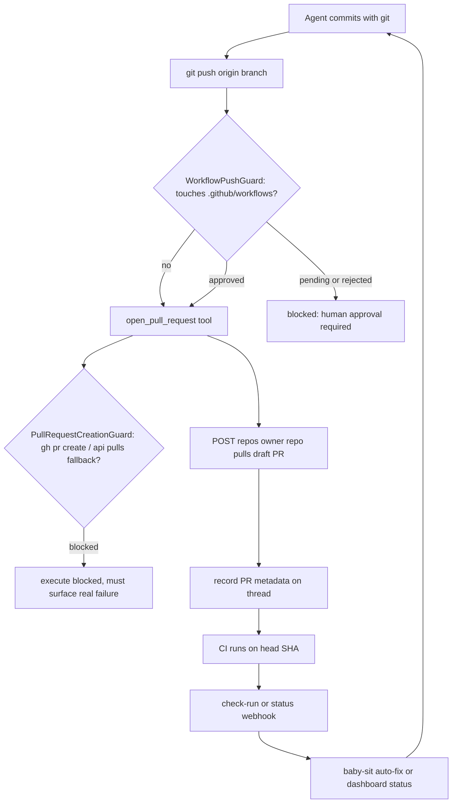

# PR Creation & GitHub Delivery

This page traces the delivery leg of an agent run: turning committed work into a
GitHub pull request, keeping that PR attributed to the human who triggered the
run, guarding the branch/PR mutation surface, and closing the loop with CI and
review-comment feedback.

The core sequence is **commit → push → open/update PR → CI → feedback**. Two
middleware sit on the tool-call path to keep that sequence safe, one tool
(`open_pull_request`) performs the attributed creation, and a family of read
helpers surface PR health back to the dashboard and the CI auto-fix loop.

Caption: the commit-to-feedback loop, showing where the two guards intercept and where CI feedback re-enters the run.

## Opening an attributed pull request

New pull requests are opened through the `open_pull_request` tool rather than a
shell `gh pr create`, and the branch must already be pushed to `origin` before
the tool is called. The tool takes `owner`, `repo`, `head` (the pushed branch),
`base`, `title`, and `body`, and returns a structured result whose `created`
flag distinguishes a freshly opened PR from an already-existing one.

The defining behavior is attribution: `open_pull_request` prefers the triggering
user's OAuth token so the PR is authored *as that person* rather than as
`open-swe[bot]`. `_resolve_pr_author_token` resolves the token by GitHub login
for Slack, Linear, and dashboard runs (looking it up fresh from the dashboard
OAuth store rather than trusting shared thread metadata), and falls back to the
GitHub App installation token for GitHub-triggered runs, unmapped users, or
bot-only deployments.

Before creating anything, the tool runs a preflight that GETs the repository and
the base and head branches, so an access or missing-branch problem is reported
with a specific failure code (`github_app_access_missing_or_repo_not_found`,
`github_pr_branch_not_visible`, or `github_pr_preflight_failed`) and a summary of
exactly what GitHub returned — status, selected response headers, and a truncated
body — instead of an opaque error. Every failure path also emits structured
telemetry recording the failed step and whether the branch was pushed.

Idempotency matters: if creation returns HTTP 422 the tool looks up the existing
open PR for the head branch and returns it with `created: False`, so the agent
switches to `gh pr edit` for updates instead of erroring or opening a duplicate.
Updating an existing PR, marking it ready, commenting, and reading status all
stay on `gh`.

## Draft behavior and source linking

The requested `draft` flag is only a default. `_effective_draft` overrides it
with the authenticated sender's `draft_prs` profile preference when that
preference is a boolean, so a deployment or user setting decides whether newly
created PRs are drafts; `profile_draft_prs` defaults this to `True`. Existing PRs
returned via the 422 path are left unchanged.

Before posting, `_maybe_append_references` appends a `## References` section to
the PR body (unless the body already contains that heading). It adds the
dashboard plan link when a plan exists, and adds originating-source references —
the Slack thread permalink, the Linear ticket, or the GitHub issue — but only
when GitHub confirms the target repository is private, so private conversation
links are never leaked into a public PR.

On success the tool records PR telemetry: it fetches full PR details, calls
`record_agent_pr_usage`, and upserts a normalized PR record (URL, number, state
via `derive_pr_state`, head/base refs, author, and diff stats) into the thread's
`pull_requests` metadata along with legacy single-PR fields. For Slack code-channel
sessions it also refreshes the channel context bar and pushes the PR diff into
the channel's diff view.

## Guard 1: PR-creation fallback guard

`PullRequestCreationGuardMiddleware` wraps `execute`/`background_execute` tool
calls and blocks any command that would create a pull request outside
`open_pull_request` — `gh pr create`, a `gh api .../pulls` POST/field call, or a
`curl` POST to the pulls endpoint. It parses shell tokens, expands nested shell
invocations up to a bounded depth (blocking if the depth limit is exceeded so a
deeply nested command cannot slip through), and returns a non-recoverable
`pr_creation_fallback_blocked` error message. The purpose is to stop an
attributed-PR failure from being silently papered over by an unattributed
fallback path; the agent must surface the real `open_pull_request` failure
instead. It is only installed for hosted (non-local) runs.

## Guard 2: workflow-file push guard

`WorkflowPushGuardMiddleware` gates `git push` commands that would ship changes
under `.github/workflows/`. It parses the push command (only a standalone,
operator-free `git push origin <refspec>`, optionally prefixed with `cd`/`-C`),
then inspects the sandbox git repo to compute the workflow diff between the base
and head, a diff preview, diff stats, and a content **fingerprint** hashed over
the exact change.

If no workflow files changed the push proceeds untouched. Otherwise the guard
consults per-thread approval state stored in thread metadata
(`workflow_push_approvals`, keyed by fingerprint). If that fingerprint is
`approved`, the push is rewritten to a safe explicit refspec
(`<head_sha>:refs/heads/<branch>`) and allowed; otherwise the push is blocked with
`WorkflowPushApprovalRequired`, a pending approval record is created, and a Slack
approval message with the diff and an "Open in Web" link is posted once. Because
approval is keyed by fingerprint, any further change to the workflow files
produces a new fingerprint and requires fresh approval. A human approves the diff
in Slack or the web UI (see [Auth & Security](../concepts/auth-and-security.md)),
after which the agent retries the identical push.

Both guards are installed in the agent's middleware stack in `server.py`; see
[Middleware Stack](../architecture/middleware-stack.md) for ordering.

## Requesting a review

`request_pr_review` is a separate tool that starts the reviewer agent for a PR
URL. It parses the URL into a `GitHubPrRef`, resolves the active Slack thread and
the triggering identity from the run config, and delegates to the GitHub
webhook's `trigger_pr_review_from_ref`. It is invoked only on an explicit request
to review a PR or run the reviewer, and hands off cleanly rather than
cloning/editing. See [PR Review](../workflows/pr-review.md) for the reviewer
side.

## GitHub CI status monitoring

`agent/utils/github_ci.py` provides best-effort read helpers over GitHub Actions
check runs and the legacy combined commit status. `list_check_runs` and
`list_commit_statuses` paginate the full latest set for a ref; check runs Open
SWE itself produces (its review check and "Open SWE Auto-fix") are filtered out
so the agent never tries to fix its own checks. `list_failing_check_runs` treats
only `failure`, `timed_out`, and `action_required` conclusions as fixable —
`cancelled`, `stale`, and `skipped` are deliberately excluded.

Two helpers keep the auto-fix loop disciplined: `names_failing_on_base` returns
the set of checks already failing on the base SHA so failures inherited from the
base branch are not re-fixed, and `has_repo_write_permission` fails closed unless
the requester has write/maintain/admin, gating the no-mention auto-fix path.
Payload helpers (`branch_from_check_payload`, `head_sha_from_check_payload`,
`is_failing_ci_payload`) extract the branch, head SHA, and failure state from
CI webhooks. `handle_ci_webhook` in the baby-sit flow consumes `is_failing_ci_payload`
and only proceeds for a completed failure that matches an active watch; see
<!-- openwiki: broken internal link [../workflows/baby-sit-ci.md] file "../workflows/baby-sit-ci.md" does not exist. Fix the href or restore the target, then delete this comment. -->
[Baby-sit CI](../workflows/baby-sit-ci.md).

## PR feedback: review comments

Feedback comes back through `agent/utils/github_comments.py`.
`fetch_pr_comments_since_last_tag` merges the three GitHub comment sources —
issue comments, inline review comments, and reviews — chronologically and returns
everything since the last `@open-swe` mention, so the agent only re-acts to new
feedback. `mentions_open_swe` recognizes the deployment's configurable handles
without matching a handle that is only a prefix of a longer one, and untrusted
external comment bodies are wrapped/sanitized before entering a prompt.

## Dashboard PR status surface

`agent/dashboard/pull_request_status.py` computes live PR health for the tracked
PR records on a thread and is served through the dashboard thread API. For each
record it fetches the PR plus, via GraphQL, the unresolved review threads, then
fetches check runs and commit statuses for the head SHA. It reports live state
(open/closed/merged), draft flag, a merge-conflict state derived from
`mergeable`/`mergeable_state`, the list of failing checks with links, and counts
of pending and inconclusive checks. Every field is guarded by an availability
flag (`statusAvailable`, `checksAvailable`, `commentsAvailable`) so a missing
permission or transient error degrades to "unavailable" rather than a hard error.
