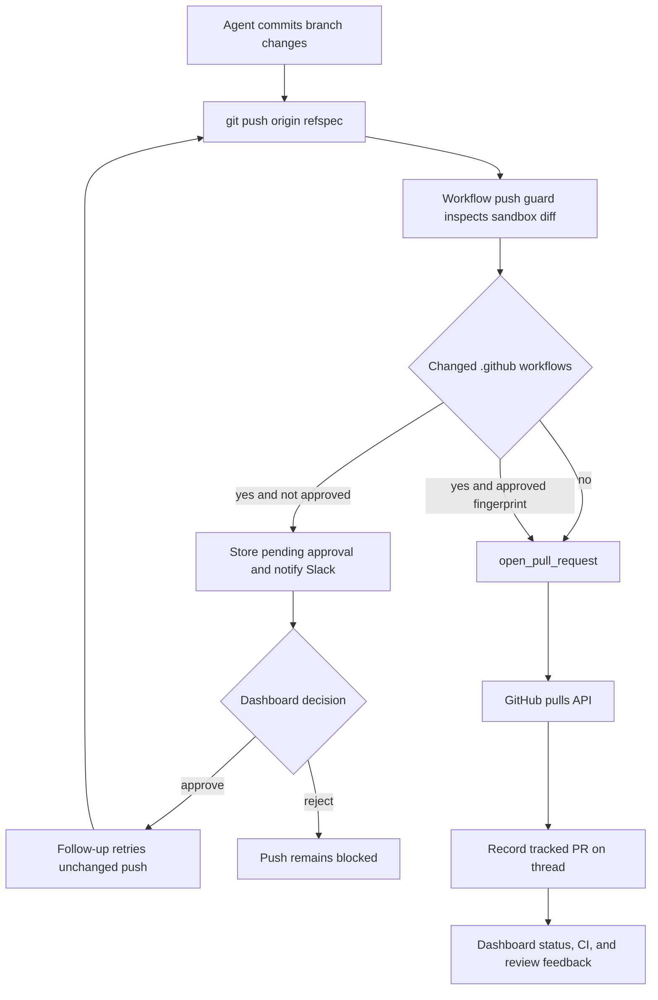

# Pull Request Delivery and Approval

Delivery is **commit → guarded push → attributed PR → CI/review feedback**. `open_pull_request` is the only supported operation for creating a PR: it applies author credential rules, preflight checks, safe references, attribution, and thread recording. Two middleware boundaries prevent an agent from bypassing that path or publishing workflow-file changes without a human decision.

Caption: delivery is gated before a workflow-changing branch is published, then PR creation is attributed and recorded for the remainder of the lifecycle.

## Create an attributed pull request

Push the branch to `origin`, then call `open_pull_request(owner, repo, head, base, title, body, draft=True, resolves_thread=False)`. Do not use `gh pr create`. A successful result supplies URL, number, author, token kind, and `created`. When GitHub returns 422, the tool searches for an open PR with the same head and returns it with `created=False`; update that PR with `gh pr edit` instead of opening a duplicate.

### Author and token boundary

The author is a credential-scope decision, not merely a tool argument. On a private thread the saved owner must start the run and their login is used. On a public user-owned thread, the authenticated requester is used; an explicit `author` is permitted only when that login has participated in the thread. System threads use the GitHub App token. Background completion cannot publish from a user-owned/private context because it cannot identify the requester. A missing user token raises user-auth-required; an unavailable effective token yields a structured `no_github_token` failure. These limits prevent borrowing a participant's identity or silently switching an interactive user delivery to bot authorship.

Before creating, the tool verifies workspace access when using a user token in a shared workspace, then reads the repository and relevant base/head branches. Failures are returned as a payload with `success: false`, an actionable error, and structured logging context—not as a fallback instruction. The payload includes an error code, cause, whether the branch appears pushed, failed step, token kind, and GitHub status/selected headers/truncated response when available. Important codes are `pr_author_not_a_participant`, `no_github_token`, `github_app_access_missing_or_repo_not_found`, `github_pr_branch_not_visible`, `github_pr_preflight_failed`, and `github_pr_create_failed`.

### Draft preference and references

`draft=True` is a default rather than a guarantee: a non-null runtime `draft_prs` preference overrides the supplied value for a newly created PR. Profile configuration defaults new PRs to drafts, so callers should explicitly account for the preference before assuming a PR is ready for review.

Unless the body already contains `## References`, the tool may add a dashboard plan link and an originating Slack thread, Linear ticket, or GitHub issue link. Source links are added only after GitHub positively identifies the target repository as private; an access or lookup failure is treated as not private. This fail-closed rule prevents private conversation links from being copied into a public PR. The tool then stamps the platform attribution footer.

## Record delivery and resolve work

After creation or duplicate discovery, telemetry best-effort fetches full PR details, records usage and opening feedback, and upserts a normalized PR record in thread metadata alongside legacy PR fields. The record carries repository, number, URL, state, refs, author, diff stats, and `resolves_thread`; a registry write failure is logged rather than invalidating an already-created GitHub PR. For an active Slack code-channel session, the same sequence refreshes context/resources and loads a nonempty PR diff view. Failures in this sequence do not reverse PR creation.

Set `resolves_thread=True` only for a PR intended to complete the work. Lifecycle webhooks update tracked records by PR URL. They auto-resolve an agent thread only when every tracked PR is terminal and at least one tracked record has `resolves_thread=True`. If all are terminal without that flag, the thread gets `attention_reason="prs_closed"`; reopening clears automatic resolution/that attention state as appropriate.

## Delivery guards

### Block unattributed shell fallbacks

`PullRequestCreationGuardMiddleware` wraps `execute` and `background_execute`. It blocks `gh pr create`, `gh api` creation of a `/pulls` endpoint, and `curl` POST/body submission to GitHub's pulls endpoint. It also expands supported nested shell `-c` commands to a bounded depth and blocks at the depth limit rather than allowing an evasive command.

The failure is a `ToolMessage` with `error_type: "PullRequestCreationFallbackBlocked"`, code `pr_creation_fallback_blocked`, `recoverable_by_agent: false`, and the blocked command. This deliberately makes the original `open_pull_request` failure visible instead of replacing it with an unattributed PR. Hosted main agents and hosted subagents install the PR-creation guard; local runs omit it. Workflow push protection is installed for both main agents and subagents.

### Require a human decision for workflow pushes

`WorkflowPushGuardMiddleware` recognizes only conservative, standalone `git push origin <refspec>` forms, including `git -C`, `cd … &&`, and `--set-upstream`. It declines to interpret unsafe shell shapes, unfamiliar push forms, non-current branches, or invalid refs, leaving those commands to ordinary execution. For an eligible current-branch push, it inspects the sandbox Git range and allows the push untouched when no `.github/workflows/` path changed.

For a workflow change, the guard captures the binary diff, bounded preview, changed files and stats, base/head SHA, normalized remote, and a SHA-256 fingerprint of the exact push identity. It persists a per-thread `workflow_push_approvals` record keyed by this fingerprint, including review fields, status, notification state, and eventual actor/timestamp; persistence retains the newest 20 records. Inherited workflow changes from a merge can be labelled with their source branch for human review.

An approved fingerprint causes the guarded command to be rewritten to an explicit `<head_sha>:refs/heads/<branch>` refspec before execution. Otherwise the tool call returns `WorkflowPushApprovalRequired` with `workflow_approval_status`, fingerprint, file list, SHAs, stats, preview-truncation indicator, and approval URL. The guard creates/reuses a pending record and sends a Slack interactive request only while it is not marked notified; it marks notification only after Slack supplies a message timestamp without an error. Since the fingerprint includes the workflow diff and push identity, changing workflow content requires a fresh approval.

The dashboard API exposes readable-thread records and requires a session plus same-origin protection for mutations. Approval requires a promptable thread, records the session subject, and dispatches a follow-up that says to retry the blocked push without changing workflow files. Rejection records the decision only, so the push stays blocked.

## CI, review, and status feedback

CI readers are best effort: missing `Checks: Read` permission or transient HTTP errors return unavailable data rather than breaking webhook handling. The auto-fix input considers only completed check runs with `failure`, `timed_out`, or `action_required` conclusions, filters Open SWE's own check names, and excludes check/status names already failing on the base SHA. The no-mention auto-fix route also fails closed unless the requester has `write`, `maintain`, or `admin` permission.

CI webhook helpers normalize branch, head SHA, and completed-failure state for `check_run`, `check_suite`, `workflow_run`, and legacy `status` events. PR comment collection merges issue comments, inline review comments, and nonempty reviews chronologically. A first configured Open SWE mention returns full context; repeat mentions return entries after the preceding mention, while handle matching rejects prefix-only matches such as a different deployment's longer handle.

The tracked-PR status surface reads live PR state/draft/mergeability, checks and legacy statuses, plus GraphQL review threads. It reports unavailable portions explicitly through `statusAvailable`, `checksAvailable`, and `commentsAvailable`; clients must not interpret unavailable as clean. Dashboard re-review constructs a `GitHubPrRef` and hands it to `trigger_pr_review_from_ref`, which validates GitHub metadata and starts/updates a dedicated reviewer thread. This is separate from PR creation; see [PR Review](pr-review.md).

## Focused verification

The delivery boundary has direct tests in `tests/github/test_open_pull_request.py` (scope, preflight, idempotency, references, and recording), `tests/github/test_pr_creation_guard.py` (direct and nested fallback detection), `tests/agent/test_workflow_push_guard.py` (parsing, diff fingerprinting, approval payloads, and rewritten approved pushes), and `tests/dashboard/test_workflow_approval_api.py` (approval listing). CI and review helpers are covered under `tests/github/`; lifecycle behavior is covered under `tests/webhooks/`.
