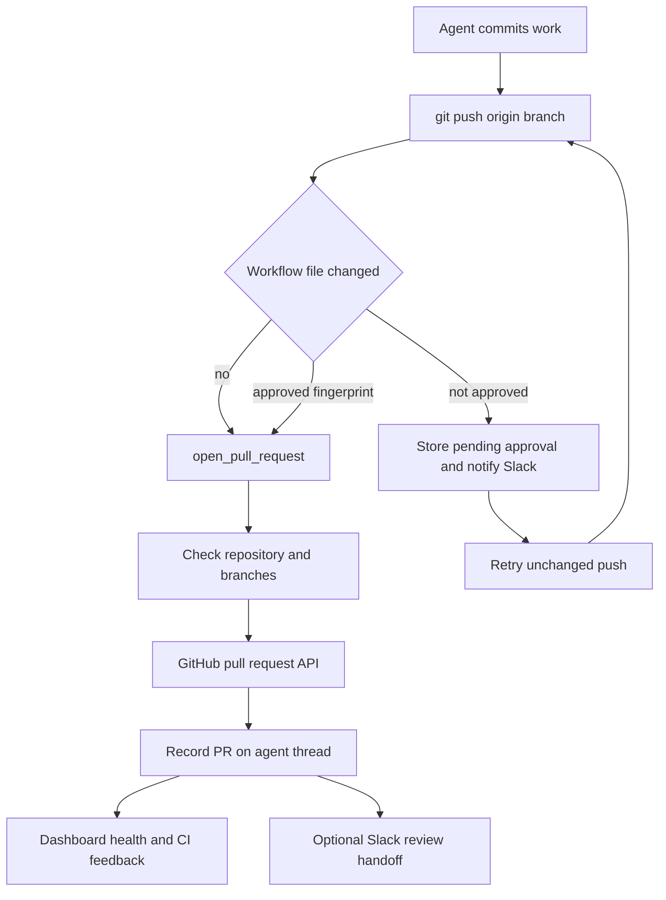
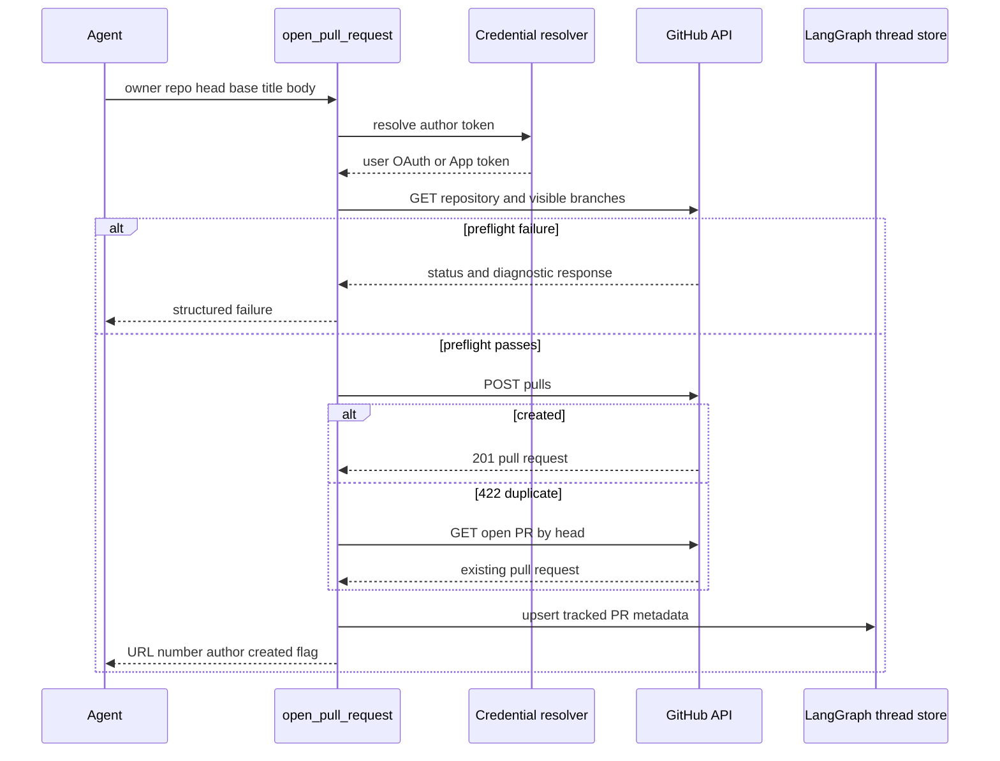

# Pull Request Creation and Delivery Controls

The delivery path is **commit → push → open or update PR → CI and review feedback**. New PR creation is centralized in `open_pull_request`, preserving attribution to the person who triggered the run. Two middleware controls protect the risky transitions: shell-created substitute PRs and pushes that change GitHub Actions workflow files. The created PR is then persisted on the agent thread, which supplies dashboard state and lifecycle automation.

The decision flow applies workflow approval before a branch carrying Actions changes can be delivered.

## Create or update through the attributed tool

Push the branch to `origin` before calling `open_pull_request(owner, repo, head, base, title, body, draft=True, resolves_thread=False)`. Do not use `gh pr create` for a new PR. The result includes `success`, URL, number, author, token kind, and `created`; `created=False` means an open PR already exists and the agent should use `gh pr edit` to make subsequent title, body, or draft/readiness changes.

For an initiator with a resolvable PR-author login, `_resolve_pr_author_token` obtains a current OAuth token for that login and uses it to create the PR. When no author login is applicable, it uses the installation token and labels the token kind `bot`. A mapped user whose OAuth authorization cannot be resolved raises `GitHubUserAuthRequired`; it does not silently substitute the bot identity. User-token creation is additionally restricted to repositories demonstrably in the workspace App installation unless the credentials are explicitly private.

This GitHub interaction distinguishes access and visibility failures from creation outcomes, then records either a newly created or discovered PR.

### Preflight, idempotency, and body construction

Before the POST, the tool checks repository access and the base branch; it also checks the head branch when the head belongs to the target owner. Failures distinguish repository/App access (`github_app_access_missing_or_repo_not_found`), branch visibility (`github_pr_branch_not_visible`), other preflight failures (`github_pr_preflight_failed`), and no available token (`no_github_token`). The returned error includes the step, whether the head appears pushed, and GitHub's status, selected useful headers, and a truncated response body. This is diagnostic output for an agent or operator, not an opaque API failure.

A `422` POST response triggers lookup of the existing open PR for the head and returns it with `created=False`; other failures report either access/not-found or `github_pr_create_failed`. This gives retries idempotent behavior per open head branch rather than creating duplicate PRs.

`draft` is a caller default, not an absolute instruction: `RunConfig.draft_prs`, when non-`None`, overrides it. The run builder derives that setting from the sender profile, whose absent or non-boolean `draft_prs` value defaults to `True`. Existing PRs are returned, not modified, by this tool.

Unless the body already contains `## References`, the tool may append a dashboard plan link and links to the originating Slack thread, Linear ticket, or GitHub issue. Source links are appended only when a repository GET positively confirms the target repository is private. Thus an API failure or a public/unknown repository cannot leak a private conversation link; a plan reference is independently eligible.

## Delivery record and thread lifecycle

After a creation or duplicate discovery, telemetry best-effort fetches full PR details, records agent PR usage, and upserts a normalized `pull_requests` record in thread metadata while maintaining legacy `pr_url`, `pr_number`, `pr_state`, and `pr_urls` fields. The record contains repository/number identity, URL, branches, author, diff statistics, and the `resolves_thread` intent; its state is normalized to `draft`, `open`, `closed`, or `merged`. It preserves any existing `slack_feedback` field for the same PR identity.

For a Slack code-channel session, the same best-effort sequence refreshes the repository context bar, registers a PR resource, and switches to a diff view only when GitHub returns a nonempty diff. An exception is logged and cannot revoke a successful PR creation result, but because this work is inside one protected sequence, a failure can prevent later bookkeeping in that sequence.

`resolves_thread=True` marks a PR as eligible to finish its agent thread. Lifecycle webhooks locate non-reviewer agent threads through persisted PR URL metadata, update the tracked state, and resolve only when every tracked PR is terminal (`closed` or `merged`) and at least one tracked record has that flag. If all are terminal without that intent, the thread gets `attention_reason="prs_closed"`; reopening a PR clears this attention state and reverses a PR-driven resolution. A merge also schedules merge feedback after state handling.

## Mutation controls

### Block unattributed creation fallbacks

`PullRequestCreationGuardMiddleware` wraps `execute` and `background_execute`. It blocks `gh pr create`, `gh api` creation requests to `/pulls`, and `curl` POST/body submissions to GitHub's pulls endpoint. It tokenizes shell input and follows supported `bash`, `dash`, `sh`, and `zsh` `-c` nesting; nesting beyond the bounded expansion depth is blocked rather than trusted.

The rejection is a non-recoverable `PullRequestCreationFallbackBlocked` tool error with code `pr_creation_fallback_blocked`. Its purpose is to make the original attributed-tool failure visible instead of masking it with an unattributed fallback. The hosted main agent installs it outside local runs. `WorkflowPushGuardMiddleware` is installed for the main agent and subagents.

### Require human approval for Actions changes

The workflow guard considers only conservative standalone forms of `git push origin <refspec>`—including accepted `git -C`, `cd ... &&`, and `--set-upstream` variants. Ambiguous shell syntax, unsupported push shapes, missing sandbox state, and pushes that do not change `.github/workflows/` are passed through without interpretation or approval.

For an eligible push, it verifies the current branch/refspec relationship, derives the remote-tracking or merge-base comparison range, and inspects workflow paths and a binary full-index diff. It stores a SHA-256 fingerprint over the delivery identity, including repository, branch, base/head SHA, files, diff, and refspec values. The derived change also records a bounded preview, stats, normalized remote, and whether a merged parent contributes inherited workflow changes.

Approval records are stored under `workflow_push_approvals` in thread metadata and keyed by fingerprint. A pending record contains the review fields and notification state; approval or rejection records the actor and decision time. Saving trims history to the 20 newest records. A terminal record is not replaced by a new pending record for the same fingerprint, while changing workflow content creates a different fingerprint and requires a fresh decision.

An approved fingerprint causes the guard to replace the submitted command with an explicit validated `<head_sha>:refs/heads/<branch>` refspec before executing it. Otherwise it returns `WorkflowPushApprovalRequired`, creates or refreshes a pending approval, and tries to post a Slack interactive review request. It posts only when the record is not already notified, and marks notification only after Slack returns a timestamp without an error. A missing thread or approval-store error remains blocked rather than authorizing the push.

The web API at `/dashboard/api/workflow-approval` has session and same-origin mutation dependencies. Listing requires a readable thread; approve and reject require a promptable thread. Approval records the session subject and dispatches a follow-up that directs the agent to retry the unchanged blocked push. Rejection only records the denial.

## CI, feedback, and review handoff

`request_pr_review` is deliberately separate from creation. It parses a GitHub PR URL, obtains the active Slack thread plus source and triggering identity from runtime configuration, then delegates to the GitHub review trigger. Use it when a requester explicitly asks to start review; the reviewer workflow is documented in [PR Review](pr-review.md).

CI readers paginate GitHub Actions check runs and legacy commit statuses and return `None` on HTTP or permission failure so a webhook is not broken by unavailable Checks access. Auto-fix considers completed check runs with `failure`, `timed_out`, or `action_required` conclusions, and filters Open SWE's review and auto-fix checks. It excludes check/status names already failing on the base SHA, and the no-explicit-mention auto-fix path fails closed unless the requester has `write`, `maintain`, or `admin` permission. Event helpers normalize branch, head SHA, and failure state for `check_run`, `check_suite`, `workflow_run`, and legacy `status`; baby-sit proceeds only for a matching active watch and completed failure.

For ordinary GitHub feedback, `fetch_pr_comments_since_last_tag` obtains issue comments, inline review comments, and nonempty reviews, merges them in chronological order, and uses configured Open SWE mentions as the boundary. The first mention returns all gathered context; a repeated mention returns only later items. Mention matching rejects a deployment handle that is merely a prefix of a longer handle. See [Scheduling and Baby-sit](scheduling-and-baby-sit.md) for watch behavior.

## Dashboard health contract

The dashboard status endpoint authorizes access to the thread, reads all tracked PR records (or a legacy PR URL fallback), and returns a live result for each record. It validates repository identity before calling GitHub, then independently reads the PR, GraphQL review threads, check runs, and legacy statuses. The status includes live state, draft status, merge-conflict state, linked failing checks, pending/inconclusive check counts, and unresolved review-thread details.

Availability flags are part of the response contract. `statusAvailable`, `checksAvailable`, and `commentsAvailable` say which portions could be read; invalid records, missing permissions, malformed GitHub payloads, or transient failures yield unavailable fields rather than a false clean result or a page-level error. Consumers must therefore distinguish unavailable from zero failures.

## Focused verification

The delivery tests should preserve the security and lifecycle boundaries: author-token and workspace admission, preflight diagnostics, duplicate-PR handling, reference privacy, metadata upsert, and `resolves_thread` transitions. Guard coverage should include direct and nested shell PR fallback detection; accepted and rejected push parsing; workflow diff/fingerprint construction; one-time Slack notification; and rewritten approved refspecs. Test approval API authorization and approve-versus-reject behavior, CI conclusion/base-failure filtering, status partial availability, and Slack review URL validation.
