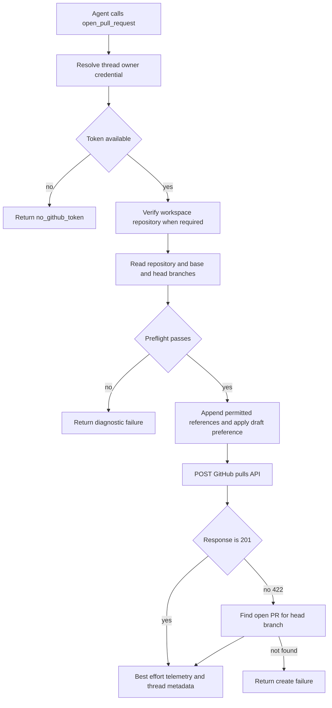
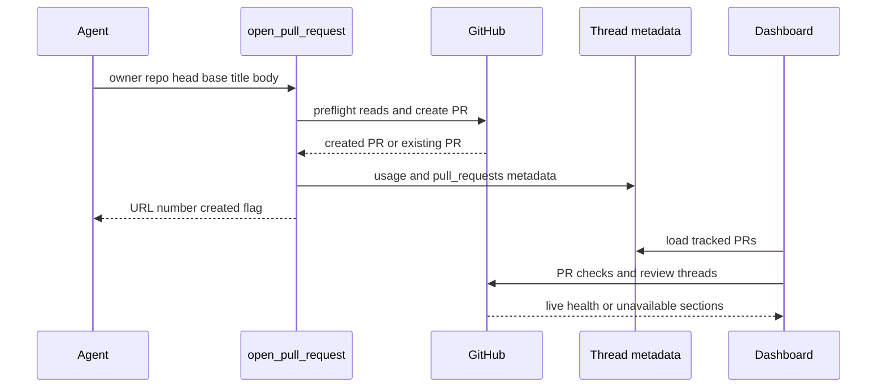
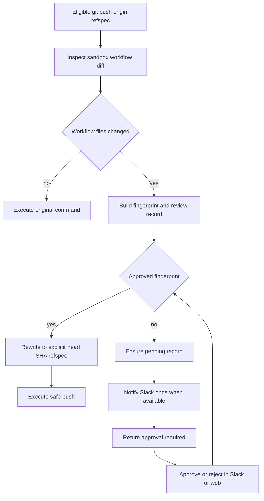

# Pull Request Delivery and Approval

The delivery path is **commit → push → open or update PR → CI and review feedback**. New PR creation is centralized in `open_pull_request` so the system can use the credential selected for the thread owner. Two middleware boundaries prevent unsafe substitutes for that creation path and require an explicit decision before an agent pushes GitHub Actions workflow changes. Thread metadata then connects delivery to Slack, dashboard status, lifecycle updates, and follow-up automation.

## Creation preflight and delivery

For a new PR, push the branch to `origin` first and call `open_pull_request(owner, repo, head, base, title, body, draft=True, resolves_thread=False)`—not `gh pr create`. The result includes URL, number, author, token kind, and `created`. `created=True` means the API created a PR; `created=False` means the tool recovered an already-open PR for the head branch, after which the agent should use `gh pr edit` for updates.

Caption: `open_pull_request` validates the target before creating a PR and turns a duplicate-create response into an updateable result.

`pr_author_login()` derives the author identity from thread credential scope. User-owned threads use the initiating owner (resolving an OAuth login where necessary); a private thread additionally requires its saved owner to start the run. System-owned threads have no user author and use the GitHub App installation token. `_resolve_pr_author_token` obtains a valid OAuth token for a user identity and raises `GitHubUserAuthRequired` if it is unavailable; otherwise it uses the App token. For a user credential outside a private credential scope, the tool also verifies that the repository belongs to the workspace App installation.

Before posting, the tool GETs the repository and base branch, and also the head branch when `head` is in the same owner repository. It differentiates absent repository/App access (`github_app_access_missing_or_repo_not_found`), a branch GitHub cannot see (`github_pr_branch_not_visible`), and other preflight failures (`github_pr_preflight_failed`). `no_github_token` is separate. Failures include GitHub status, selected diagnostic headers, and a body truncated to 800 characters, as well as structured logging telemetry with the branch, token kind, failed step, thread, and source.

### Drafts, references, and thread resolution

The `draft` argument is a request, not an absolute policy: the runtime `draft_prs` preference overrides it when set. The profile-level default for new PRs is `True`; an already-existing PR is returned without modification.

Unless the body already contains `## References`, the tool can append a dashboard plan link and source links. Slack thread, Linear ticket, and GitHub issue links are added only when GitHub positively confirms that the destination repository is private. A failed lookup or any non-private result omits those potentially sensitive source links.

Set `resolves_thread=True` for a PR intended to complete the agent thread. The tool persists this flag in its normalized PR record. Lifecycle webhooks locate agent threads by the PR URL, synchronize record state, and auto-resolve only when every tracked PR is terminal and at least one record has this flag. If all are terminal without such a flag, the thread receives `attention_reason="prs_closed"`; reopening a PR clears the attention state and reverses an automatic resolution.

## Recording delivery and live dashboard state

After either creation or duplicate recovery, `_record_pr_telemetry` fetches full PR details, records agent PR usage, and upserts a normalized `pull_requests` record while maintaining legacy PR metadata and `pr_urls`. It preserves an existing `slack_feedback` object while replacing the same repository/number or URL record. State is normalized to `draft`, `open`, `closed`, or `merged`.

For an active Slack code-channel session, telemetry also refreshes the repository context bar, registers the PR as an agent resource, and sets a diff view only when GitHub returns a nonempty diff. This is one best-effort sequence: exceptions are logged and do not make a successful creation fail, but an earlier exception can prevent later bookkeeping.

The authenticated dashboard endpoint `GET /threads/{thread_id}/pull-request-status` reads the tracked records (falling back to legacy `pr_url`) and requests live state for each independently. A status includes live open/closed/merged state, draft status, merge-conflict state, failing check links, pending and inconclusive check counts, and unresolved GraphQL review threads. Invalid records, unavailable permissions, malformed responses, and GitHub failures degrade individual sections through `statusAvailable`, `checksAvailable`, and `commentsAvailable`; consumers must not interpret unavailable fields as healthy.

Caption: delivery writes durable PR references to thread metadata; dashboard health is refreshed from GitHub rather than inferred from creation-time metadata.

## Mutation guards

### Stop unattributed creation fallbacks

`PullRequestCreationGuardMiddleware` wraps `execute` and `background_execute`. It blocks shell attempts to open a PR outside `open_pull_request`: `gh pr create`, `gh api` submission to a `/pulls` endpoint using POST or a body field, and `curl` POST or body submission to GitHub's pulls endpoint. It tokenizes commands and recursively expands supported `bash`, `dash`, `sh`, and `zsh` `-c` commands. Expansion is bounded at three levels and is treated as a fallback attempt when the depth limit is reached.

The guard returns non-recoverable `PullRequestCreationFallbackBlocked` with code `pr_creation_fallback_blocked`, so the agent surfaces the attributed-tool failure instead of hiding it with another creator. The hosted main agent installs this guard only outside local runs. `WorkflowPushGuardMiddleware` is installed for both main agents and subagents.

### Require approval for workflow pushes

The workflow guard only interprets conservative standalone `git push origin <refspec>` shapes, with narrowly supported `git -C`, `cd ... &&`, and `--set-upstream` forms. Unsafe shell syntax, unfamiliar push shapes, missing sandbox backend, or a push that is not the current branch are not interpreted by this guard and continue to normal tool execution. For an eligible push, it inspects the sandbox Git repository; if no changed path is below `.github/workflows/`, it passes the original command through.

For workflow changes, it collects the binary diff, a preview capped at 20,000 characters and 400 lines, file/addition/deletion statistics, base and head SHA, normalized remote URL, and a SHA-256 fingerprint of the change identity. It also detects a qualifying merge that inherited workflow files from the base branch, so the approval prompt can say that Open SWE did not author them. The record is persisted under per-thread `workflow_push_approvals`, keyed by fingerprint, with review fields, notification state, and decision actor/time. Persistence retains the 20 most recent records.

Caption: approval is tied to the exact workflow diff fingerprint, and an approved retry executes a SHA-pinned refspec.

An approved fingerprint allows the middleware to rewrite the command to `<head_sha>:refs/heads/<branch>` before executing it. Any changed workflow content creates a different fingerprint and therefore requires another decision. Otherwise the guard returns `WorkflowPushApprovalRequired`, creates or refreshes a pending record, and posts an interactive Slack request only when that record is not already notified. It marks notification complete only after Slack supplies a message timestamp without an error. A rejected terminal record remains rejected and is reported as such.

The workflow API is rooted at `/dashboard/api/workflow-approval`. Its router applies same-origin mutation protection and every operation requires a session. Listing requires a readable thread; approval and rejection require a promptable thread. Approval records the session subject as `decided_by` and dispatches a follow-up instructing the agent to retry the unchanged blocked push. Rejection records the decision but does not dispatch a retry.

## CI, feedback, and review handoff

`request_pr_review` is a handoff, not a creation operation. It validates a GitHub PR URL, resolves the active Slack thread and triggering identity from runtime configuration, then delegates to the GitHub webhook's `trigger_pr_review_from_ref`. Use it only for an explicit request to start review; see [PR Review](pr-review.md).

CI readers paginate GitHub check runs and legacy commit statuses, returning `None` on permission or HTTP failures so webhook handling remains best effort. The auto-fix path treats only completed `failure`, `timed_out`, and `action_required` check runs as fixable and excludes Open SWE's own checks. It removes failure names already present on the base SHA, and the no-explicit-mention auto-fix path fails closed unless the requester has `write`, `maintain`, or `admin` repository permission.

Webhook helpers normalize branch, head SHA, and completed-failure state across `check_run`, `check_suite`, `workflow_run`, and legacy `status` payloads. The baby-sit handler proceeds only when a completed failure matches an active watch. See [Scheduling and Baby-sit](scheduling-and-baby-sit.md).

For GitHub feedback, `fetch_pr_comments_since_last_tag` merges issue comments, inline comments, and nonempty reviews chronologically. On a first Open SWE mention it returns the whole conversation; on repeated mentions it returns items after the preceding mention. Mention matching uses configurable deployment handles and rejects a handle that is merely a prefix of a longer handle. Raw comment bodies are sanitized and content from an unmapped author is wrapped as untrusted before prompt use.

## Focused verification

`tests/github/test_open_pull_request.py` covers credential selection, workspace and GitHub preflight diagnostics, duplicate recovery, reference privacy, telemetry, and metadata upsert. `tests/github/test_pr_creation_guard.py` exercises direct and nested shell fallback detection. `tests/agent/test_workflow_push_guard.py` covers push parsing, workflow diff/fingerprint construction, pending notification, approval records, and SHA-pinned rewrites. `tests/dashboard/test_workflow_approval_api.py` and `tests/agent/test_plan_review.py` cover web API authorization and record serialization. `tests/github/test_github_ci.py`, `tests/github/test_baby_sit_webhook.py`, and GitHub feedback tests cover CI classification, dispatch, and feedback behavior.
