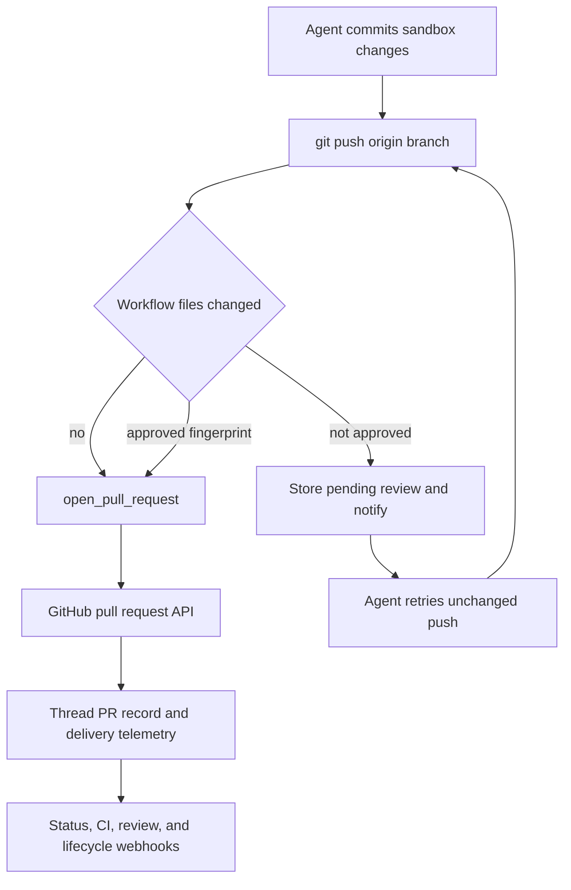

# Code Delivery and Pull Request Creation

Code delivery follows **commit → guarded push → attributed PR creation or update → CI and review follow-up**. The agent must use the `open_pull_request` tool for a new PR; middleware prevents both an unattributed creation fallback and an unapproved push that changes GitHub Actions workflow files. The resulting PR is recorded on the agent thread, which supplies the dashboard, Slack context, webhook lifecycle handling, and later feedback runs.

Caption: delivery is gated at the push boundary for workflow changes and at the creation boundary for requester attribution.

## Open or update the pull request

Push the branch to `origin` before calling `open_pull_request(owner, repo, head, base, title, body, draft=True, resolves_thread=False)`. Its result exposes `created`: `True` denotes a newly created PR, while `False` means GitHub reported a 422 and the tool found the existing open PR for that head branch. This makes creation idempotent per head branch; the agent should use `gh pr edit` to update the existing PR rather than create a duplicate.

The tool resolves authorship from the thread credential scope. A user-owned thread uses the authenticated requester's valid OAuth token, and a system thread uses the GitHub App installation token. A missing user token is an authorization error rather than a silent bot fallback. For a user token on a public thread, the target repository must also be verifiably available to the workspace App unless a private credential scope applies. This maintains both requester attribution and workspace access boundaries.

Before `POST /repos/{owner}/{repo}/pulls`, the tool checks repository access and the base branch; it checks the head branch too when the head is in the same owner/repository. It returns actionable failure payloads for unavailable App/repository access, an invisible branch, missing credentials, or another preflight/create failure. Diagnostic messages retain GitHub's status, selected response headers, and a bounded response body.

The requested `draft` value is a default: a non-null `RunConfig.draft_prs` setting overrides it. The tool appends `## References` only when absent. A dashboard plan link may be included, while Slack, Linear, or originating GitHub-issue links are included only if GitHub confirms the destination repository is private; uncertainty fails closed to avoid leaking private conversation links.

## Record delivery and close the work lifecycle

After a created PR or an existing-PR lookup, telemetry is best effort. It fetches PR details, records usage and opening feedback, upserts a normalized `pull_requests` record plus legacy thread metadata, and saves the PR in the registry. In a Slack code-channel session it refreshes repository context, registers the PR resource, and installs a diff view only for a nonempty GitHub diff. A telemetry or registry exception does not invalidate a PR that GitHub already created.

`resolves_thread=True` marks a tracked PR as eligible to finish the agent thread. Lifecycle webhooks update the matching persisted PR URL under a thread lock. A thread auto-resolves only when all tracked PRs are terminal and at least one tracked record has that flag. If they are all terminal without the flag, it receives `attention_reason="prs_closed"`; reopening a PR clears PR-caused resolution and that attention state.

## Guards around risky delivery operations

### Prevent a creation fallback

`PullRequestCreationGuardMiddleware` wraps `execute` and `background_execute`. It rejects `gh pr create`, `gh api` creation requests to `/pulls`, and `curl` POST/body submissions to GitHub's pulls endpoint. It also inspects supported nested shell `-c` commands and fails closed when nesting exceeds its bounded expansion depth. The non-recoverable `pr_creation_fallback_blocked` response tells the agent to surface the actual `open_pull_request` failure instead of bypassing attribution.

Hosted main-agent runs install both this guard and the workflow push guard. Subagents always receive the workflow guard; hosted subagents also receive the PR-creation guard, while local runs omit that attribution guard.

### Require human review before pushing workflows

`WorkflowPushGuardMiddleware` deliberately handles only safe, standalone `git push origin <refspec>` forms, including supported `git -C`, `cd ... &&`, and `--set-upstream` variants. Other shell shapes are not interpreted by this middleware. For an eligible push of the current branch, it inspects the sandbox Git range against the remote branch or merge base. If no `.github/workflows/` path changed, it passes the original command through.

For workflow changes it captures files, binary diff, bounded preview, diff statistics, base/head SHAs, normalized remote, and an SHA-256 fingerprint of the exact push identity. Per-thread `workflow_push_approvals` metadata stores pending review data and notification state keyed by that fingerprint, with history trimmed to 20 records. A changed workflow diff yields a new fingerprint and therefore a fresh decision.

An approved fingerprint causes the command to be rewritten to an explicit `<head_sha>:refs/heads/<branch>` refspec. Otherwise the middleware records or reuses a pending decision and returns `WorkflowPushApprovalRequired`. It posts a Slack interactive approval request only while that record is not notified, then marks it notified only after Slack returns a message timestamp without an error.

The `/dashboard/api/workflow-approval` routes require a session and same-origin mutation protection. Listing requires readable thread access; approve/reject requires promptable access. A decision records the session subject. Approval dispatches a follow-up telling the agent to retry the blocked push without altering workflow files; rejection merely keeps the decision recorded and the push blocked.

## Observe and continue delivery

`request_pr_review` is a separate reviewer handoff: it parses a GitHub PR URL, obtains the active Slack thread and triggering identity from run configuration, then calls the GitHub webhook review trigger. It does not create a PR.

CI readers paginate both GitHub check runs and legacy commit statuses, returning unavailable results on HTTP/permission failures. Auto-fix considers only completed check runs with `failure`, `timed_out`, or `action_required`, excluding Open SWE's own checks. It removes failure names already present on the base SHA, and permission checking for an unmentioned auto-fix fails closed unless the requester has `write`, `maintain`, or `admin` access. CI webhook normalization supports `check_run`, `check_suite`, `workflow_run`, and `status`; the baby-sit path dispatches only for a completed failure matching an active watch by SHA or branch.

For GitHub feedback, `fetch_pr_comments_since_last_tag` merges issue comments, inline review comments, and nonempty reviews chronologically. The first valid Open SWE mention returns the full context; later invocations return content after the preceding mention. Deployment-specific mention matching does not accept a configured handle as a prefix of a longer handle. Untrusted comment bodies are sanitized and wrapped before prompt use.

The dashboard independently computes live status for every tracked PR. It reports state and draft status, merge-conflict state, failing checks with links, pending and inconclusive check counts, and unresolved GraphQL review threads. `statusAvailable`, `checksAvailable`, and `commentsAvailable` distinguish known data from an unavailable GitHub read, so clients must not treat missing permissions or transient failures as a clean PR.

## Focused verification

`tests/github/test_open_pull_request.py` covers credential scope, workspace access, preflight diagnostics, duplicate discovery, references, and telemetry. `tests/github/test_pr_creation_guard.py` covers direct and nested shell fallback detection. `tests/agent/test_workflow_push_guard.py` covers conservative parsing, workflow diff/fingerprint construction, inherited workflow changes, notifications, and rewritten approved pushes. `tests/dashboard/test_workflow_approval_api.py` verifies approval response shaping; CI, baby-sit, pull-request status, and comment utility tests cover their corresponding follow-up boundaries.
