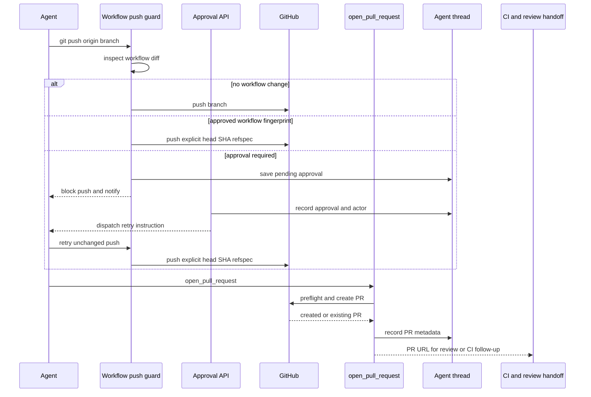

# Code Delivery and Pull Request Creation

The delivery path is **commit → push → open or update pull request → CI and review follow-up**. New PR creation is centralized in `open_pull_request`, rather than a shell-based create command, so the tool can select the appropriate GitHub identity, diagnose access before mutation, and record the resulting PR on the agent thread. Two middleware boundaries protect delivery: one prevents an unattributed PR-creation fallback and the other requires a human decision before a push carrying GitHub Actions workflow changes.

Caption: delivery, workflow approval, and post-PR handoff; the approval fingerprint binds approval to the inspected workflow change.

## Open a PR with the delivery tool

Push the branch to `origin` before calling `open_pull_request(owner, repo, head, base, title, body, draft=True, resolves_thread=False)`. It POSTs GitHub's pull-request endpoint and returns `success`, URL, number, author, token kind, and `created`. `created=True` means GitHub opened a PR; `created=False` means creation received HTTP 422 and the tool found the already-open PR for that head branch. The latter is the update path: use `gh pr edit` for edits rather than attempting a second creation.

The tool obtains an author token before mutating GitHub. It resolves the requested or triggering participant through `pr_author_login` and then obtains that login's valid OAuth token; if no participant is applicable it uses the GitHub App installation token. A requested author who is not a thread participant, a user without a valid token, or a missing App token becomes an explicit failure rather than silently changing the author. For user-token delivery outside a private-credential context, the target repository must also be visible to the workspace App installation.

Before the create call, the tool reads the repository and base branch and, when the head is in the same owner, the head branch. It distinguishes App/repository access failures, branch invisibility, and generic preflight failures. Failure payloads identify the failed step and include GitHub's status, selected response headers, and a bounded response body. This makes a missing push or an authorization problem diagnosable without replacing the attributed path with an arbitrary API call.

### Body policy and drafts

The configured `draft_prs` preference overrides the requested `draft` value when it is set. Before creating a new PR, the tool stamps the collaboration footer and may append `## References`: a plan link when a plan exists, plus Slack, Linear, or issue source links only after GitHub confirms the destination repository is private. If visibility cannot be confirmed, source links are omitted; an existing References section is not duplicated.

## Record the PR as thread state

After either a create or duplicate lookup, telemetry is best effort. The tool fetches PR details, captures opening revision information when available, records usage and feedback, and upserts a normalized `pull_requests` record on the agent thread alongside legacy PR metadata. The record contains the repository, number, URL, normalized state, refs, author, diff statistics, and `resolves_thread` flag. A registry write failure is logged rather than changing a successfully created GitHub PR into a failed tool result.

For a Slack code-channel session, the same best-effort path refreshes repository context, registers the PR as an agent resource, and supplies a diff view only when the diff response is nonempty. These integrations are conveniences, not prerequisites for delivery.

`resolves_thread=True` makes a tracked PR eligible to conclude the agent thread. Lifecycle webhooks update tracked records by persisted URL. They auto-resolve only when all tracked PRs are terminal and at least one carries that flag; otherwise terminal PRs set `attention_reason="prs_closed"`. If an auto-resolved PR reopens, the webhook clears the auto-resolution and associated attention state.

## Delivery guards

### Prevent PR-creation fallback

`PullRequestCreationGuardMiddleware` wraps `execute` and `background_execute`. It rejects shell attempts to create a PR through `gh pr create`, `gh api` POST or field submission to a pulls endpoint, or `curl` POST/body submission to GitHub's pulls endpoint. It recursively inspects supported shell `-c` commands and treats excessive nesting as blocked. The resulting `PullRequestCreationFallbackBlocked` tool error is non-recoverable and tells the agent to surface the `open_pull_request` failure instead.

The main agent and delegated subagents install the workflow push guard. The PR-creation guard is also installed for both, except in local runs. This preserves the same safety boundary when a delegated task performs delivery.

### Require human approval for workflow files

`WorkflowPushGuardMiddleware` deliberately recognizes only constrained standalone push commands: `git push origin <refspec>`, including supported `git -C`, `cd … &&`, and `--set-upstream` forms. Unsafe shell syntax, unsupported push shapes, detached heads, or a refspec that does not push the current branch are not interpreted as eligible guarded pushes. For an eligible push, it inspects the sandbox repository. If the comparison contains no changed `.github/workflows/` path, the original command proceeds.

For workflow changes, the guard computes the base and head SHA, normalized origin remote, changed-file list, binary diff, bounded preview, statistics, and a SHA-256 fingerprint over the delivery identity and full diff. The fingerprint is the approval key. Its record is stored in thread metadata under `workflow_push_approvals`; it contains review fields, notification state, and decision actor/time, and persistence retains the most recent 20 records.

An approved matching fingerprint rewrites the execution command to an explicit `<head_sha>:refs/heads/<branch>` refspec. Otherwise the guard stores or refreshes a pending record and returns `WorkflowPushApprovalRequired`. It posts one Slack approval request only when the record has not been notified, and marks it notified only after Slack returns a message timestamp without error. Changing workflow content changes the fingerprint, so the old approval cannot authorize the new push.

The workflow-approval REST routes require a session and same-origin mutation protection. Reading requires a readable thread; deciding requires a promptable thread. Approval records the session subject and dispatches a follow-up instructing the existing agent thread to retry the same push without changing workflow files. Rejection records the decision but does not dispatch a retry.

## Handoff after delivery

`request_pr_review` is an explicit review handoff, not a PR-creation substitute. It parses a GitHub PR URL, resolves the active Slack thread and requester identity from run configuration, and delegates to the webhook review trigger. See [PR Review](pr-review.md) for reviewer behavior.

CI readers are best effort: unavailable Checks permissions or GitHub errors return `None` rather than breaking webhook handling. They paginate check runs and legacy commit statuses, exclude Open SWE's own check names, and regard only completed `failure`, `timed_out`, and `action_required` check runs as fixable. Base-SHA failure names allow the auto-fix workflow to avoid retrying failures inherited from the base; permission checks for unattended review-triggered changes fail closed unless the requester has `write`, `maintain`, or `admin` access.

The baby-sit webhook handler first accepts only a completed CI payload, extracts branch and head SHA across `check_run`, `check_suite`, `workflow_run`, and legacy `status` events, and matches active watches by SHA or branch. It then evaluates and deduplicates its own watch dispatches. See [Scheduling and Baby-sit](scheduling-and-baby-sit.md).

GitHub feedback collection merges issue comments, inline review comments, and nonempty reviews in chronological order. A first configured Open SWE mention supplies the entire available conversation; later mentions supply content after the preceding mention. Configured mention handles do not match merely because they prefix a longer handle. Comment text is sanitized and untrusted authors are wrapped before prompt inclusion.

## Focused verification

- `tests/github/test_open_pull_request.py` covers author-token selection, preflight diagnostics, duplicate handling, references, and thread metadata behavior.
- `tests/github/test_pr_creation_guard.py` covers direct and nested shell fallback detection and the non-recoverable middleware result.
- `tests/agent/test_workflow_push_guard.py` covers safe push parsing, workflow diff and fingerprint construction, pending notification, and approved-command rewriting.
- `tests/dashboard/test_workflow_approval_api.py` covers serialized approval records; `tests/github/test_github_ci.py` covers CI extraction and required-check behavior.
