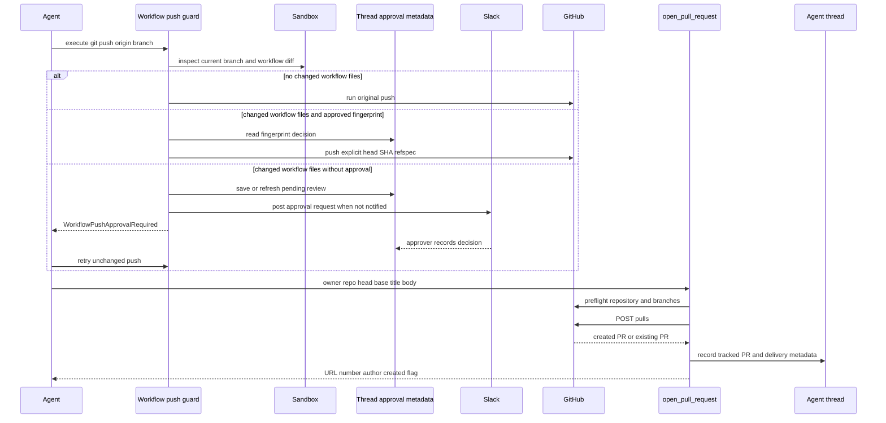

# Implementation, push approval, and pull-request delivery

An implementation run delivers a sandbox branch by pushing it and then calling `open_pull_request`. These are separate boundaries: the workflow-push guard can hold a branch push for human approval, while PR creation is centralized so the GitHub author and the thread record are intentional. The resulting PR is both a GitHub object and a durable delivery record linked to its agent thread.

```mermaid
sequenceDiagram
    participant Agent
    participant PushGuard as Workflow push guard
    participant Sandbox
    participant ApprovalStore as Thread approval metadata
    participant Slack
    participant GitHub
    participant PRTool as open_pull_request
    participant Thread as Agent thread

    Agent->>PushGuard: execute git push origin branch
    PushGuard->>Sandbox: inspect current branch and workflow diff
    alt no changed workflow files
        PushGuard->>GitHub: run original push
    else changed workflow files and approved fingerprint
        PushGuard->>ApprovalStore: read fingerprint decision
        PushGuard->>GitHub: push explicit head SHA refspec
    else changed workflow files without approval
        PushGuard->>ApprovalStore: save or refresh pending review
        PushGuard->>Slack: post approval request when not notified
        PushGuard-->>Agent: WorkflowPushApprovalRequired
        Slack-->>ApprovalStore: approver records decision
        Agent->>PushGuard: retry unchanged push
    end
    Agent->>PRTool: owner repo head base title body
    PRTool->>GitHub: preflight repository and branches
    PRTool->>GitHub: POST pulls
    GitHub-->>PRTool: created PR or existing PR
    PRTool->>Thread: record tracked PR and delivery metadata
    PRTool-->>Agent: URL number author created flag
```
Caption: guarded push and attributed PR creation; the approval decision applies to the inspected workflow-change fingerprint, not merely to a branch name.

## Delivery entrypoint and authorship

Push the feature branch to `origin` before opening a PR. The public, audited `open_pull_request` tool accepts `owner`, `repo`, `head`, `base`, `title`, and `body`; `draft`, `resolves_thread`, `retitle_thread`, and an optional `author` control delivery behavior. Do not replace it with `gh pr create`. The result carries `success`, URL, number, author, token kind, and `created`; `created=False` means GitHub already had an open PR for the head branch and subsequent changes belong in PR-edit operations.

The tool resolves the author credential through the thread's eligible participant identity. When there is no eligible login it uses the GitHub App installation token; when a user login is selected it requires that user's valid OAuth token and reports an authorization requirement rather than silently using another user. For user-token creation outside a private-credential context, it also verifies that the target repository belongs to the workspace GitHub App installation. This prevents a user's broader OAuth access from being used to create an Open SWE PR in an unrelated repository.

Before the create request, preflight reads the repository and base branch, plus the head branch when it belongs to the target owner. It distinguishes repository/App access, invisible branch, and generic preflight failures, with GitHub status, selected response headers, and a bounded response body in the diagnostic. A 422 create response is handled idempotently: the tool searches for the already-open PR for the head and returns it rather than creating a duplicate.

### Body policy and draft behavior

A configured `draft_prs` value overrides the tool's requested `draft` value when present. The tool stamps an attribution/collaboration footer and may add a `## References` section. It never duplicates an existing references heading; a plan link is included when a thread plan is available. Slack-source references may be added, whereas Linear and GitHub-issue source references are added only after GitHub confirms that the destination is private. An unreadable or public destination therefore does not receive those issue-system links.

## Guard the sandbox push

`WorkflowPushGuardMiddleware` wraps `execute` and `background_execute`. It intentionally recognizes only a narrow, standalone form of `git push origin <refspec>` (including `git -C`, `cd ... &&`, and `--set-upstream` variants). Shell operators, unsafe raw syntax, non-`origin` remotes, malformed refspecs, and refspecs that do not push the current branch are not interpreted as an approval-eligible push. This conservative parser avoids rewriting an ambiguous command.

For an eligible push, the guard inspects the sandbox repository. It compares the current head with the remote branch, or with the merge base of `origin/HEAD` for a new remote branch, and limits its diff to `.github/workflows/`. No changed workflow path means the original tool call proceeds. For a workflow change it records the remote identity, base and head SHAs, affected files, a binary diff preview bounded by characters and lines, diff statistics, and a SHA-256 fingerprint over the delivery identity and complete workflow diff. It can also identify workflow changes inherited by a merge from the base branch, so the approval message does not attribute those changes to Open SWE.

### Approval lifecycle and Slack notification

Approval records are thread metadata under `workflow_push_approvals`, keyed by the fingerprint. A pending record contains the review material, request time, and notification state; approving or rejecting records the decision time and actor. Per-thread persistence retains only the 20 most recent records. Because the fingerprint includes the diff and SHAs, altering the workflow change produces a different key and requires a fresh decision.

If the fingerprint is approved, the guard does **not** replay the caller's refspec verbatim. It rewrites the execution request to an explicit `<head_sha>:refs/heads/<branch>` refspec, preserving `--set-upstream` where applicable. If it is not approved, it returns `WorkflowPushApprovalRequired` and ensures a pending record. Where an active Slack thread is available, it posts an interactive review request only until the record is marked notified; the mark occurs after the Slack post returns successfully.

The dashboard API requires a session and same-origin mutation protection. A readable thread can expose its approval records, while approve/reject requires the thread to be promptable by the session subject. Approval records the session subject and dispatches a follow-up that tells the agent to retry the unchanged push; rejection records the denial but dispatches no retry. Both the main agent and subagents install the workflow guard. The PR-creation fallback guard is omitted only for local runs.

## Protect attributed PR creation

`PullRequestCreationGuardMiddleware` also wraps `execute` and `background_execute`. It blocks shell fallbacks that could bypass `open_pull_request`: `gh pr create`, a `gh api` POST or body submission to a GitHub `/pulls` endpoint, and a `curl` POST or body submission to that endpoint. It inspects supported `bash`, `dash`, `sh`, and `zsh` `-c` nesting; expansion has a depth limit and treats an over-limit nested shell as blocked.

The block is a non-recoverable `PullRequestCreationFallbackBlocked` tool error with code `pr_creation_fallback_blocked`. Safe follow-up commands such as `gh pr view`, `gh pr edit`, and comments are not creation fallbacks. The intent is to make the agent surface the attributed creation failure, not conceal it by creating a PR under an unintended identity.

## Record delivery and follow it

After either a new PR or idempotent discovery, the tool best-effort fetches details and writes delivery telemetry. It records usage and thread metadata, including a normalized `pull_requests` entry, legacy PR fields, diff statistics, and the `resolves_thread` request. It also saves a `PullRequest` registry record that links the PR to the agent thread. Registry persistence is deliberately non-fatal: GitHub has already created the PR even if Open SWE cannot record it. For a code-channel Slack session, it updates the context bar and agent resource and displays a diff only when GitHub returns nonempty diff text.

A tracked PR may be designated with `resolves_thread=True`. PR lifecycle handling updates its linked threads from GitHub events. It auto-resolves a thread only when every tracked PR is terminal and at least one tracked PR has that flag. Otherwise terminal PRs set `attention_reason="prs_closed"`; reopening a PR clears automated resolution and that attention marker.

The dashboard status reader is deliberately partial rather than optimistic. It identifies a tracked PR from `repo_full_name` and number, reports live state, draft state, merge-conflict state, failing/pending/inconclusive checks, and unresolved review-thread data. If a GitHub read fails, the corresponding availability fields distinguish unavailable status, checks, or comments from a clean result.

`request_pr_review` is a distinct handoff after delivery. It validates a GitHub PR URL, resolves the active Slack thread and triggering identity, starts review through `trigger_pr_review_from_ref`, and adds a dashboard review URL when available. See [Human review and merge](human-review-and-merge.md).

## CI follow-up and operating checks

`openswe.github.ci` reads third-party check runs and legacy commit statuses as best-effort data: missing Checks-read permission or transient failures return `None` rather than breaking webhook handling. It filters Open SWE's own review and auto-fix check names. Required checks are derived from both branch protection and rulesets, including app identity where GitHub supplies it; an unreadable required-check configuration is also unavailable rather than assumed empty. See [Scheduling and baby-sit](scheduling-and-baby-sit.md) for follow-up automation.

Focused regression coverage lives in `tests/github/test_open_pull_request.py` (workspace scope, preflight diagnostics, draft preference, duplicate handling, references, and telemetry), `tests/github/test_pr_creation_guard.py` (direct and nested fallback detection), and `tests/agent/test_workflow_push_guard.py` (parsing, diff/fingerprint review data, Slack request, and approved-ref rewriting). `tests/github/test_github_ci.py` exercises required-check and fail-closed permission behavior.
