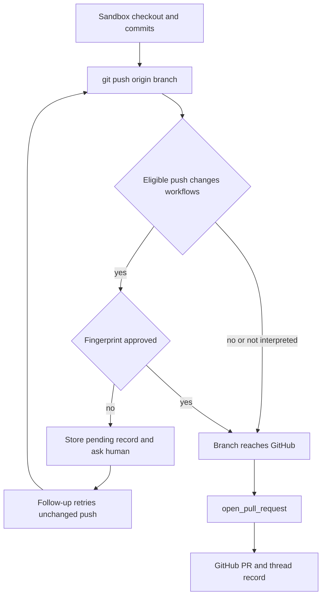
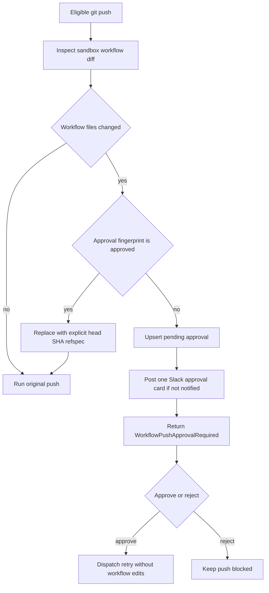

# Implementation, Push, and Pull Request Creation

An implementation run works in its sandbox checkout, commits its branch, pushes it, and then opens or updates a GitHub pull request. The boundaries are intentionally different: ordinary shell/API capabilities can push and maintain a PR, while **new PR creation** is centralized in `open_pull_request` for authorship, and only a detected push that modifies `.github/workflows/` requires a human decision. The resulting PR is recorded against the thread and can drive CI repair, review, lifecycle, and merge work.

```mermaid
flowchart TD
    Work["Sandbox checkout and commits"] --> Push["git push origin branch"]
    Push --> Detect{"Eligible push changes workflows"}
    Detect -->|"no or not interpreted"| Remote["Branch reaches GitHub"]
    Detect -->|"yes"| Decision{"Fingerprint approved"}
    Decision -->|"no"| Pending["Store pending record and ask human"]
    Pending --> Retry["Follow-up retries unchanged push"]
    Retry --> Push
    Decision -->|"yes"| Remote
    Remote --> Open["open_pull_request"]
    Open --> PR["GitHub PR and thread record"]
```
Caption: workflow approval applies only to an eligible, detected workflow-file push; it is not a general restriction on shell or GitHub API use.

## From branch to attributed PR

Use `open_pull_request(owner, repo, head, base, title, body, draft=True, resolves_thread=False)` to open a new PR **after the head branch is visible on `origin`**. It POSTs to GitHub's pulls endpoint and returns `success`, URL, number, author, token kind, and `created`. Do not replace a failed call with `gh pr create` or a direct API request. Once a PR already exists, ordinary PR maintenance such as `gh pr edit`, comments, readiness changes, and status reads remains separate from creation.

The tool resolves a participant's current GitHub OAuth credential through `pr_author_login`; if there is no participant author, it uses the installation token as the bot. A requested author who did not participate is rejected, unavailable user authorization raises the user-auth path, and missing credentials return a structured failure. For user credentials outside a private credential scope, the target also has to belong to the workspace GitHub App installation. `require_consent` runs before the GitHub preflight and create request.

Before creation, preflight reads the repository and base branch and, for a same-owner head, the head branch. It distinguishes missing App/repository access, an invisible branch, revoked user authorization, and generic preflight failures; failures include status, selected response headers, and a bounded response body to make the GitHub condition diagnosable. A `422` create response triggers an open-PR lookup by head branch. If found, the result is successful with `created=False`, and the agent should edit that PR rather than create a duplicate.

The requested draft value is a default: `RunConfig.draft_prs`, when set, overrides it. The body receives the platform attribution footer and, unless it already has `## References`, may receive a plan link and source references. Source links from Linear or GitHub are added only when GitHub confirms a private target repository; Slack source links are permitted for Slack-originated work. Reference construction is best effort.

### Creation safety versus push approval

`PullRequestCreationGuardMiddleware` wraps `execute` and `background_execute`, detecting `gh pr create`, a `gh api` create against `/pulls`, and a `curl` POST/body submission to GitHub's pulls endpoint. It examines supported nested shell `-c` commands up to a bounded depth and blocks suspected creation with the non-recoverable `pr_creation_fallback_blocked` result. The guard protects attribution; it does **not** generally block commands that view, edit, comment on, or otherwise operate on existing PRs.

The server installs the creation guard for hosted main-agent and delegated tool calls, but omits it in a local run. `WorkflowPushGuardMiddleware` is a separate guard and is installed for both the main agent and subagents.

## Workflow-file push approval

The push guard deliberately handles only a conservative grammar: a standalone `git push origin <refspec>`, optionally with `git -C`, `cd ... &&`, or `--set-upstream`. Unsafe shell syntax and unsupported push shapes are not interpreted and proceed through normal execution. For an eligible current-branch push, the guard inspects the sandbox Git history against the remote branch, or against the merge base for a new branch. If no changed path is below `.github/workflows/`, it forwards the original request untouched.

For a workflow change, it builds a reviewable record from the binary diff: changed file list, additions/deletions, bounded preview, base and head SHA, normalized origin URL, and a SHA-256 fingerprint. The fingerprint includes the diff and push identity, so changing workflow content produces a new approval requirement. The guard also identifies workflow changes inherited through a merge for the approval message.

```mermaid
flowchart TD
    Candidate["Eligible git push"] --> Inspect["Inspect sandbox workflow diff"]
    Inspect --> Changed{"Workflow files changed"}
    Changed -->|"no"| Execute["Run original push"]
    Changed -->|"yes"| Lookup{"Approval fingerprint is approved"}
    Lookup -->|"yes"| Rewrite["Replace with explicit head SHA refspec"]
    Rewrite --> Execute
    Lookup -->|"no"| Record["Upsert pending approval"]
    Record --> Notify["Post one Slack approval card if not notified"]
    Notify --> Block["Return WorkflowPushApprovalRequired"]
    Block --> Human{"Approve or reject"}
    Human -->|"approve"| Followup["Dispatch retry without workflow edits"]
    Human -->|"reject"| Stop["Keep push blocked"]
```
Caption: an approval authorizes exactly the inspected workflow change and retries it with a pinned commit SHA.

Approval records live in thread metadata under `workflow_push_approvals`, keyed by fingerprint. They retain the review data, notification state, timestamps, and decision actor; persistence keeps the 20 newest records. A pending record is reused, whereas an approved or rejected record is terminal. The Slack request is posted only if its record is not already notified, and the notification flag is written only after the Slack post succeeds.

Approval causes the middleware to replace the command with a safe explicit `<head_sha>:refs/heads/<branch>` refspec. Otherwise it returns `WorkflowPushApprovalRequired`, including the approval URL and summary. The web API requires a session, same-origin mutation protection, and permission to prompt/read the thread. Approval stores the session subject and dispatches an agent follow-up that instructs it to retry without changing workflows; rejection only records the denial.

## Record the delivery and follow its lifecycle

After either a new or reused PR, telemetry fetches details, records usage and opening feedback, and upserts both thread metadata and the PostgreSQL `PullRequest` registry. Thread metadata maintains normalized `pull_requests` alongside legacy PR fields; the registry makes one PR linkable to its primary opening thread and later secondary repair/reviewer threads. Registry failure does not invalidate the GitHub PR, and the overall telemetry block is best effort. In a Slack code-channel session, it refreshes repository context, registers the PR resource, and shows a nonempty diff.

`resolves_thread=True` is persisted for an agent-opened PR. Lifecycle webhooks update linked threads when GitHub reports a PR state change. A thread resolves only when every tracked PR is closed or merged and at least one tracked record has `resolves_thread=True`; otherwise it receives `attention_reason="prs_closed"`. Reopening a PR clears that attention marker and reverses an automatic resolution.

## CI and GitHub feedback loop

CI reads paginate check runs and legacy commit statuses, returning `None` rather than breaking webhook handling when GitHub access fails. Auto-fix candidates are completed check runs concluded `failure`, `timed_out`, or `action_required`; Open SWE's own checks are excluded. Failures whose names already fail on the base SHA are excluded as inherited. The no-explicit-mention auto-fix path verifies that the requester has `write`, `maintain`, or `admin` access and fails closed otherwise.

CI webhook helpers normalize branch and SHA across `check_run`, `check_suite`, `workflow_run`, and legacy `status` events. Baby-sit ignores non-completed events, finds active watches by SHA or branch, deduplicates delivery IDs under a watch lock, and dispatches a queued repair run only when its evaluation says one is needed. See [Scheduling and Baby-sit](scheduling-and-baby-sit.md).

When invoked from a PR discussion, `fetch_pr_comments_since_last_tag` merges issue comments, inline review comments, and nonempty reviews in chronological order. The first matching Open SWE mention returns all context; later invocations start after the preceding mention. Configured mention handles reject prefix-only matches. Comment bodies are sanitized and authors outside registered users are fenced as untrusted before prompt inclusion.

## Human review and PR actions

`request_pr_review` is a handoff rather than PR creation: it validates the GitHub PR URL, resolves the active Slack thread and triggering identity, delegates to the GitHub review trigger, and returns a dashboard review URL when available. See [PR Review](pr-review.md).

The human-review model has one open request per PR. An expedited request pins the head SHA and a fingerprint of the displayed non-test diff; test-only changes do not invalidate that fingerprint. It is eligible only for a small readable text diff—no binary/oversized reviewed file, fewer than 100 files, and at most 25 non-test changed lines—while test lines are excluded from the size gate. A non-author with repository write access may approve; the approval is submitted as that person's GitHub review when the same fingerprint still matches. A draft card first permits only its author to mark the PR ready.

Readiness is re-evaluated before merging: the PR must be open, non-draft, conflict-free, have successful completed checks and no unreported required checks, no unresolved review threads, and no outstanding changes request. Non-required failing checks do not block an expedited merge. The merge operation uses an installation token limited to contents and pull-request write permissions when available, sends the observed head SHA and an allowed merge method, and never bypasses GitHub branch protection.

Dashboard/status readers degrade per field when GitHub cannot answer rather than claiming a clean PR; callers should distinguish unavailable review, check, and live-status data from a passing result. Existing-PR actions are performed with the signed-in user's token: merge and close confirm GitHub's response, marking ready uses GraphQL because REST cannot clear draft state, and update-branch supplies an expected head SHA to avoid acting on a stale view.

## Focused verification

The GitHub-focused tests cover PR preflight, author/token selection, reference handling, duplicate discovery, telemetry, and fallback-guard command detection in `tests/github/test_open_pull_request.py` and `tests/github/test_pr_creation_guard.py`. `tests/github/test_github_ci.py`, `tests/github/test_baby_sit_webhook.py`, `tests/github/test_pull_request_actions.py`, and `tests/github/test_pull_requests.py` cover CI handling, watch dispatch, confirmed user actions, and PR record behavior. Workflow approval, expedited review, and human-review behavior are covered in their corresponding middleware and review test suites.
