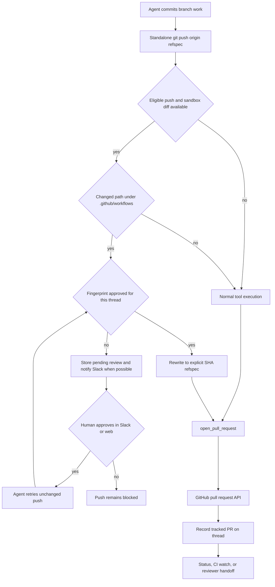

# Pull Request Creation and Approval

The delivery path is **commit → push → open or update a pull request → CI and review feedback**. New PR creation is centralized in `open_pull_request`, which selects an attributed credential and records the result on the agent thread. Two middleware controls protect narrower boundaries: one prevents common shell fallbacks that would create an unattributed PR, and the other pauses an eligible push when it contains changes below `.github/workflows/`. They are important controls, but neither is a universal authorization layer for every Git mutation or GitHub API mutation.

```mermaid
flowchart TD
    Commit["Agent commits branch work"] --> Push["Standalone git push origin refspec"]
    Push --> Eligible{"Eligible push and sandbox diff available"}
    Eligible -->|"no"| Normal["Normal tool execution"]
    Eligible -->|"yes"| Workflow{"Changed path under .github/workflows"}
    Workflow -->|"no"| Normal
    Workflow -->|"yes"| Decision{"Fingerprint approved for this thread"}
    Decision -->|"no"| Pending["Store pending review and notify Slack when possible"]
    Pending --> Approve{"Human approves in Slack or web"}
    Approve -->|"yes"| Retry["Agent retries unchanged push"]
    Approve -->|"no"| Blocked["Push remains blocked"]
    Retry --> Decision
    Decision -->|"yes"| Fixed["Rewrite to explicit SHA refspec"]
    Normal --> PR["open_pull_request"]
    Fixed --> PR
    PR --> GitHub["GitHub pull request API"]
    GitHub --> Recorded["Record tracked PR on thread"]
    Recorded --> Followup["Status, CI watch, or reviewer handoff"]
```
Caption: the workflow-push guard only intervenes after it recognizes a conservative push shape and can identify a workflow-file diff; PR creation follows a successful push.

## Prepare and publish the PR

Push the branch to `origin` before opening a PR. For a new PR, call `open_pull_request(owner, repo, head, base, title, body, draft=True, resolves_thread=False)` rather than `gh pr create`. Its result includes `created`: `True` means GitHub created a PR, while `False` means the tool found an existing open PR for that head branch. In the latter case, use `gh pr edit` for subsequent title, body, or readiness changes rather than attempting another creation.

`open_pull_request` resolves the intended author through the credential scope. If `pr_author_login` produces a login, it obtains that person's current OAuth token; a missing or invalid user token raises a user-authentication requirement rather than silently changing author. If there is no author login, it uses the GitHub App installation token and reports token kind `bot`. The tool also rejects a requested author who is not a thread participant, checks workspace App repository membership in the applicable user-token case, and calls the consent gate before writing to GitHub.

Before POSTing `/repos/{owner}/{repo}/pulls`, preflight reads the repository and visible base and same-owner head branches. It distinguishes missing App/access or unavailable repository (`github_app_access_missing_or_repo_not_found`), a branch GitHub cannot see (`github_pr_branch_not_visible`), and other preflight failures (`github_pr_preflight_failed`). Failure payloads state whether the head appears pushed and include the actual HTTP status, selected response headers, and a bounded response body. A rejected user credential is separately marked revoked and returns a re-authentication failure; absence of any usable token returns `no_github_token`.

A successful POST returns `created=True`. On HTTP 422, the tool queries open PRs for the head and, if found, returns that PR with `created=False`; it does not create a duplicate. Other responses are returned as structured attributed-creation failures. This makes the creation API idempotent at the agent workflow level for the common “same head already has an open PR” case, not a guarantee about arbitrary concurrent GitHub operations.

### Body, draft, and resolution choices

`draft` is a default, not an absolute instruction: `RunConfig.draft_prs`, when set, overrides it. The tool stamps its collaboration/attribution footer after assembling the body. Unless the body already contains `## References`, it may add a dashboard plan link and source links. Slack source links are eligible directly; for other sources, source references are included only when GitHub confirms the destination repository is private. A failed privacy lookup therefore does not authorize adding a non-Slack originating-source link.

`resolves_thread=True` records a completion intent on the tracked PR. PR lifecycle webhooks synchronize tracked PR state using the PR registry (falling back to persisted thread metadata if needed). The thread auto-resolves only when all tracked PRs are terminal (`closed` or `merged`) and at least one tracked record has `resolves_thread=True`. If all are terminal without that intent, the thread gets `attention_reason="prs_closed"`; a reopened PR clears the automatic resolution/attention condition.

## Record the delivery result

After a created PR—or the existing PR returned after a 422—the tool best-effort fetches full details, records usage, and upserts a normalized `pull_requests` record plus compatibility metadata such as `pr_url`, `pr_number`, and `pr_urls` on the thread. The normalized state is derived as `draft`, `open`, `closed`, or `merged`. It also saves a PR registry record linked to the agent thread; a registry write failure is logged rather than allowed to make an already-created GitHub PR look unsuccessful.

For an active Slack code-channel session, the same best-effort sequence updates the repository context bar, registers the PR resource, and sets a diff view only when GitHub supplies a nonempty diff. The outer telemetry error handling preserves the GitHub creation outcome, but it also means a preceding exception can prevent later telemetry steps; this is not a transaction.

## Guard the two delivery boundaries

### Prevent common unattributed creation fallbacks

`PullRequestCreationGuardMiddleware` wraps `execute` and `background_execute`. It blocks shell patterns that create a PR outside `open_pull_request`: `gh pr create`, `gh api` requests to a pulls endpoint that use POST or a body, and `curl` POST/body requests to GitHub’s pulls endpoint. It tokenizes commands and expands supported `bash`, `dash`, `sh`, and `zsh` `-c` nesting only to a bounded depth; exceeding that depth is itself blocked. The returned error is non-recoverable `PullRequestCreationFallbackBlocked` with code `pr_creation_fallback_blocked`, so the attributed tool's real failure is surfaced instead of hidden by a fallback.

The server adds this guard for both main-agent and subagent tool stacks when the run is not local; local desktop runs omit it. It detects the listed shell pathways, not all conceivable ways of mutating GitHub. Code which adds a new PR-creation transport must either use `open_pull_request` or extend the guard deliberately.

### Require a human decision for recognized workflow pushes

`WorkflowPushGuardMiddleware` similarly applies to `execute` and `background_execute`, and is present in both main-agent and subagent stacks. It intentionally recognizes only conservative standalone `git push origin <refspec>` commands, including supported `git -C`, `cd … &&`, and `--set-upstream` forms. Shell operators, unsafe raw shell syntax, unfamiliar remotes, refspecs, non-current-branch pushes, missing sandbox backend, or failed inspection do not produce a `WorkflowPushChange` and are passed to normal tool execution. This conservative behavior avoids incorrectly rewriting complex commands; it is why the guard must not be described as universal protection against all repository mutations.

For an eligible current-branch push, the middleware calculates the appropriate remote-branch or merge-base range in the sandbox. If no changed path is below `.github/workflows/`, it forwards the original request untouched. Otherwise it collects the binary workflow diff, bounded preview, changed files, addition/deletion statistics, base/head SHA, normalized origin URL, and a SHA-256 fingerprint over the change identity. It also detects an inherited workflow change introduced by a merge for clearer review messaging.

Approval state is stored in per-thread `workflow_push_approvals`, keyed by that fingerprint. A pending record keeps the review fields, requested time, and notification state; decisions add `approved` or `rejected`, actor, and decision time. Persistence retains only the 20 newest records. An approved matching fingerprint causes the middleware to replace the command with an explicit `<head_sha>:refs/heads/<branch>` refspec before invoking the tool handler. A non-approved fingerprint returns `WorkflowPushApprovalRequired`, creates or refreshes the pending review, and makes a material workflow change require a new fingerprint and decision.

Slack notification is best effort and de-duplicated: a pending record already marked `notified` is not posted again, and the record is marked only after Slack returns a message timestamp without an error. The notification offers the workflow files, stats, approval ID, and web review URL where available.

## Approval API and operator workflow

The workflow approval router is `/dashboard/api/workflow-approval`. Its routes require a session and same-origin mutation protection. Listing requires that the caller can read the thread; approving or rejecting requires that the caller can prompt the thread. Both decision routes store the session subject as the actor and return 404 for an unavailable approval record or inaccessible thread.

Approval dispatches a follow-up on the existing thread telling the agent to retry the blocked push without altering workflow files first. Rejection merely persists the rejected decision, so the same fingerprint stays blocked. The approval is thus scoped to the inspected fingerprint and retry, rather than granting a broad, durable permission to push workflow changes.

## CI, feedback, and review handoff

`request_pr_review` is a handoff rather than PR creation. It parses the GitHub PR URL, resolves the active Slack thread and triggering identity from run configuration, delegates to GitHub webhook review triggering, and adds a dashboard review URL when available. Use it when an explicit reviewer-agent handoff is wanted; see [PR Review](pr-review.md).

CI readers paginate GitHub check runs and legacy commit statuses. Calls are best effort: unavailable permissions or HTTP failures return `None` rather than breaking webhook handling. The auto-fix classifier considers only completed check runs with `failure`, `timed_out`, or `action_required` conclusions, filters Open SWE's own check names, and excludes failure names already failing on the base SHA. The no-mention auto-fix path fails closed unless GitHub verifies the requester has `write`, `maintain`, or `admin` repository permission.

CI webhook helpers normalize branch and head SHA for `check_run`, `check_suite`, `workflow_run`, and `status` events and recognize a completed event before baby-sit evaluates it. The baby-sit handler then finds active watches matching the SHA or branch, de-duplicates deliveries and failure dispatches, evaluates current checks, and enqueues an agent follow-up only when a watched failure needs action. See [Scheduling and Baby-sit](scheduling-and-baby-sit.md).

For GitHub feedback, `fetch_pr_comments_since_last_tag` merges issue comments, inline review comments, and nonempty review bodies in chronological order. The first Open SWE mention returns the full timeline so prior drafted inline comments remain available; a repeat invocation returns entries after the preceding mention. Mention matching is configured per deployment and avoids treating a handle that is only a prefix of a longer handle as a match.

## Safe-change checklist

- Keep branch creation, commit, and push separate from `open_pull_request`; verify the intended base, head, title, and body before invoking the tool.
- Treat `created=False` as an existing PR to edit, not a failed creation to work around.
- Preserve structured failure codes and diagnostic context: they tell the agent or operator whether to push, repair credentials, grant repository access, or correct branch visibility.
- When changing the workflow-push parser, keep its fail-open-by-non-recognition boundary explicit and test both accepted command shapes and unsafe/unrecognized shapes.
- When changing approval persistence or UI/API behavior, preserve fingerprint matching, actor recording, 20-record trimming, and the invariant that only approval—not rejection—dispatches a retry.
