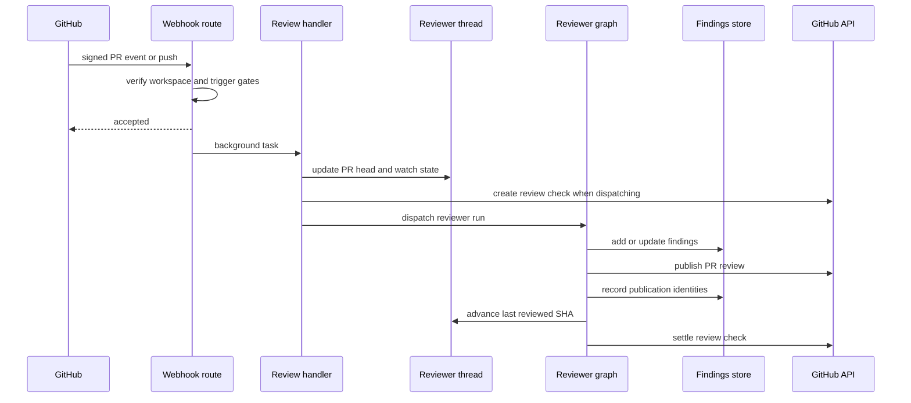

# Pull Request Review Lifecycle

Open SWE reviews a pull request through the dedicated `reviewer` graph. The lifecycle is intentionally PR-centric: a deterministic reviewer thread carries dispatch and watch state, while the PR's findings are durable records that are reconciled with GitHub across later runs. For adjacent graph design, see [Reviewer and Analyzer Architecture](../architecture/reviewer-and-analyzer.md); for generic run dispatch, see [Invocation Workflow](invocation.md).

## Admission: automatic versus on-demand

`POST /webhooks/github` is the signed asynchronous ingress. It verifies `X-Hub-Signature-256`, ignores unsupported event types and PR actions, verifies that the repository belongs to a workspace, and schedules accepted handlers as FastAPI background tasks. A temporarily unreadable workspace lookup returns `503` so GitHub retries rather than silently dropping work.

**Automatic triggers** are deliberately gated:

- `pull_request` `opened` and `ready_for_review` begin an automatic first review only when the repository is in the enabled-review-repositories record. Repositories are disabled by default, and an unavailable enabled-repositories store fails closed (skip review rather than fail the webhook). These automatic PR triggers also pass the public-repository organization gate.
- A draft is skipped unless its author's effective `review_draft_prs` setting is enabled; the author profile setting falls back to workspace settings.
- A `push` enters only when auto-review remains enabled. It then must identify an open PR for the branch and an existing watched reviewer thread; it does not create a first review for an arbitrary branch push.

**On-demand triggers** do not use the automatic repository-enable gate. The dashboard's re-review action calls `trigger_pr_review_from_ref`, which fetches current PR metadata, obtains a reviewer token, creates the canonical thread if needed, records PR metadata, `head_sha`, and `watch=True`, posts a transient review-started comment, and dispatches the reviewer. This entry point is suitable for an explicit re-review even when no automatic delivery caused it.

A reply to an Open SWE inline review comment is a third, focused path: the webhook recognizes a reply before normal mention handling, applies the public-repository gate, and routes it to the reviewer workflow.

*Caption: Accepted automatic deliveries update the canonical PR state and asynchronously dispatch the reviewer; publication persists GitHub identity before the review lifecycle is settled.*

## Canonical PR state and durable findings

`reviewer_thread_id(owner, repo, pr_number)` is UUIDv5 over `"{owner}/{repo}/pr/{pr_number}/reviewer"`. Webhook handlers, dashboard review APIs, and the reviewer re-derive this identifier, so the exact formula is a persisted routing contract: changing it would make existing threads and their metadata unreachable.

The LangGraph thread owns **review lifecycle metadata**, including `kind="reviewer"`, PR identity, current `head_sha`, `last_reviewed_sha`, `watch`, optional Slack origin, the current run ID, transient status-comment ID, and review-check state. Dispatches use `assistant_id="reviewer"`, mapped to `agent.graphs.reviewer:traced_reviewer_agent` in `langgraph.json`.

Findings are instead stored in PostgreSQL under their pull request, with a `pull_request_finding_state` mapping back to the reviewer thread. This separates durable review records from a replaceable sandbox and supports linking human replies to registered GitHub identities. Older threads that still hold metadata findings are migrated on first access. Finding reads normalize legacy singular GitHub identifiers and nested `surface` data into canonical ID lists and a forward-only `surface_state`.

Writes serialize a current PR finding set with a database row lock. `mutate_findings` writes only if the mutator changed the fresh state, `replace_findings` merges by finding ID so it does not discard concurrently added findings, and `append_finding` de-duplicates open findings by fingerprint. If the backing reviewer thread is absent before migration, tools return the structured `thread_not_found` do-not-retry result rather than inviting a retry.

## Read-only preparation and finding collection

Before the model runs, `PrepareReviewerRunMiddleware` obtains and caches a GitHub App token, provisions a per-thread sandbox (permitting replacement of an unreachable one), and prepares a checkout. It materializes the first-review or re-review diff and provides both diff text and a per-file/per-side changed-line set. A re-review range uses `last_reviewed_sha`; otherwise the PR diff is used. Failure to materialize the local range falls back to a fetched PR diff where possible, while an unavailable checkout is represented to the reviewer as not ready.

The graph exposes review-oriented tools such as `fetch_review_diff`, `add_finding`, `update_finding`, `publish_review`, and finding-thread reply/resolution tools—not code-authoring tools. It loads organization guidance, repository style, and base-branch `AGENTS.md`/`CLAUDE.md` conventions. PR descriptions and existing review-thread bodies are delimited as untrusted data; wrapper-closing tags are neutralized so commenter-controlled text cannot escape its data block. The prompt's review bar excludes style-only, speculative, pre-existing, and out-of-diff reports.

`add_finding` normalizes a one-ended range, requires a generated non-default title, and validates severity, confidence, side, and range ordering. When changed-line context is available, an anchor outside the PR diff returns `success: false`, `in_diff: false`, and an explicit instruction not to retry. File-level findings are accepted but cannot become inline comments. Suggestions longer than `MAX_SUGGESTION_LINES` (4) are dropped while retaining the description-only finding.

## Selecting and publishing a review

Publication considers open, in-diff findings at or above the chosen severity threshold (default `medium`). The reviewer may provide an explicit rank; ranked findings come first, and unranked findings then sort by severity, file, and line. Confidence is recorded but does not itself gate publication. The normal review cap is `REVIEW_FINDING_CAP` (6). On a re-review, publication considers only unsurfaced findings first seen at the effective current head, preventing duplicate inline comments.

`publish_review` first resolves the live head SHA from thread metadata: a push can update it while the run still holds a frozen configuration. It reconciles/backfills from GitHub threads, then posts one GitHub PR Review with a summary body and inline comments for renderable findings. Inline comments include the hidden finding marker and may include a fenced suggestion. After GitHub accepts the review, it records review, comment, run, and thread identities in a coordinated findings write; it then resolves eligible fixed threads, advances `last_reviewed_sha`, removes the transient status comment, and settles the check.

Important publication outcomes are explicit:

- Eval mode is a dry run: it records simulated publication metadata and posts nothing.
- An empty re-review with a known Open SWE summary skips a redundant summary but still resolves fixed threads and advances `last_reviewed_sha`.
- A GitHub unresolved-anchor response triggers one selective retry after identifiable bad anchors are removed. If it cannot safely recover, the tool returns `unresolvable_findings` and directs the agent to repair or resolve those findings rather than retry identically.
- A numeric `review_id` without `dry_run` or `skipped_empty_re_review` is the signal that GitHub received a new review.

## Watches, SHA transitions, and feedback

Closing a PR disables `watch`; reopening re-enables it. Converting to draft disables watch only when the author's effective draft-review setting is off. The watch is a re-review subscription, not a universal push listener.

For a watched open PR, a push short-circuits when its head equals `last_reviewed_sha`. When a comparison proves the PR diff is unchanged, it advances `last_reviewed_sha` and creates then completes a **No new changes to review** success check on the new head, because GitHub only shows checks on the current commit. For a changed diff, the handler reconciles live review threads, updates PR metadata and `head_sha`, creates an in-progress **Open SWE Review** check, and dispatches `re_review=True` with the prior reviewed SHA. `ready_for_review` follows the same SHA discipline: it does not dispatch if `head_sha` already equals `last_reviewed_sha`, but after a prior review it dispatches a re-review prompt asking the graph to reconcile existing findings and publish net-new ones.

Reconciliation matches a GitHub thread first by the embedded finding marker, then recorded thread or comment identity. It backfills publication identities and marks findings surfaced; captures a latest non-bot reply as an interaction requiring reassessment; and changes an open finding to `resolved` only if all matched threads are resolved. Outdated threads are terminal for sweep purposes but do not count as resolved. The reply webhook performs this sweep, finds the parent finding, appends its reply interaction, and dispatches a `reviewer_event="finding_reply"` run.

Automatic first reviews and changed-diff push re-reviews create an **Open SWE Review** check and save `review_check_run_id` in thread metadata. `publish_review` settles that check, clearing the ID only after a successful GitHub completion PATCH. A failed PATCH retains the ID plus `review_check_pending_result`, allowing the after-agent hook to retry the intended conclusion. If a run ends without publishing, `settle_review_check_on_exit` settles the remaining check as `neutral`, so reviewer or sandbox failure is not presented as a defect in the PR.

## Operations and focused tests

Enabling the GitHub App is insufficient for automatic review: operators must opt each repository into the enabled-review-repositories record. For a missing or stuck review, inspect reviewer-thread metadata (`watch`, `head_sha`, `last_reviewed_sha`, `review_check_run_id`, and `review_check_pending_result`), token availability, and sandbox preparation. Treat `thread_not_found` as a terminal storage blocker for that run.

Focused coverage includes automatic PR admission and draft behavior in `tests/reviewer/test_pr_ready_auto_review.py`; watch, SHA, unchanged-diff, and check behavior in `tests/reviewer/test_reviewer_watch.py`; PostgreSQL findings, storage migration, and tool validation in `test_reviewer_findings.py` and `test_reviewer_tools.py`; reconciliation in `test_reviewer_reconcile.py`; and publication, retry, status-comment, and check settlement behavior in `test_reviewer_publish.py`.
