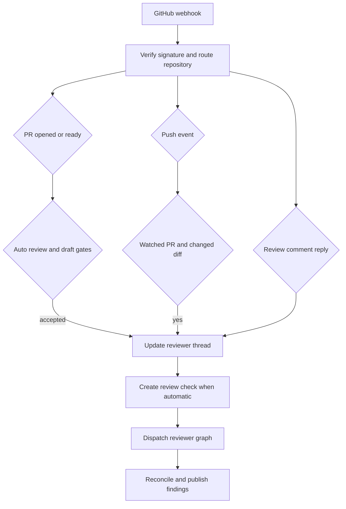
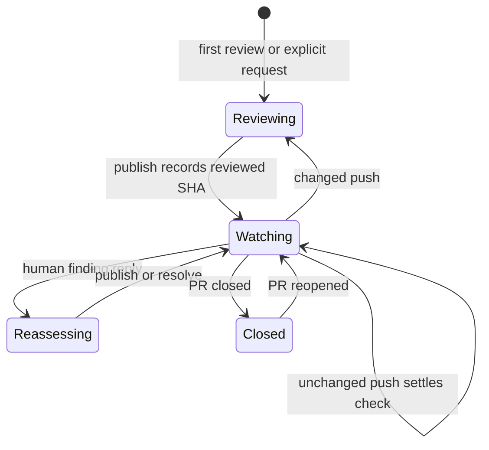

# Pull Request Review and Re-review

Open SWE uses a dedicated `reviewer` graph and one durable reviewer thread per pull request. Initial review, later pushes, and replies to review comments all return to that state so findings can be reconciled rather than duplicated. See [Reviewer and Analyzer Architecture](../architecture/reviewer-and-analyzer.md), [Invocation Workflow](invocation.md), and [Scheduling and Baby-sit](scheduling-and-baby-sit.md) for adjacent responsibilities.

## Admission and triggers

`POST /webhooks/github` is the signed ingress: it verifies `X-Hub-Signature-256`, rejects malformed JSON or unsupported events/actions, and schedules accepted work as FastAPI background tasks. Before event-specific routing, a repository must be assigned to a workspace; an unreadable workspace lookup returns `503` so GitHub retries rather than silently losing work. Automatic review events are also subject to the public-repository organization gate.

A review can begin in four ways:

- **Automatic first review:** `pull_request` `opened` and `ready_for_review` events require automatic review to be enabled for the repository. A draft additionally needs its author's `review_draft_prs` override, or the owning workspace default when no override exists.
- **Explicit request:** the agent's `request_pr_review` parses a GitHub PR URL and preserves an active Slack thread when applicable. The dashboard's `trigger_re_review` calls the same `trigger_pr_review_from_ref` service. That service fetches PR metadata and a repository-scoped reviewer token, creates the canonical thread if necessary, sets `watch=True` and the live head, posts a transient in-progress comment, then dispatches the reviewer.
- **Watched push:** only an open PR with an existing, watched reviewer thread is eligible for re-review.
- **Reply to a reviewer comment:** a non-bot reply to an Open SWE inline comment is routed before ordinary mention processing and can start a focused reassessment.

The trigger paths converge on the same per-PR reviewer state.

## Durable state and reviewer preparation

`reviewer_thread_id(owner, repo, pr_number)` is a UUIDv5 derived from `"{owner}/{repo}/pr/{pr_number}/reviewer"`. Webhooks, review APIs, and reviewer tools independently derive that ID, so the formula is a persisted-data contract: changing it would strand existing threads.

LangGraph thread metadata is the durable state owner. It is marked `kind="reviewer"` and holds PR identity, `head_sha`, `last_reviewed_sha`, `watch`, optional Slack origin, status-comment/check IDs, the dispatched run ID, and `findings`. Metadata survives sandbox eviction and can be queried across threads. Dispatches use `assistant_id="reviewer"`, which `langgraph.json` maps to `agent.graphs.reviewer:traced_reviewer_agent`.

Before model execution, `PrepareReviewerRunMiddleware` obtains a token and a replaceable per-thread sandbox, prepares the checkout, materializes either the first-review range or the range since `last_reviewed_sha`, and computes changed lines by file and diff side. It concurrently fetches PR metadata, review threads, organization guidance, repository style, and base-branch instruction files. Existing review bodies are deliberately rendered as bounded, escaped, XML-delimited untrusted data; PR descriptions receive the same prompt-injection treatment. The reviewer is instructed to report concrete in-diff defects, not style-only, speculative, or pre-existing issues.

## Finding lifecycle and guardrails

A finding records its anchor, diff side, severity, confidence, title and description, fingerprint, first/last-confirmed SHA, lifecycle (`open`, `resolved`, or `dismissed`), interactions, and GitHub publication identity. The list is persisted in reviewer-thread metadata. Every read normalizes old singular GitHub IDs and legacy nested `surface` data into canonical comment/thread ID lists and a forward-only `surface_state`.

Writes use a per-thread/event-loop lock and fresh read-modify-write state. Mutators write only when changed; replacing a snapshot merges by finding ID so concurrently added records survive; adding a finding deduplicates by fingerprint among open findings. If the thread is missing, storage raises `ReviewerThreadMissingError` and tools return `thread_not_found` with an explicit do-not-retry instruction.

`add_finding` requires a generated, non-default title; validates severity, confidence, side, and line ordering; and normalizes a one-ended range. It validates anchors against the locally prepared changed-line set. An out-of-diff location returns `success: false`, `in_diff: false`, and must not be retried. File-level findings are accepted by the data model but have no inline GitHub payload. Suggestions longer than `MAX_SUGGESTION_LINES` (4) are dropped while the description-only finding is retained.

## Selection and publication

`publish_review` selects open findings at or above the requested threshold (default `medium`), ordered by severity descending then file/line and normally capped at `REVIEW_FINDING_CAP` (6). Confidence is retained for calibration but does not gate publication. Only in-diff findings with a renderable line anchor become inline comments. During a re-review, only unsurfaced findings first seen at the current live head are candidates, preventing duplicate comments.

The tool first reconciles with live GitHub threads, resolves `head_sha` from thread metadata rather than a frozen run config, and posts one GitHub PR Review. Each inline comment contains a hidden finding marker, title, details, line reference, and optional fenced suggestion; the summary has its own marker. It records the review and comment identities in one findings write, then backfills and stores review-thread IDs. This ordering minimizes a crash window in which GitHub contains a comment that the durable finding cannot later resolve.

A `422` unresolved-anchor response causes one filtered retry after identifiable invalid findings are excluded; otherwise the tool returns the affected IDs and a fix-or-resolve hint rather than inviting identical retries. Eval runs are dry runs. When there is nothing new and a prior Open SWE summary is known, the tool skips another empty summary but still resolves fixed threads, advances `last_reviewed_sha`, clears the transient status comment, and settles the check. Thus a real GitHub review is confirmed only by a numeric `review_id` without `dry_run` or `skipped_empty_re_review`.

## Watch, reconciliation, and checks

The watch lifecycle preserves finding and GitHub-thread identity across review runs.

`closed` disables watch and `reopened` enables it. `converted_to_draft` disables watch only if the author's effective draft-review setting is off. For a watched push, the system stops if the head equals `last_reviewed_sha`; if normalized compare diffs are identical, it advances that SHA and creates then completes a **No new changes to review** success check on the new commit. Otherwise it reconciles review threads, refreshes PR/head metadata, creates an in-progress **Open SWE Review** check, and dispatches `re_review=True` with a prompt to reconcile existing findings and publish net-new ones. A `ready_for_review` event likewise skips dispatch when its head already equals the prior reviewed SHA.

Reconciliation matches live threads first using the hidden marker, then persisted thread/comment IDs. It backfills identities and marks findings surfaced, captures the latest non-bot reply after the bot comment as a reassessment interaction, and marks an open finding resolved only when all matched threads are resolved. An outdated thread is terminal but does not itself resolve the finding. A reply webhook performs this sweep, records the reply, and dispatches with `reviewer_event="finding_reply"`.

Automatic first-review and push dispatches create a GitHub check and save `review_check_run_id`. Publication settles it and clears the ID only after the completion PATCH succeeds; a failed PATCH retains the ID and stashes the intended result as `review_check_pending_result`. The after-agent middleware uses that pending result on retry, or closes an unpublished run as `neutral`: a reviewer failure is not a PR-code failure.

## Operations and focused tests

Automatic review must be enabled per repository; GitHub App installation alone is not enough. Operators investigating a stuck or missing check should inspect reviewer-thread metadata (`head_sha`, `last_reviewed_sha`, `watch`, `review_check_run_id`, and `review_check_pending_result`), GitHub token availability, and sandbox/check-out failures. `thread_not_found` is terminal for the run, not a retry instruction.

`tests/reviewer/` covers automatic PR admission and draft behavior (`test_pr_ready_auto_review.py`), watched pushes and unchanged-diff settlement (`test_reviewer_watch.py`), finding storage and tools (`test_reviewer_findings.py`, `test_reviewer_tools.py`), reconciliation (`test_reviewer_reconcile.py`, `test_reconcile_sweep.py`), publication (`test_reviewer_publish.py`), reviewer preparation/diffs, and API presentation (`test_review_api.py`).
