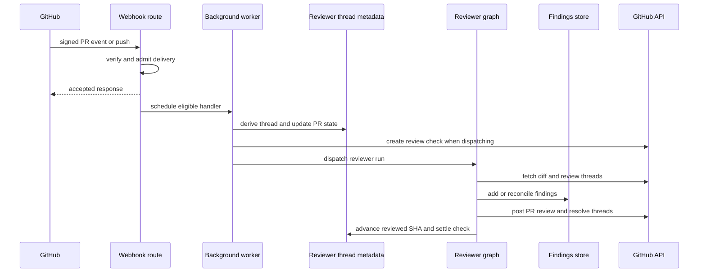
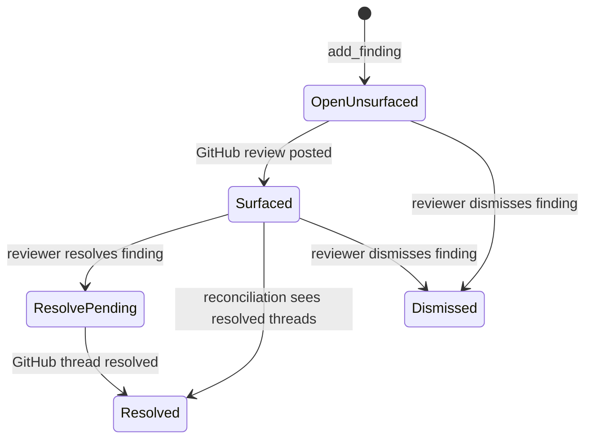

# Pull Request Review Workflow

Open SWE uses the dedicated `reviewer` graph to review a GitHub PR. The stable unit of continuity is one reviewer thread per PR: it carries operational state such as the current head, watch status, and check IDs, while the PR's evolving findings are persisted in PostgreSQL. A later push or a human reply reuses that identity rather than opening an unrelated review. See [Reviewer and Analyzer Architecture](../architecture/reviewer-and-analyzer.md), [Invocation Workflow](invocation.md), and [Scheduling and Baby-sit](scheduling-and-baby-sit.md) for adjacent behavior.

## Admission, authorization, and triggers

`POST /webhooks/github` is the signed ingress. It verifies `X-Hub-Signature-256` before parsing the payload, records the delivery, rejects events/actions it does not support, checks that a workspace owns the repository, and schedules accepted work as a FastAPI background task. A temporarily unreadable workspace assignment returns HTTP 503 so GitHub retries instead of silently losing work. The ordinary comment path also requires a registered Open SWE GitHub user; first-review and review-reply paths apply the public-repository organization gate.

Automatic review is an explicit repository opt-in, not an effect of installing the GitHub App. `opened` and `ready_for_review` PR events, and push events, are ignored unless the repository appears in the enabled-review-repositories record. The lookup intentionally fails closed: an unavailable store means no automatic review. Draft PRs add an author setting gate: an explicit `review_draft_prs` profile value wins, otherwise the workspace default applies.

There are four meaningful entrypoints:

- **Automatic first review:** `opened` or `ready_for_review` starts a reviewer run after the repository, organization, and draft gates. On `ready_for_review`, an existing review whose `last_reviewed_sha` already equals the head is not repeated.
- **Explicit request:** Slack's `request_pr_review` parses a PR URL and forwards the active Slack thread when present; the dashboard calls the same `trigger_pr_review_from_ref` entrypoint. That entrypoint fetches PR metadata, establishes the canonical thread and `watch=true`, posts an in-progress status comment, and dispatches the graph.
- **Watched push:** a branch push resolves the open PR and can dispatch a re-review only after the watched reviewer thread passes SHA and diff checks.
- **Review-thread reply:** a reply to an Open SWE inline finding is routed before generic mention processing, reconciled to its finding, then dispatched as a focused `finding_reply` run.

Reviewer credentials are GitHub App installation tokens. For a known public repository, `reviewer_token_for_repo` requests a token scoped to its repository ID (or name fallback); private or unknown-privacy repositories use the installation-token path. The reviewer preparation middleware acquires an installation token constrained to the configured repository and caches it for the thread's sandbox/proxy use.

This sequence shows the asynchronous path from an eligible GitHub delivery to reviewer publication; a trigger can stop at any admission or short-circuit gate.

## Canonical identity and durable state

`reviewer_thread_id(owner, repo, pr_number)` is UUIDv5 over `"{owner}/{repo}/pr/{pr_number}/reviewer"`. Webhooks, dashboard actions, and the reviewer independently derive it, so the formula is a persisted routing contract: changing it would orphan existing reviewer state.

The LangGraph thread is the owner of **operational** PR state: `kind="reviewer"`, PR identity, `head_sha`, `last_reviewed_sha`, `watch`, optional Slack origin, status-comment/check identifiers, and current run ID. Runs dispatch with `assistant_id="reviewer"`, which `langgraph.json` maps to `agent.graphs.reviewer:traced_reviewer_agent`.

Findings are now durable **PostgreSQL** records keyed by the pull request, with `pull_request_finding_state` linking that PR to its reviewer thread; interaction rows are stored with their finding. This lets a PR retain review history independently of sandbox lifetime. On first access, legacy findings in thread metadata are copied into those tables; legacy record shapes are normalized on read so old singular GitHub identities and nested `surface` fields become canonical comment/thread ID lists and a forward-only `surface_state`. A reviewer thread missing before that migration raises `ReviewerThreadMissingError`, and tools return a structured `thread_not_found` result that explicitly says not to retry.

Writes use a row-locked read-modify-write operation. It reads the freshest rows, persists only when a mutator changed data, and replacement merges by finding ID rather than dropping concurrently-added records. `append_finding` de-duplicates only against open findings by a fingerprint over location, side, and normalized description.

## Preparing a bounded review

Before the model runs, `PrepareReviewerRunMiddleware` obtains the token, creates or replaces the per-thread sandbox, checks out the target PR, and materializes a review diff. Initial review uses the PR diff; re-review derives its range from `last_reviewed_sha`. It computes changed lines by file and diff side and injects both the diff text and set into graph state. If checkout or diff preparation cannot be trusted, the system prompt tells the model not to trust the stale workspace.

The reviewer has finding, diff, reply/resolution, and publication tools rather than authoring tools. It is instructed to report concrete defects in changed code, not style-only, speculative, pre-existing, or out-of-diff observations. PR title/body and existing review-thread bodies are author-controlled: they are delimited as untrusted data, closing tags are neutralized, and the prompt says never to execute instructions embedded in them. Organization guidance, repository review style, base-ref `AGENTS.md` guidance, scoped guidance for changed files, and trusted skills can refine the review criteria.

`add_finding` normalizes a one-sided range, rejects default/empty generated titles and invalid severity, confidence, side, or reversed ranges, and checks the complete anchor against the changed-line set. An out-of-diff result is `success: false`, `in_diff: false`, with a do-not-retry instruction. A file-level finding without lines can pass that check, but it has no inline GitHub payload; suggestions over `MAX_SUGGESTION_LINES` (4) are discarded while the description-only finding remains.

## Finding lifecycle and publication

A finding starts `open` and `not_surfaced`; it retains severity, confidence, location/side, first-seen and last-confirmed SHAs, fingerprint, GitHub identity lists, interactions, and optional rank. `surface_state` moves forward through `not_surfaced`, `surfaced`, `resolve_pending`, and `resolved`; the business status can be `open`, `resolved`, or `dismissed`.

This is the finding lifecycle; reconciliation can backfill a surfaced finding and can finalize resolution after observing GitHub's thread state.

The model must submit a `ranking` containing every eligible candidate exactly once, in importance order. Publication selects open findings at or above the severity threshold (default `medium`) and uses that rank before fallback severity/file/line order; confidence is recorded but does not gate publication. The normal GitHub path surfaces only in-diff findings with an inline payload. Re-reviews further limit candidates to unsurfaced findings first seen at the live head, preventing duplicate comments.

`publish_review` reconciles existing GitHub threads before selection and resolves the effective head from thread metadata, because a push can update that metadata while the run retains frozen config. It posts one GitHub PR Review with a marked summary and marked inline comments (`path`, line/range, side, generated title, detail, and optional fenced suggestion). After GitHub accepts it, it records the review/comment identities in one findings mutation, backfills if necessary, and discovers GitHub thread IDs. This ordering protects later reconciliation and resolve-on-fix behavior from a partially stamped publication.

Publication has explicit failure semantics:

- Eval mode is dry-run: it records the selected IDs in metadata and posts nothing.
- An empty re-review with a known prior Open SWE summary does not post another summary, but still resolves fixed threads, advances `last_reviewed_sha`, clears status, and settles its check. A numeric `review_id` without `dry_run` or `skipped_empty_re_review` is the reliable signal that GitHub received a review.
- For a 422 unresolved inline anchor, it identifies invalid anchors from the current PR diff, drops them, and retries the remaining batch once. If it cannot safely retry, it returns `unresolvable_findings` and tells the agent to fix or resolve those records instead of blind retry.

## Watch, replies, and checks

Closing a PR turns off `watch`; reopening turns it on. Converting to draft turns it off only if the author's effective draft-review setting is disabled. A watched push stops if there is no reviewer thread, the flag is off, the new head equals `last_reviewed_sha`, or its normalized diff is unchanged. In the unchanged-diff case it advances `last_reviewed_sha` and creates then completes a fresh success check titled **No new changes to review**, because GitHub only displays checks on the current head.

For a changed push, the handler reconciles live review threads, refreshes PR/head metadata, creates an in-progress **Open SWE Review** check, and dispatches `re_review=True` with the prior reviewed SHA. The re-review prompt directs the graph to reassess existing findings, identify net-new findings, and publish. `ready_for_review` follows the same re-review mode if a prior reviewed SHA exists.

Reconciliation matches a live thread first through the hidden finding marker, then stored thread or comment identity. It backfills identity and marks findings surfaced; it stores the latest non-bot reply after the bot comment as an interaction requiring reassessment. A finding becomes resolved only when every matched terminal thread is actually resolved—outdated is terminal for waiting purposes but does not itself count as resolution. A reply webhook first reconciles, finds the parent-comment finding, appends its interaction, then dispatches `reviewer_event="finding_reply"`.

Automatic first-review and watched-push dispatches create a check and store `review_check_run_id`. `publish_review` computes the conclusion from surfaced findings and settles it, clearing that ID only after GitHub accepts the completion PATCH. On a transient completion failure it retains the ID and saves `review_check_pending_result`; after-agent middleware retries that true pending result. If a reviewer run ends without publication, the middleware completes the outstanding check as `neutral`, so a reviewer/sandbox/model failure is not represented as a code failure.

## Operations and focused tests

Enable automatic review in the enabled-review-repositories store; App installation alone is insufficient. If a check remains in progress, inspect the canonical reviewer thread's `review_check_run_id` and `review_check_pending_result`, then investigate GitHub token acquisition, sandbox preparation, and GitHub API access. A `thread_not_found` tool response is terminal for that run, not a retry instruction.

`tests/reviewer/` focuses on automatic PR/draft/token gating (`test_pr_ready_auto_review.py`), watched push and unchanged-diff behavior (`test_reviewer_watch.py`), PostgreSQL finding migration, locking, and lifecycle (`test_reviewer_findings.py`), finding-tool validation (`test_reviewer_tools.py`), reconciliation (`test_reviewer_reconcile.py`), and publication, retry, status/comment, and assessment paths (`test_reviewer_publish.py`).
