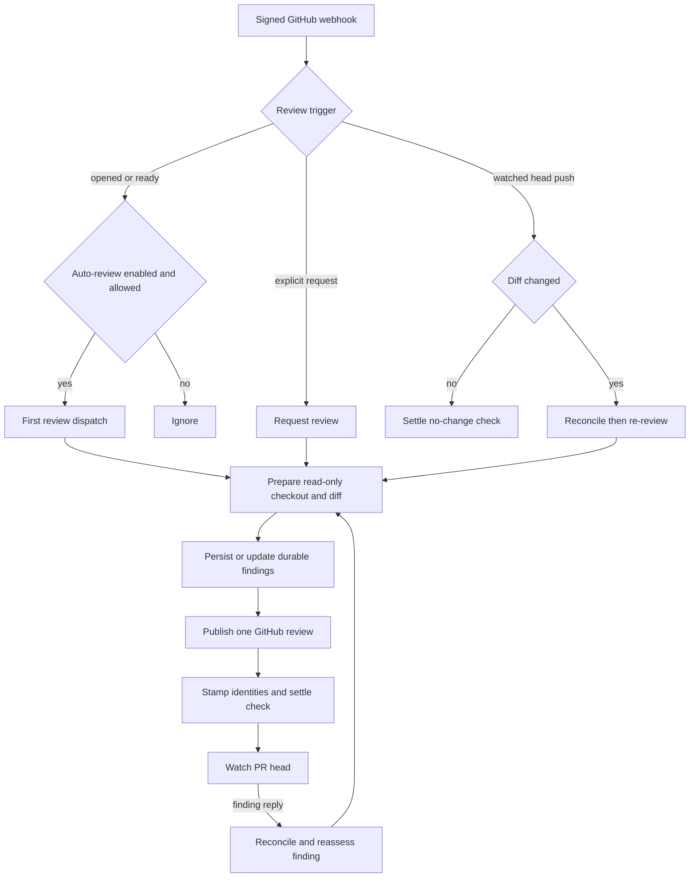

# Pull-request review lifecycle

Open SWE assigns a dedicated, **read-only** reviewer agent to one GitHub pull request (PR). A review is not a disposable sandbox session: the PR's canonical reviewer thread owns its durable metadata and evolving findings list, while a sandbox is only a replaceable checkout and analysis environment. The reviewer may inspect, fetch, and publish through its purpose-built tools; it must not commit, push, open a PR, or use `gh pr review` / `gh api .../reviews` directly.

Related: [Reviewer and analyzer architecture](../architecture/reviewer-and-analyzer.md), [Threads and state](../concepts/threads-and-state.md), [Dashboard UI](../integrations/dashboard-ui.md), [Invocation](invocation.md), and [Scheduling and baby-sit](scheduling-and-baby-sit.md).

## Lifecycle at a glance

The first-review, re-review, reply, publication, and GitHub reconciliation paths share one reviewer thread for a PR.

## Entry points and admission

`POST /webhooks/github` verifies the `X-Hub-Signature-256` HMAC before parsing a supported delivery and scheduling handlers as FastAPI background tasks. PR `opened` and `ready_for_review` deliveries schedule auto-review only for repositories in the enabled-review-repos list. That lookup deliberately fails soft: an unavailable settings store means *not opted in*, rather than failing the webhook. The route also applies the public-repository organization gate before scheduling first review; push deliveries are similarly auto-review gated.

A draft is not automatically reviewed unless its author's `review_draft_prs` setting, falling back to the team default, enables it. `ready_for_review` does not duplicate work when the existing reviewer metadata says the current head is already `last_reviewed_sha`; it re-enables watching instead.

An explicit request follows a separate path. The main agent's `request_pr_review` tool parses a GitHub PR URL and forwards the request, including the active Slack thread when available, to `trigger_pr_review_from_ref`. The dashboard re-review control calls that same trigger with `source="dashboard"`. The trigger fetches canonical PR metadata, obtains a suitably scoped GitHub App token, ensures the reviewer thread exists, stores PR metadata, enables `watch`, posts a transient “in progress” comment, and dispatches the reviewer graph.

## Thread identity and durable ownership

`reviewer_thread_id(owner, repo, pr_number)` derives a UUIDv5 from `"{owner}/{repo}/pr/{pr_number}/reviewer"`. Webhooks, the dashboard, and the reviewer independently derive that value, so all runs, pushes, and review-comment replies for a PR target the same thread. Treat this derivation as a persisted-data contract: changing it strands live reviewer state.

The metadata on that thread has `kind == "reviewer"` and holds the PR identity, current `head_sha`, `last_reviewed_sha`, `watch`, optional initiating Slack thread, active status-comment/check identifiers, current run id, and `findings`. It is the system of record for reviewer state. Findings are therefore durable thread metadata—not sandbox files or transient agent memory—and survive sandbox eviction, are accessible to webhook handlers, and can be queried through the LangGraph SDK.

All dispatched reviews use `assistant_id="reviewer"`, resolving to `agent.reviewer:traced_reviewer_agent`. Dispatch stores the active run id on the same metadata so later components can identify it.

## Read-only preparation and review context

Before the first model call, `PrepareReviewerRunMiddleware` obtains a sandbox for the reviewer thread and runs `prepare_review_repo`: it clone-or-fetches the repository, force-checks out the requested PR head, and verifies `HEAD`. A reused or unreachable reviewer sandbox may be replaced because it contains only re-derivable checkout state. If preparation fails, the run warns that local files may be stale and can still work from the fetched PR diff; it must not trust the checkout.

The preparation step materializes the review diff and a changed-line set. For a first review it uses the PR diff; for a re-review it computes the range from the previous reviewed SHA to the current head. It injects that context into tool state so anchors can be validated at creation time. It also fetches PR overview and existing review threads, reconciles stored findings, and presents externally supplied PR text and review comments as untrusted data in delimited prompt sections. Repository skills are copied from the **base SHA**, never the author-controlled PR head.

The reviewer tool set is deliberately narrow: `fetch_review_diff`, `add_finding`, `update_finding`, `list_findings`, `publish_review`, `resolve_finding_thread`, and `reply_to_finding_thread` (plus constrained information tools). The system prompt permits at most one partitioned reviewer subagent and reserves finding mutation and publishing for the parent. It requires concrete, in-diff defects rather than style, speculative, or pre-existing issues.

## Findings: one evolving list

A PR has one evolving list of `Finding` records in reviewer-thread metadata. A finding retains its location and diff status, severity and confidence, description and optional suggestion, lifecycle status (`open`, `resolved`, or `dismissed`), SHA history, a fingerprint, GitHub review/comment/thread identities, surface state, resolution notes, and human interactions. `coerce_finding` normalizes legacy singular GitHub identity fields and nested surface metadata to the canonical list-based fields on every read.

The storage layer protects this state from local concurrent mutations:

- `mutate_findings` locks, reads the latest list, and writes only when its mutator reports a change.
- `replace_findings` merges snapshots by finding id so an concurrently appended record is retained.
- `append_finding` de-duplicates against fingerprints of open findings.
- A missing reviewer thread becomes `ReviewerThreadMissingError`; tools return `thread_not_found` with an explicit do-not-retry instruction instead of treating missing storage as an empty list.

### Recording valid findings

`add_finding` normalizes a one-sided range, requires a non-default generated title, checks severity, confidence, and side enums, and rejects an inverted range. It verifies `start_line..end_line` against the changed-line set for the requested file and side. An out-of-diff anchor returns `success: false`, `in_diff: false`, and “Do not re-anchor or retry”; a file-level finding with both lines absent is accepted but cannot be an inline GitHub comment.

Suggestions over `MAX_SUGGESTION_LINES` (four) are removed while retaining the description-only finding. The tool resolves the live review head from thread metadata before constructing the finding, which protects a run whose originally frozen configuration has been overtaken by a push.

### Publication selection

`filter_findings_for_publish` selects only open findings at or above the supplied threshold (default `medium`), orders them by descending severity then file and line, and caps the result at `REVIEW_FINDING_CAP` (six). Severity is `low < medium < high < critical`. Confidence is captured for calibration, but is not a publication gate.

## Publishing and the GitHub boundary

The reviewer calls `publish_review` once after recording and reconciling findings. It first backfills identities from live GitHub review threads, then excludes previously published findings; on a re-review it further limits new publication to findings first seen at the live head. Only in-diff, eligible findings with a renderable line anchor become inline comments.

Those comments are submitted together as one REST GitHub PR Review (`event: "COMMENT"`) at the resolved head SHA. Each carries an embedded finding-id marker, generated title and description, optional `suggestion` fence, and path/line/side payload. The summary is host-rendered rather than agent-authored and includes an Open SWE summary marker; sub-threshold findings are counted as additional items for the web application. GitHub comment ids are recovered by that marker and recorded with the review id in one findings update, preventing ambiguous location/body matching and reducing surfaced-but-untracked records. The tool subsequently resolves threads for findings now marked `resolved` or `dismissed`, optionally posting their agent-provided note before the GraphQL resolution.

A mid-run push updates metadata before the older configuration can change. `publish_review` therefore prefers thread metadata's `head_sha` and advances `last_reviewed_sha` for the commit actually reviewed.

Important outcomes and failures:

- A GitHub 422 unresolved-anchor response triggers one tool-side revalidation. If identifiable invalid findings can be removed while valid ones remain, the request is retried once; otherwise the result names `unresolvable_findings` and tells the agent to update or resolve them rather than retry blindly.
- If an already reviewed PR has no new inline comments, the tool avoids another empty summary, but still resolves completed threads, advances `last_reviewed_sha`, clears the status comment, and settles the check. This is `skipped_empty_re_review` with `review_id: null`.
- Evaluation mode is a dry run: it records simulated selection metadata and advances the reviewed SHA, but posts nothing.
- `success: true` alone does not mean GitHub received a review. A real posted review requires a numeric `review_id` and neither `dry_run` nor `skipped_empty_re_review`.

## Watching, re-reviewing, and reconciling

Watch state follows PR lifecycle transitions. `closed` disables watch; `reopened` enables it; `converted_to_draft` disables it only when draft reviews are not enabled for the author. A push is considered only for a branch head that maps to an open PR with an existing watched reviewer thread. The handler returns without dispatch when the head equals `last_reviewed_sha`. When it can prove the PR diff has not changed, it advances `last_reviewed_sha` and creates and immediately completes a new “No new changes to review” check on the new head, because GitHub does not show the old head's check after a push.

For a changed diff, the push handler fetches live review threads and reconciles them, refreshes PR metadata and `head_sha`, creates a fresh in-progress check, and dispatches a `re_review=True` reviewer run. The re-review prompt directs the reviewer to resolve fixed findings with a complete reply note, update materially changed findings, add only net-new findings, and publish once.

`reconcile_findings_with_review_threads` is the bridge from GitHub back into durable state. It matches a finding by its marker first, then known thread or comment identity; backfills identities and marks it surfaced; captures the newest non-bot reply after the bot comment as an interaction needing reassessment; and moves an open finding to resolved only when all matched threads are terminal and resolved. It writes only if something changed.

A `pull_request_review_comment` reply with a parent comment id is routed even without an `@open-swe` mention. For a non-bot reply to a tracked Open SWE comment, the webhook reconciles first, locates the finding by parent comment id, records a `FindingInteraction` with `needs_reassessment`, and dispatches the reviewer with `reviewer_event="finding_reply"`. That run is scoped to reassessing the one finding: it may clarify with `reply_to_finding_thread`, or use the resolution path for a verified dismissal or fix.

## Check and status settlement

A first review or changed-diff re-review creates an in-progress **Open SWE Review** check for the current head and records `review_check_run_id` in thread metadata. `publish_review` clears the transient status comment and settles that check according to the number of surfaced comments. The check id is cleared only after a successful completion PATCH. On a transient failure, the intended conclusion, title, and summary are retained as `review_check_pending_result` so a retry preserves the real result.

The after-agent `settle_review_check_on_exit` middleware closes a still-open check when a reviewer run exits without publishing—for example after a crash, model limit, or sandbox failure. It reports neutral, not failure, because an incomplete review is infrastructure failure rather than evidence that the PR's code failed. If publication had succeeded but the check PATCH did not, it instead retries the stored pending result.

## Focused regression coverage

`tests/reviewer/` covers the behavior at the workflow seams: `test_pr_ready_auto_review.py` exercises first-review dispatch, draft gating, scoped tokens, and ready-head deduplication; `test_reviewer_watch.py` covers branch/deletion, watched-thread, unchanged-diff, and lifecycle-watch behavior. Findings schema, storage, and tools are covered by `test_reviewer_findings.py` and `test_reviewer_tools.py`; GitHub synchronization by `test_reconcile_sweep.py` and `test_reviewer_reconcile.py`; and the substantial publication, marker, retry, status-comment, and check behavior by `test_reviewer_publish.py`. `test_reviewer.py`, `test_reviewer_diff.py`, and `test_fetch_review_diff_tool.py` cover reviewer assembly and diff preparation.
