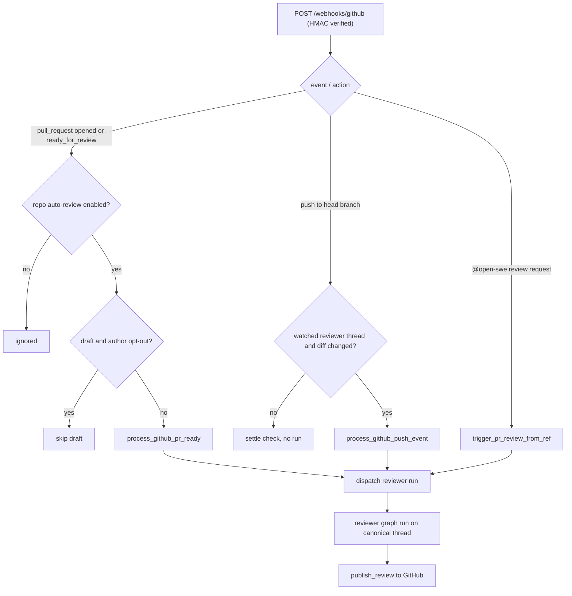
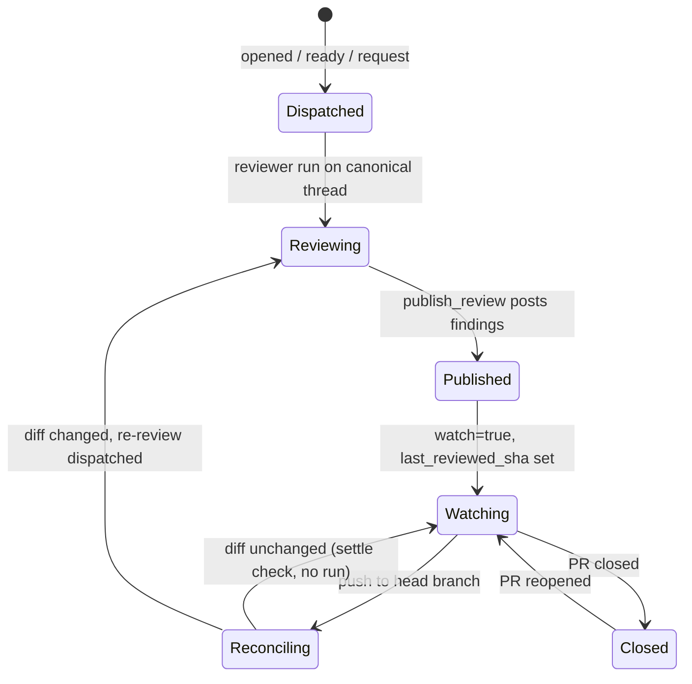

# PR Review Workflow

Open SWE runs a dedicated **reviewer agent** that reviews one GitHub pull
request per run, records findings as durable state, and publishes them as a
single GitHub PR Review. This page traces that lifecycle end to end: how a
webhook triggers a review, how the reviewer thread and its findings evolve
across pushes, and how findings surface on (and resolve off) GitHub.

Related pages: architecture/reviewer-and-analyzer (the reviewer graph and
analyzer internals), workflows/pr-creation (how Open SWE opens the PRs that
later get reviewed), and testing/overview (`tests/reviewer`).

## Triggers and routing

All GitHub deliveries land on a single signed endpoint that verifies the
`X-Hub-Signature-256` HMAC, rejects unsupported event types, and dispatches the
work as a FastAPI background task. Routing branches by event and action to the
matching handler in `agent/webhooks/github.py`.

The reviewer is triggered three ways:

1. **PR `opened` / `ready_for_review`** — auto-review, gated by a repo-level
   opt-in and (for drafts) an author-level opt-in.
2. **`@open-swe review <url>`** (or the dashboard "re-review" button, or the
   Slack `@open-swe review` command) — an explicit review request.
3. **`push` to a watched PR's head branch** — a re-review that reconciles
   existing findings against the new diff.


Trigger and routing paths that lead to a reviewer run.

### Auto-review opt-in

The webhook route only schedules the auto-review task for `opened` /
`ready_for_review` when `_is_repo_auto_review_enabled` returns true, which
delegates to `is_review_repo_enabled` — a repo must be explicitly opted into
the enabled-review-repos list. That lookup fails **soft**: if the backing store
is unreachable it reads as "not opted in" and the webhook skips the review
rather than 500ing. Draft PRs are additionally gated:
`process_github_pr_ready` skips a draft unless the PR author's
`review_draft_prs` profile flag (falling back to the team-wide default) is on.

### Explicit review requests

`request_pr_review(pr_url)` is an agent tool the main agent invokes only when a
user explicitly asks to review a PR; it parses the URL and calls
`trigger_pr_review_from_ref`. The same entrypoint backs the dashboard
`trigger_re_review` handler (`source="dashboard"`). It fetches PR metadata to
resolve base/head SHAs, sets reviewer thread metadata with `watch=True`, posts
a "review started" comment, and dispatches the run.

## The canonical reviewer thread

Every review of a given PR runs on one deterministic thread id:
`reviewer_thread_id(owner, repo, pr_number)` is a UUIDv5 over
`"{owner}/{repo}/pr/{pr_number}/reviewer"`. Webhooks, the dashboard, and the
reviewer all re-derive the same id from the same external identifiers, so a
push, a comment reply, and a dashboard fetch all address the same thread and
its accumulated findings. The formula is a persisted-data contract: changing it
would orphan every live reviewer thread.

The thread's metadata carries the review's durable state, keyed under
`kind == "reviewer"` (`REVIEWER_THREAD_KIND`): the PR identity
(`ReviewerPRMeta`), a `watch` flag, `head_sha`, `last_reviewed_sha`, an optional
originating Slack thread, an in-flight `review_check_run_id`, and the findings
list itself.

Every reviewer run is dispatched with `assistant_id="reviewer"`, which maps to
the `reviewer` graph (`agent.graphs.reviewer:traced_reviewer_agent`). The
webhook stores the dispatched run id on thread metadata so the dashboard and
later events can find the current run.

## The single-evolving-findings model

A PR has exactly one evolving findings list, persisted on the reviewer thread's
metadata under `findings` — not a fresh set per run. Thread metadata is chosen
deliberately: it survives sandbox eviction, is queryable cross-thread via the
LangGraph SDK, and matches how the codebase already persists durable non-secret
run state.

Each `Finding` records its severity, confidence, category, a generated title,
`file`/`start_line`/`end_line`/`side` anchor, `in_diff`, description, optional
suggestion, `status` (`open`/`resolved`/`dismissed`), the SHAs it was first
seen and last confirmed at, the GitHub identity it surfaced as
(`github_review_id`, comment/thread id lists), a forward-only `surface_state`,
human-reply bookkeeping, and a `fingerprint`. Reads pass through
`coerce_finding`, which folds legacy flat-singular and nested-`surface` records
into the canonical list-plus-`surface_state` shape so nothing outside the module
sees the old layout.

Writes go through a small storage layer. `mutate_findings` performs a locked
read-modify-write against the freshest persisted list and only writes when the
mutator reports a change, so a no-op never clobbers a concurrent update.
`replace_findings` merges an incoming snapshot by id rather than overwriting, so
a concurrently-added finding is not dropped. `append_finding` de-duplicates:
before appending it compares the new finding's fingerprint against every open
finding and returns the existing record instead of creating a duplicate. If the
reviewer thread does not exist, storage raises `ReviewerThreadMissingError` and
tools return a structured do-not-retry result (`thread_missing_tool_result`)
rather than looping.

## In-diff-only discipline and add_finding validation

Findings must anchor to lines the PR actually changed. `add_finding` validates
`start_line..end_line` against the diff line set for the file and side using
`is_range_in_diff`; when the anchor is not part of the diff it returns
`success: false` with `in_diff: false` and an explicit "do not re-anchor or
retry" message. The diff line set comes from the reviewer run's injected state
or config, or is fetched and computed on demand
(`compute_diff_line_set`/`fetch_pr_diff`). File-level findings (both lines
`None`) are accepted but do not render as inline comments. The reviewer system
prompt reinforces the same bar: a finding must anchor to a specific changed
line, name a concrete failure mode, and out-of-diff findings — even a proven
base-vs-head regression at an unchanged callsite — cannot be filed.

`add_finding` also normalizes and requires a non-default generated title,
validates severity/confidence/side enums, and clips suggestions over the
4-line cap (`MAX_SUGGESTION_LINES`) — dropping the suggestion but keeping the
description-only finding.

## Severity ladder and publish selection

Severity is ordered `low < medium < high < critical` (`SEVERITY_ORDER`).
`filter_findings_for_publish` selects the findings to surface: status must be
`open`, severity must be at or above the `severity_threshold` (default
`medium`), the result is sorted severity-descending then file/line for stable
ordering, and capped at `REVIEW_FINDING_CAP` (6) to avoid review spam.
Confidence is recorded on every finding for calibration but does **not** gate
publication.

## publish_review to GitHub

The reviewer calls `publish_review` once at the end of a run. It reads the
current findings, drops any already surfaced (those with a recorded comment id)
so a re-review only posts net-new findings, keeps only in-diff findings, and
runs them through `filter_findings_for_publish`. Eligible findings become inline
comments (each anchored to path + line + side, with a metadata marker and an
optional fenced ```suggestion``` block), posted as a single GitHub PR Review
whose body is a fixed host-formatted summary line — the agent never writes the
review prose.

`publish_review` resolves the effective head SHA from thread metadata (a push
that landed mid-run updates the live head there, ahead of the run's frozen
config), so the review anchors to and `last_reviewed_sha` advances to the commit
actually reviewed. After posting, it records the returned GitHub review id and
per-comment/thread ids back onto each finding in a single findings write (to
avoid a half-stamped surfaced-but-unrecorded state), resolves GitHub threads for
findings that just moved to `resolved`, and settles the review check run.

Failure and edge handling is explicit rather than silent:

- **Unresolved anchor (422):** if GitHub rejects the batch because a comment
  anchors outside the diff, `publish_review` drops just those findings, retries
  once, and returns `unresolvable_findings` so the agent resolves or fixes them
  instead of retrying byte-identical args.
- **Empty re-review:** with nothing new to surface and an existing Open SWE
  review summary already on the PR, it skips posting another summary (returns
  `skipped_empty_re_review: true`, `review_id: null`) but still resolves fixed
  threads and advances `last_reviewed_sha`.
- **Eval / benchmark mode:** publication is simulated as a `dry_run` and nothing
  is posted to GitHub.

The return contract is precise: `success: true` alone does not mean a review was
posted — only a numeric `review_id` with neither `skipped_empty_re_review` nor
`dry_run` set confirms a real GitHub Review.

## Review lifecycle and reconciliation across pushes


The review lifecycle: a first review begins watching; pushes reconcile and may
re-review.

### Watch toggling

`process_github_pr_close` toggles the `watch` flag on the reviewer thread as the
PR moves through close/reopen/draft transitions: `reopened` re-enables watch,
`closed` disables it, and `converted_to_draft` disables watch only when the
author's effective draft-review setting is off (otherwise watch stays on so
drafts still re-review on push).

### Push re-review and the settle check

`process_github_push_event` fires on any branch push, but only proceeds for a
watched reviewer thread whose PR head actually changed. It short-circuits when:
the head SHA equals the recorded `last_reviewed_sha`, or the thread is not
watching, or `_is_pr_diff_unchanged_since_last_review` proves the diff is
identical since the last review. In the diff-unchanged case it still advances
`last_reviewed_sha` and creates-then-settles a fresh "No new changes to review"
check on the new head — GitHub only shows checks on the current head, so the
old head's check would otherwise silently disappear.

When the diff has changed, the handler syncs GitHub review-thread state into
findings via `reconcile_findings_with_review_threads` (see below), refreshes PR
metadata, creates a new in-progress review check on the new head, and dispatches
a re-review run with `re_review=True` and a prompt instructing the reviewer to
reconcile existing findings against the new diff, add net-new findings, and call
`publish_review`. The `ready_for_review` first-review path applies the same
short-circuit: if `head_sha` is unchanged from an existing `last_reviewed_sha`
it re-enables watch and returns without a run.

### Findings reconciliation

`reconcile_findings_with_review_threads` is the watch-mode sweep that keeps
tracked findings in sync with the live GitHub review threads. It indexes the
PR's review threads by thread id, comment id, and the embedded Open SWE comment
marker, then for each finding: backfills the GitHub comment/thread identity and
marks it surfaced; syncs the latest human reply (recording it as an interaction
and flagging the finding for reassessment); and, once every GitHub thread for a
finding is resolved or outdated, moves the finding to `status=resolved` and
`surface_state=resolved`. It writes only when something changed. The same
reconciliation runs before a push re-review and when a human replies to an Open
SWE review comment.

### Human replies to findings

`process_github_review_finding_reply` routes a non-bot reply to an Open SWE
review comment back to the reviewer graph. It reconciles findings, matches the
parent comment id to a finding, records the reply as a `FindingInteraction`
flagged `needs_reassessment`, and dispatches a run
(`reviewer_event="finding_reply"`) so the reviewer can reassess and reply,
resolve, or dismiss.

### Settling a stale review check

The webhook creates an "Open SWE Review" GitHub check run when it dispatches a
review and stores its id in thread metadata. `settle_review_check_run` completes
it on publish. If a run ends without ever publishing (crash, model-call limit,
sandbox failure), the `settle_review_check_on_exit` after-agent middleware
closes the still-open check as **neutral** — an incomplete review is reviewer
infrastructure failing, not a code problem, so it must not show a red X. A
transient completion failure is retried: the intended conclusion is stashed in
`review_check_pending_result` so the retry reports the real result instead of
misreporting a published review as failed.

## Tests that matter

`tests/reviewer/` covers the behavior this page relies on: the
opened/ready_for_review auto-review handlers and their draft/opt-in gating
(`test_pr_ready_auto_review.py`), push watch and diff-unchanged short-circuits
(`test_reviewer_watch.py`), findings storage and in-diff validation
(`test_reviewer_findings.py`, `test_reviewer_tools.py`), the reconciliation
sweep (`test_reconcile_sweep.py`, `test_reviewer_reconcile.py`), and publish
selection and GitHub posting (`test_reviewer_publish.py`).
