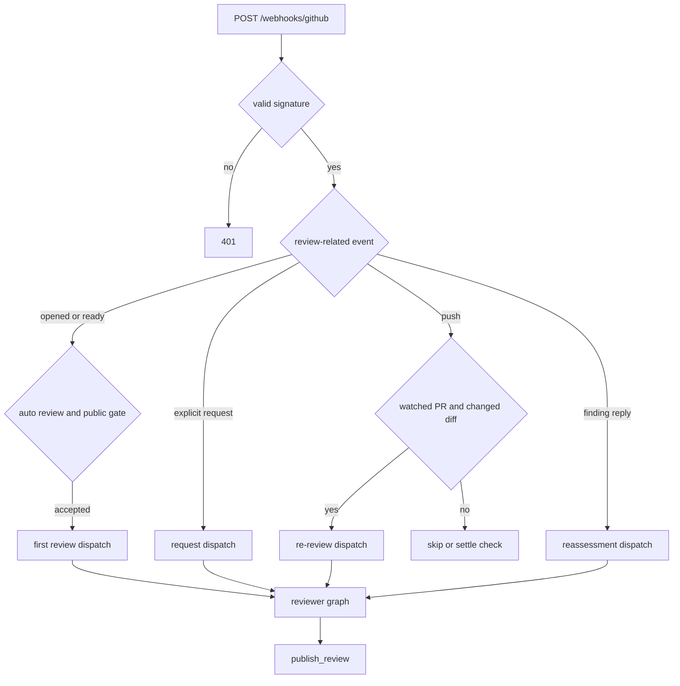
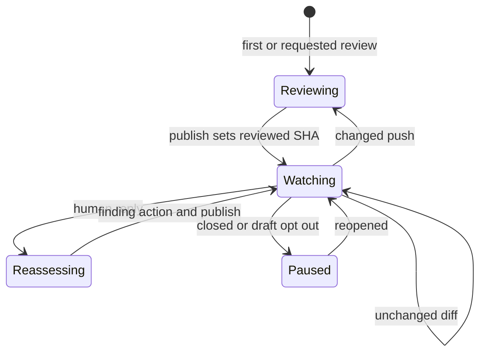

# Pull Request Review Workflow

Open SWE reviews a pull request through a dedicated `reviewer` graph. The graph is deliberately separate from the coding agent: it prepares a checkout and a diff for inspection, exposes finding and publication tools, and does not expose commit, push, or PR-creation tools. Durable PR-review state lives on one LangGraph reviewer thread, rather than in an evictable sandbox, so later pushes and human replies can continue the same review.

Related: [Reviewer and Analyzer Architecture](../architecture/reviewer-and-analyzer.md), [Auth and Security](../concepts/auth-and-security.md), [Threads and State](../concepts/threads-and-state.md), [PR Creation](pr-creation.md), and [Scheduling and Baby-sit](scheduling-and-baby-sit.md).

## Entry points and gates

`POST /webhooks/github` is the GitHub entry point. It verifies `X-Hub-Signature-256` before parsing the body, ignores unsupported event types/actions, and schedules accepted handlers as FastAPI background tasks. This keeps delivery acknowledgement independent of the potentially long reviewer run.

A reviewer run begins by one of these routes:

- **Automatic first review:** `pull_request` `opened` or `ready_for_review` is accepted only when the repository appears in the enabled-review-repositories store. That lookup fails closed for review purposes: if the store cannot be read, the webhook treats the repository as not opted in instead of failing the delivery. On public repositories, the public-repository organization gate is also enforced.
- **Drafts:** `process_github_pr_ready` declines a draft unless the author’s effective `review_draft_prs` setting enables draft review.
- **Explicit request:** a Slack/dashboard/GitHub request reaches `trigger_pr_review_from_ref`, which fetches current PR metadata, creates or locates the reviewer thread, turns on `watch`, posts a transient in-progress comment, and dispatches the reviewer.
- **A new head commit:** a `push` can trigger a watched PR re-review, after it resolves the pushed branch to an open PR.
- **A reply in a review thread:** a non-bot reply to an Open SWE inline comment is routed back to the reviewer to reassess that one finding.

This is the event-level routing; every accepted branch dispatches work asynchronously.

## Canonical reviewer thread and dispatch contract

The reviewer thread ID is deterministic: `reviewer_thread_id(owner, repo, pr_number)` uses UUIDv5 over `"{owner}/{repo}/pr/{pr_number}/reviewer"`. Webhook handlers, dashboard operations, and the reviewer independently derive this same ID. It is a persisted routing contract—changing its namespace or input format would leave existing PR state unreachable.

The thread metadata is marked `kind="reviewer"` and carries the PR identity, current `head_sha`, `last_reviewed_sha`, `watch`, optional originating Slack thread, transient status/check identifiers, and `findings`. Dispatches use `assistant_id="reviewer"`, mapped in `langgraph.json` to `agent.graphs.reviewer:traced_reviewer_agent`; the handler also stores the dispatched run ID in metadata.

## Reviewer preparation: checkout, diff, and trust boundaries

Before the model is called, `PrepareReviewerRunMiddleware` obtains a sandbox and prepares the target repository at the PR head. Reviewer sandboxes are replaceable because the canonical thread outlives a sandbox and the checkout is re-derived on every run. If a replacement sandbox is still unreachable, the run posts an infrastructure notification rather than silently inspecting stale files.

The reviewer is **read-only by design**. Its specialized tools include `fetch_review_diff`, `add_finding`, `update_finding`, `list_findings`, `publish_review`, `resolve_finding_thread`, and `reply_to_finding_thread`; it does not get coding-agent mutation tools. The system prompt directs it not to use `gh pr review` or GitHub review API commands itself.

`fetch_review_diff` materializes a deterministic patch file in the sandbox and returns only bounded metadata (path, byte count, changed files, range, cache flag), not the patch body. The agent reads that file through sandbox file tools. A first review uses the merge-base range `base...head`, matching GitHub’s PR view; a re-review uses `last_reviewed_sha..head_sha`, restricting attention to commits added since the prior review. Both refs must be Git SHAs. The patch path contains a digest of the range and is reused when cached.

The preparation stage also computes a per-file LEFT/RIGHT line set, fetches fresh title/body and current review threads, and loads conventions from the trusted base ref. PR title/body, historical review comments, and human replies are treated as untrusted GitHub data: they are wrapped/escaped before insertion into model context, and the prompt explicitly says not to follow instructions inside them. Existing threads are context for avoiding duplicate defects, including defects already raised by other reviewers.

## Findings: durable state with controlled mutation

A `Finding` is a durable record with an ID, severity/confidence/category/title/description, file and range/side anchor, source SHAs, optional short suggestion and hunk, status (`open`, `resolved`, or `dismissed`), GitHub review/comment/thread identities, forward-only surface state, and interactions. It is stored in the canonical reviewer thread’s `findings` list. Reads normalize older records—flat singular GitHub identity fields and nested `surface` data become canonical identity lists plus `surface_state`—so callers do not need legacy handling.

The storage layer serializes local read-modify-write operations per thread. `mutate_findings` fetches the latest list and persists only when its mutator changed it; `replace_findings` merges by finding ID so an incoming snapshot does not discard a concurrently added record. `append_finding` fingerprints open findings and returns the existing one for a duplicate. A missing reviewer thread is converted to `ReviewerThreadMissingError`; tools return `thread_not_found` with an explicit do-not-retry instruction rather than burning the run on retries.

### Adding and updating a finding

`add_finding` validates severity, confidence, side, title, and line ordering. A title must be a non-default generated headline. A single supplied endpoint is normalized to a one-line range. Suggestions longer than `MAX_SUGGESTION_LINES` (4) are discarded while preserving the description-only finding.

Inline findings are constrained to the PR diff. `is_range_in_diff` requires every selected line to be present for the file and selected `LEFT` or `RIGHT` side. An invalid range returns `success: false`, `in_diff: false`, and a do-not-re-anchor/retry message. File-level findings (both line values `None`) are accepted by storage but cannot become inline GitHub comments. The tool uses preparation-injected diff state when present; otherwise it can fetch GitHub’s unified PR diff and compute the line set. It also stores the overlapping hunk when available.

On re-review, `update_finding` revises a finding or marks it `resolved`/`dismissed`. A terminal change requires a nonempty `note`, because that text is the complete human-facing GitHub reply. If the finding was already surfaced, terminal `update_finding` delegates to `resolve_finding_thread`; it does not first mark the durable record closed and risk claiming success when GitHub resolution failed.

## Publication and check completion

`publish_review` selects only open, in-diff, unpublished findings at or above its severity threshold (default `medium`). Severity sorts `low < medium < high < critical`; selection is severity-descending then file/line and capped at `REVIEW_FINDING_CAP` (6). Confidence is recorded for calibration but is not a publication gate. Re-reviews further limit publication to findings first seen at the live head, preventing old findings from being reposted.

Each selected anchor is rendered as an inline GitHub Review comment (`path`, `line`, `side`, and range start where applicable), with a hidden finding marker and an optional fenced `suggestion` block. The tool submits one REST PR Review whose summary is host-generated and stamped with a hidden summary marker. It obtains and records the review ID and per-comment identities in a consolidated write; it then backfills review-thread IDs as needed. This identity is what lets future reconciliation and resolution find the original GitHub thread.

The effective head comes from thread metadata in preference to a run’s frozen configuration. Thus a push queued into an active run cannot make publication anchor to the old head. After a successful or empty completion, publication updates `last_reviewed_sha`, clears the transient review-started comment, and settles the GitHub check.

Important outcomes:

- A GitHub unresolved-anchor `422` causes a one-time revalidation against the PR diff. The tool drops identifiable bad anchors and retries once; it returns `unresolvable_findings` for the agent to repair or resolve rather than retry identical input.
- If nothing is new and Open SWE has already reviewed the PR, it suppresses another empty summary but still resolves newly fixed threads and advances `last_reviewed_sha`. The returned `skipped_empty_re_review: true` and `review_id: null` mean no review was posted.
- Evaluation mode is a dry run: it records the selected IDs/threshold/cap in metadata and advances the reviewed SHA but posts nothing. A real GitHub review is confirmed only by a numeric `review_id` with neither `dry_run` nor `skipped_empty_re_review`.

When dispatching a first review or re-review, the webhook creates an in-progress **Open SWE Review** GitHub check and stores `review_check_run_id`. `settle_review_check_run` clears that ID only after a successful completion PATCH. On a transient PATCH failure it retains the ID and saves the intended result as `review_check_pending_result`. The after-agent middleware uses that pending result on retry; if no publish happened, it concludes the check `neutral`, not failure, because a crashed/limited/sandbox-failed reviewer is infrastructure failure rather than a PR defect.

## Watch mode, re-review, and human replies

The durable thread remains the state owner through pushes, closures, and conversations.

`watch` is enabled when a review starts. A close disables it; reopening enables it. Converting to draft disables it only if the author’s effective draft-review setting is off.

For a branch push, the handler requires an opted-in repository, an open PR for the branch, a reviewer thread, `watch=true`, and a head different from `last_reviewed_sha`. If the PR diff is unchanged since the prior review, it advances `last_reviewed_sha` and creates then completes a new-head check titled “No new changes to review”; checks belong to a commit, so the old-head check would otherwise disappear. If changed, it reconciles live GitHub threads, refreshes thread metadata, creates a new in-progress check, and dispatches `re_review=True` with instructions to reconcile existing findings and add only net-new ones. `ready_for_review` has the analogous same-head short circuit.

Reconciliation indexes GitHub review threads by thread ID, comment ID, and Open SWE’s embedded marker. It backfills publication identity, marks findings surfaced, captures a latest non-bot reply as a `FindingInteraction` flagged `needs_reassessment`, and marks an open finding resolved only when all matching threads are resolved (outdated alone does not make it resolved). It writes only if data changed.

A reply webhook first reconciles, finds the parent comment’s tracked finding, records the human interaction, and dispatches the reviewer with `reviewer_event="finding_reply"`. The reviewer reassesses only that finding. It can use `resolve_finding_thread` for a verified invalid finding (`dismissed`) or `update_finding(..., status="resolved")` for a code fix. In either case the required note is posted verbatim to every unresolved associated GitHub thread before GraphQL `resolveReviewThread`; partial completion leaves `surface_state="resolve_pending"` rather than falsely declaring completion. `reply_to_finding_thread` is reserved for direct questions or concise clarifications, not terminal resolution.

## Focused test coverage

`tests/reviewer/` exercises the contracts rather than just rendering: `test_pr_ready_auto_review.py` covers automatic/draft gating, `test_reviewer_watch.py` covers watched push branches and unchanged-diff behavior, and `test_fetch_review_diff_tool.py` plus `test_reviewer_diff.py` cover bounded diff materialization, merge-base/incremental ranges, parser line sets, and LEFT-side anchors. `test_reviewer_findings.py` and `test_reviewer_tools.py` cover durable mutation and validation; `test_reviewer_publish.py` covers selection, publication, retries, check/status handling, and return semantics; `test_reviewer_reconcile.py` and `test_reconcile_sweep.py` cover reconciliation. Additional focused suites cover graph configuration, review API/chat, grouping, outcomes, trace context, and style synchronization.
