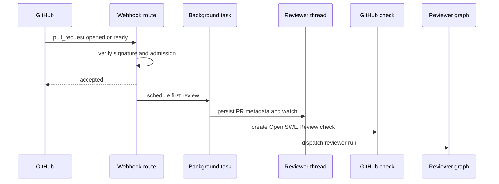
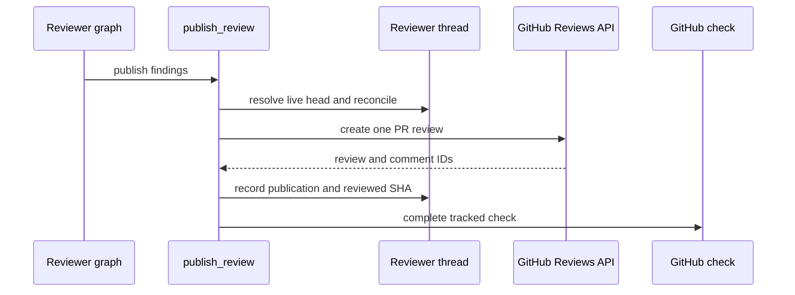
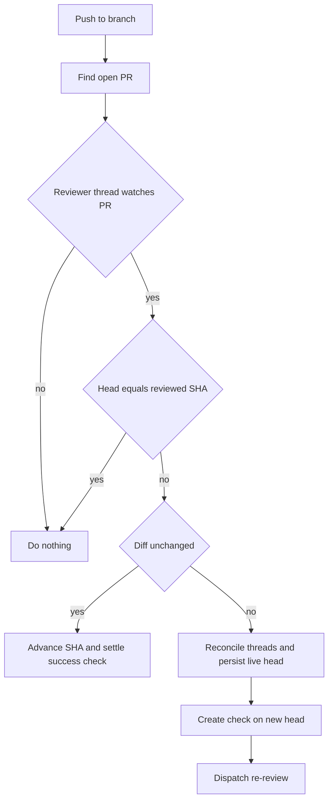
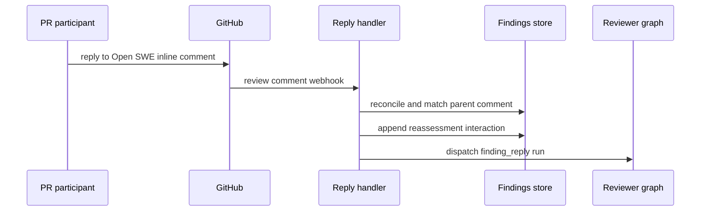
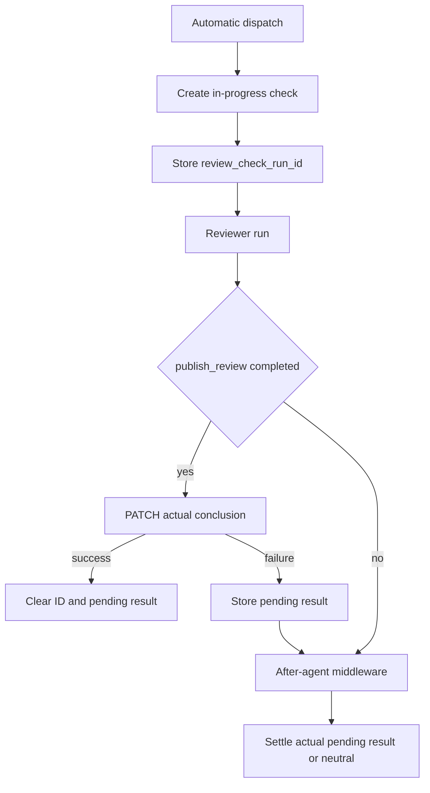

# Pull Request Review and Re-review

Open SWE treats review as a durable, per-pull-request workflow rather than a sequence of unrelated agent runs. GitHub automation, an explicit Slack request, pushes, and replies all address the same reviewer thread and its persisted findings. This page covers that workflow; see [Reviewer and Analyzer Architecture](../architecture/reviewer-and-analyzer.md), [Invocation Workflow](invocation.md), and [Scheduling and Baby-sit](scheduling-and-baby-sit.md) for adjacent concerns.

## Admission and initial review

`POST /webhooks/github` is the signed GitHub ingress. It rejects an invalid `X-Hub-Signature-256`, ignores unsupported events and PR actions, parses the payload, and uses FastAPI background tasks for accepted work. Thus the delivery is acknowledged independently of the potentially long reviewer run. First-review events (`opened` and `ready_for_review`) and push events are additionally opt-in: `is_repo_auto_review_enabled` delegates to the enabled-review repository store, where an absent repository—or an unavailable store—means disabled. The first-review and finding-reply routes also apply the configured public-repository organization gate.

A draft is only automatically reviewed if `draft_review_enabled_for_author` resolves true. A boolean profile override for the PR author wins; otherwise the team-wide `review_draft_prs` default applies (false by default). This same effective setting determines whether converting an already-watched PR to draft turns watch off.

This is the automatic initial-review path after signature, repository, and draft admission gates.

An explicit request enters through `request_pr_review`, which validates a GitHub PR URL and preserves an active Slack thread when one is available. Its shared `trigger_pr_review_from_ref` implementation obtains a GitHub App token, fetches PR metadata and base/head SHAs, creates the canonical thread if necessary, persists `watch=True` and the Slack origin, posts a transient in-progress PR comment, then dispatches the `reviewer` assistant. An unavailable token, metadata, SHA, or thread is an explicit failure rather than a partially configured review.

## Canonical state and execution preparation

`reviewer_thread_id(owner, repo, pr_number)` is a UUIDv5 over `"{owner}/{repo}/pr/{pr_number}/reviewer"`. Webhook handlers and review callers re-derive it, so the formula is a persisted routing contract: changing it would strand existing thread metadata. The metadata is the durable owner for PR identity, `watch`, `head_sha`, `last_reviewed_sha`, check/status-comment identifiers, the current run ID, optional Slack origin, and `findings`. It survives a replaceable sandbox and is queryable through LangGraph. `assistant_id="reviewer"` resolves through `langgraph.json` to `agent.graphs.reviewer:traced_reviewer_agent`.

Before the model runs, `PrepareReviewerRunMiddleware` gets and caches the GitHub token for the thread, provisions a sandbox with replacement permitted when it is unreachable, and calls `prepare_review_repo`. It materializes the full PR diff for an initial review or the calculated range from `last_reviewed_sha` for a re-review, then computes the per-file/per-side changed-line set. The middleware also loads PR overview, current review threads, persisted findings, review guidance, and scoped repository instructions. A sandbox replacement failure is surfaced as a notification and terminates preparation; an inability to load existing threads only removes that context and lets the review continue.

The reviewer graph exposes review tools—`fetch_review_diff`, finding management, thread reply/resolution, and `publish_review`—and an isolated reviewer subagent. Its preparation and prompt context are designed to ground reports in the supplied diff and existing review state rather than treat PR-provided prose as trusted instructions.

## Findings: durable records with anchor guards

Findings are stored as one evolving list in the reviewer thread metadata. Each record includes a fingerprint, location and side, severity/confidence, lifecycle status, first/last-seen SHAs, publication IDs, surface state, and interactions. Reads pass through `coerce_finding`, which migrates legacy singular GitHub identities and nested `surface` values to canonical ID lists and a forward-only `surface_state`.

Writes are protected by a per-thread/event-loop lock. `mutate_findings` reads the latest list and persists only a real change, while `replace_findings` merges snapshots by ID so a concurrent addition is retained. `append_finding` de-duplicates against open findings by fingerprint. If the backing thread is gone, the storage layer raises `ReviewerThreadMissingError`; tool wrappers return `thread_not_found` with an explicit do-not-retry instruction instead of consuming the run on blind retries.

`add_finding` requires a non-default generated title, valid severity/confidence/side values, and a nondecreasing range. It normalizes a one-sided range to a single line and validates the anchor against the changed-line set when one is available. An invalid anchor returns `success: false`, `in_diff: false`, and a do-not-retry message. File-level records (no line) can be stored but cannot become GitHub inline comments. Suggestions longer than `MAX_SUGGESTION_LINES` (4) are dropped while the description-only finding remains.

## Publication and check outcome

Publication considers only open, in-diff, unpublished findings. It uses the requested threshold (default `medium`) and orders `critical`, `high`, `medium`, then `low`, breaking ties by file and line; confidence is recorded but does not filter publication. Normal GitHub publication is uncapped. Evaluation dry runs instead use `REVIEW_FINDING_CAP` (6 by default unless configured) and store their intended publication without calling GitHub. For a re-review, only unpublished findings first seen at the live head are eligible, preventing duplicate comments.

`publish_review` resolves that live head from metadata before publishing because a push may update `head_sha` while a run still has frozen configuration. It first reconciles live PR threads, then sends eligible anchors in one GitHub PR Review. Each inline comment has `path`, line/side information, a hidden finding-ID marker, title/detail, and an optional fenced suggestion; the fixed summary body has its own marker. After GitHub responds, the tool stamps review and comment identities onto findings in a consolidated update and backfills thread IDs as needed. This identity makes later reconciliation and resolution target the right GitHub thread.

An empty review is not always an error: if a prior Open SWE review is known, an empty re-review skips a duplicate summary but resolves fixed threads, advances `last_reviewed_sha`, clears any tracked in-progress comment, and settles the check. In eval mode, publication is a dry run. For a GitHub unresolved-anchor response, the tool identifies invalid findings from a freshly fetched diff, retries the remaining batch once, and otherwise returns `unresolvable_findings` with a fix-or-resolve hint.

This shows the successful publication path; empty re-reviews and retryable anchor failures take guarded alternatives.

## Watched pushes and diff guards

A successful or explicitly requested review sets `watch=True`; `closed` clears it, `reopened` restores it, and `converted_to_draft` clears it only if effective draft review is disabled. A push first must name a nondeleted branch in an enabled repository, resolve to an open PR, and find a watched canonical reviewer thread. It is ignored if its resolved head equals `last_reviewed_sha`.

This watched-push flow avoids paying for a review when the PR's effective diff did not change.

When the compare diff is provably unchanged, the handler advances `last_reviewed_sha` and creates then completes a success check titled **No new changes to review** on the new head. GitHub only displays checks for the current head, so this keeps the prior review visible without dispatching the graph. When changed, it reconciles findings opportunistically, persists refreshed PR data and `head_sha`, creates an in-progress **Open SWE Review** check on the new commit, and dispatches `re_review=True` with the previous reviewed SHA. The re-review prompt directs the agent to reconcile existing findings, add net-new findings, and call `publish_review`. `ready_for_review` similarly skips duplicate work if the current head was already reviewed and otherwise becomes a re-review if a previous SHA exists.

## Feedback and finding resolution

A `pull_request_review_comment` that is a reply is routed before normal @open-swe mention handling. The handler ignores bot replies, requires the canonical reviewer thread, fetches and reconciles GitHub review threads, maps the parent comment to a tracked finding, records a `human_reply` interaction with `needs_reassessment=True`, and dispatches a focused reviewer run with `reviewer_event="finding_reply"`.

This feedback path preserves the existing finding rather than opening a separate review conversation.

`reconcile_findings_with_review_threads` matches a finding first by its embedded marker, then by stored thread or comment identity. It backfills publication identity and marks the finding surfaced; captures only the latest non-bot reply after the bot comment and marks it for reassessment; and changes an open finding to resolved only when every matched GitHub thread is actually resolved. An outdated thread is terminal but is not evidence of resolution. The reconciler writes only if state changed.

## Check settlement and operations

Automatic first-review and changed-push dispatches create an in-progress **Open SWE Review** check and persist `review_check_run_id`. `publish_review` settles it using the surfaced finding count. It clears the ID only after GitHub accepts the completion PATCH; a failed PATCH preserves the ID and stores the intended `review_check_pending_result` for retry.

This settlement path prevents a check from remaining in progress after a publication or an incomplete run.

The after-agent `settle_review_check_on_exit` middleware runs on the reviewer graph. If a check is still tracked, it uses a pending real result when available; otherwise it completes the check as `neutral` with **Review did not complete**. This distinguishes reviewer infrastructure failures (model limits, crash, sandbox failure) from a code failure. Operators investigating a stuck or missing result should inspect reviewer-thread metadata for `review_check_run_id` and `review_check_pending_result`, then validate GitHub App token availability and sandbox preparation. Enabling the App alone does not opt a repository into automatic review.

Focused tests cover first-review gates, watched-push deletion/watch/head/diff guards and new-head check behavior, token scoping for public and private repositories, finding persistence and tool validation, reconciliation, and publication outcomes in `tests/reviewer/`.
