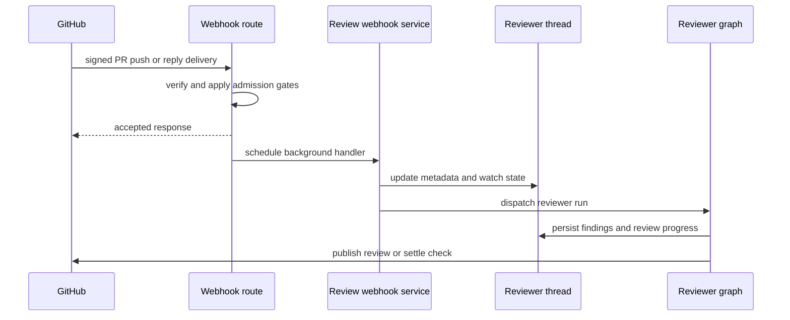
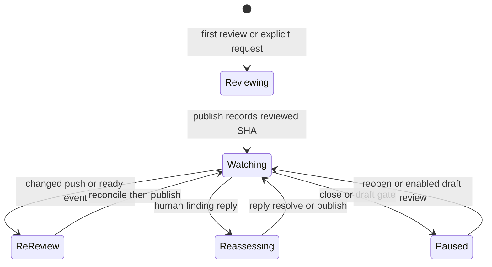

# Pull Request Review and Re-review

Open SWE runs pull-request review through the dedicated `reviewer` graph. A PR has one durable reviewer thread and an evolving findings list, so a push or a reply returns to the same review state rather than starting an unrelated review. For the graph architecture, security model, and general invocation paths, see [Reviewer and Analyzer Architecture](../architecture/reviewer-and-analyzer.md), [Auth and Security](../concepts/auth-and-security.md), [Threads and State](../concepts/threads-and-state.md), and [Invocation Workflow](invocation.md).

## Admission and dispatch

`POST /webhooks/github` is the signed asynchronous ingress: it verifies `X-Hub-Signature-256`, rejects malformed JSON, ignores unsupported event types or PR actions, and adds accepted handlers as FastAPI background tasks. First-review and finding-reply routes also apply the public-repository organization gate. The immediate webhook response therefore reports acceptance or rejection rather than waiting for model execution.

Reviews enter through four routes:

- **Automatic first review.** `pull_request` `opened` and `ready_for_review` actions require automatic review to be enabled for the repository. The enabled-repositories store is deny-by-default and deliberately fails soft: a lookup failure skips the review rather than failing the webhook. Draft PRs require the author's effective `review_draft_prs` setting, falling back to the team setting.
- **Explicit request.** The `request_pr_review` tool parses a GitHub PR URL, retains the active Slack thread when available, and calls `trigger_pr_review_from_ref`; the dashboard uses the same trigger. It obtains PR metadata and a suitably scoped reviewer token, creates the canonical thread if necessary, records PR metadata, live `head_sha`, and `watch=True`, posts an in-progress status comment, then dispatches the reviewer.
- **Push re-review.** A branch push is eligible only for an open PR with an existing canonical reviewer thread whose `watch` flag is true.
- **Finding-thread reply.** A reply to an Open SWE inline review comment is routed before normal mention processing. A non-bot reply triggers a focused reviewer reassessment without requiring an `@open-swe` mention.

This sequence shows why webhook acceptance is not evidence that a review has completed.

All dispatches use `assistant_id="reviewer"`, mapped to `agent.graphs.reviewer:traced_reviewer_agent`, and store the resulting run ID in thread metadata. The review graph has review-oriented tools—such as `fetch_review_diff`, finding lifecycle tools, thread reply/resolution tools, and `publish_review`—rather than code-authoring tools.

## Canonical state and finding records

`reviewer_thread_id(owner, repo, pr_number)` is UUIDv5 over `"{owner}/{repo}/pr/{pr_number}/reviewer"`. Webhooks, the dashboard, and the reviewer independently derive that identifier; it is consequently a persisted-data and routing contract, not an implementation detail that can be changed without orphaning live PR state.

LangGraph metadata on that thread is the durable state owner. It is tagged `kind="reviewer"` and includes PR identity, `head_sha`, `last_reviewed_sha`, `watch`, optional Slack origin, in-progress status/check IDs, current run ID, and `findings`. This choice lets state survive sandbox replacement and remain queryable across threads.

A finding includes its file, line range and side, severity and confidence, title/description, fingerprint, status (`open`, `resolved`, or `dismissed`), first/last-seen SHAs, publication identities, surface state, and interactions. Reads pass through `coerce_finding`, which converts legacy singular GitHub IDs and nested `surface` data into canonical ID lists and `surface_state`; consumers therefore do not need legacy-shape branches.

Finding writes use a per-thread/event-loop lock and fresh read-modify-write cycle. `mutate_findings` persists only an actual mutation, `replace_findings` merges by finding ID so a concurrent addition is retained, and `append_finding` de-duplicates an open finding by fingerprint. A missing backing thread raises `ReviewerThreadMissingError`; tool wrappers return the structured `thread_not_found` result with an explicit do-not-retry instruction instead of wasting the run on retries.

## Preparing a grounded review

Before the model is called, `PrepareReviewerRunMiddleware` obtains a GitHub App token, prepares the per-thread sandbox and checkout, and permits replacement of an unreachable sandbox because reviewer threads outlive their disposable workspaces. It materializes the first-review PR diff or, for a re-review with `last_reviewed_sha`, the incremental range. It also computes the per-file, per-side changed-line set and injects it with the diff for local anchor validation. If diff materialization fails, it can fall back to the fetched PR diff; if there is no usable diff it supplies no line set rather than pretending an anchor was verified.

The prompt asks for concrete defects introduced by changed lines and rejects style-only, speculative, pre-existing, and out-of-diff reports. It supplies organization guidance, learned repository style, and base-branch `AGENTS.md`/`CLAUDE.md` conventions where available; scoped instructions apply only beneath their directory and deeper instructions win. PR title/body and existing review-thread bodies are author-controlled, so they are delimited as untrusted data, sanitized to prevent wrapper escape, and explicitly not treated as instructions.

`add_finding` normalizes a one-ended line range, requires a non-default generated title, validates severity, confidence, side, and range ordering, and checks an anchor against the changed-line set when one is available. An out-of-diff range returns `success: false`, `in_diff: false`, and a do-not-retry message. A file-level finding is accepted but has no inline-comment payload. Suggestions exceeding `MAX_SUGGESTION_LINES` (4) are dropped while retaining the description-only finding.

## Selection, publication, and settlement

Severity ordering is `low < medium < high < critical`. Publication selects open, in-diff findings meeting the requested threshold (default `medium`) and sorts them by descending severity, file, and line. Confidence is retained for calibration but is not a publication gate. Production publication has no fixed six-finding cap; the `REVIEW_FINDING_CAP` value of 6 is the default cap for evaluation dry runs when the evaluation configuration provides none.

Before selecting output, `publish_review` uses the live `head_sha` from thread metadata in preference to the frozen run configuration, which handles a push arriving while a run is in flight. It backfills state from live PR review threads. A re-review selects only unpublished findings first seen at that live head, preventing duplicate inline comments for an older finding.

A normal publish posts one GitHub PR Review at that commit. Each eligible anchored finding becomes an inline comment containing a hidden finding marker, severity/title/detail, line reference, feedback request, and optionally a fenced `suggestion`; a host-formatted summary carries its own marker and optional web/trace links. After GitHub accepts the review, the system records review, comment, and thread identities onto findings before resolving fixed threads, so later reconciliation can locate what was surfaced. The transient in-progress status comment is deleted on successful publication paths; first reviews may also post a Slack completion reply.

An empty output does not always mean a new review is posted. Evaluation is a dry run that records selected IDs/`last_reviewed_sha` in metadata and makes no GitHub call. If an Open SWE review already exists, an empty re-review skips a duplicate summary while still resolving fixed threads, advancing `last_reviewed_sha`, clearing status, and settling its check. Only a numeric `review_id` with neither `dry_run` nor `skipped_empty_re_review` denotes a newly posted GitHub review. A GitHub 401 invalidates the cached token and asks for re-authentication. For a 422 unresolved anchor, the tool identifies invalid anchors against the diff, drops those findings, and retries the remaining batch once; otherwise it returns `unresolvable_findings` and directs the reviewer to correct or resolve the findings.

## Re-review and feedback lifecycle

This state model captures durable watch and finding state, while individual reviewer runs remain asynchronous.

PR lifecycle actions change watch state on an existing reviewer thread: `closed` disables it, `reopened` enables it, and `converted_to_draft` disables it only if the author's effective draft-review setting is off. On `ready_for_review`, an already reviewed matching head does not dispatch again; otherwise a prior reviewed SHA turns the run into a re-review and its prompt tells the agent to reconcile existing findings and add only net-new ones.

A watched push is also gated by repository opt-in, a valid non-deletion branch ref, an open PR for that branch, an available token, and a changed head. It short-circuits if `head_sha == last_reviewed_sha`. If GitHub comparison proves the diff unchanged, it advances `last_reviewed_sha` and creates then completes a success check titled **No new changes to review** on the new head. This preserves visible check feedback because GitHub displays checks only for the current head. Otherwise it attempts reconciliation, updates PR/live-head metadata, creates an in-progress **Open SWE Review** check, and dispatches with `re_review=True` and the preceding SHA.

Reconciliation matches a finding to a live GitHub review thread first by the hidden finding marker, then by saved thread or comment identity. It backfills identity and surface state, stores the latest non-bot reply after the bot comment as a `FindingInteraction` requiring reassessment, and marks an open finding resolved only if every matched thread is resolved. Outdated threads are terminal but do not satisfy that resolved condition. It writes state only when it changed.

The reply handler first reconciles, finds the finding owning the parent comment ID, appends the reply interaction, and dispatches with `reviewer_event="finding_reply"`. The focused prompt gets the existing findings and thread context, allowing the reviewer to assess the response and use the finding-thread reply or resolution tools.

Automatic first-review and push paths create an **Open SWE Review** check and save `review_check_run_id`. `publish_review` settles it and clears that ID only after a successful GitHub completion PATCH; a failed PATCH retains the ID and persists the intended result as `review_check_pending_result`. The `settle_review_check_on_exit` after-agent middleware retries that real result when one is pending. If a run ends without publication, it instead closes the still-open check as `neutral`, because an incomplete review is infrastructure failure rather than a PR code failure.

## Operations and focused tests

Enable automatic review explicitly in the enabled-review-repositories store; GitHub App installation alone does not opt every repository in. For a review that appears stuck, inspect canonical thread metadata—especially `head_sha`, `last_reviewed_sha`, `watch`, `review_check_run_id`, `review_check_pending_result`, and `status_comment_id`—as well as token availability and sandbox preparation. Treat a `thread_not_found` tool result as terminal for that run.

Focused tests cover PR opening/draft/token behavior in `tests/reviewer/test_pr_ready_auto_review.py`; push watch, unchanged-diff, metadata, and check behavior in `tests/reviewer/test_reviewer_watch.py`; finding persistence and validation in `test_reviewer_findings.py` and `test_reviewer_tools.py`; reconciliation in `test_reviewer_reconcile.py`; and publication rendering, retry, status, and outcomes in `test_reviewer_publish.py`.
