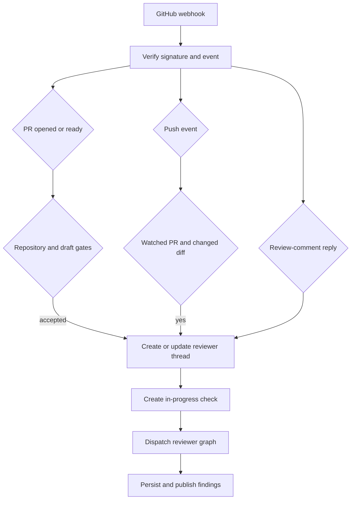
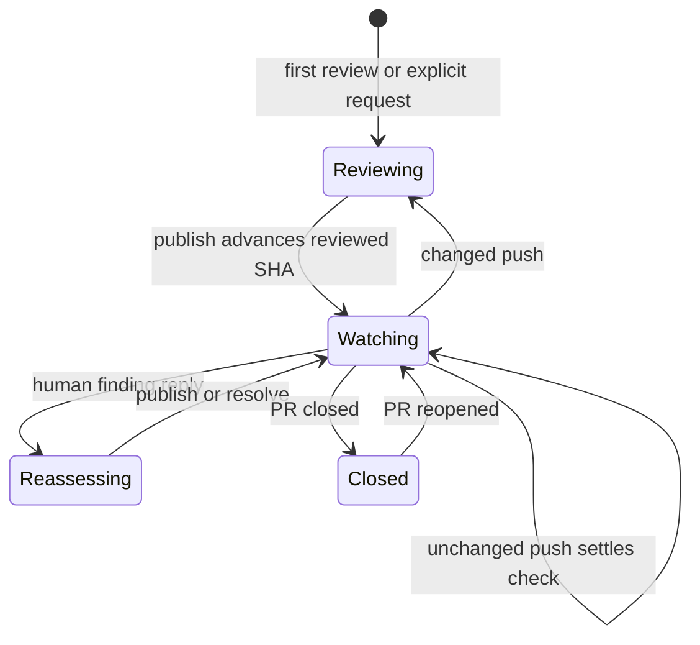

# Pull Request Review Workflow

Open SWE reviews a pull request through a dedicated `reviewer` graph. A PR has one durable reviewer thread and one evolving findings list: later pushes and human replies re-enter that thread rather than creating independent reviews. See [Reviewer and Analyzer Architecture](../architecture/reviewer-and-analyzer.md), [Invocation Workflow](invocation.md), and [PR Creation Workflow](pr-creation.md) for adjacent responsibilities.

## Entrypoints and admission

`POST /webhooks/github` is the signed ingress. It verifies `X-Hub-Signature-256`, ignores unsupported event types or PR actions, parses JSON, and schedules accepted work as FastAPI background tasks. The route applies the public-repository organization gate to first-review and comment/reply paths. Thus webhook processing responds promptly; review execution is asynchronous.

A review can begin through:

- **Automatic first review:** `pull_request` actions `opened` and `ready_for_review`. The repository must appear in the enabled-review-repositories record; absence is disabled by default and a store failure also safely reads as disabled. Drafts additionally require the author's `review_draft_prs` setting, with the team setting as fallback.
- **Explicit request:** the main-agent tool `request_pr_review` accepts a GitHub PR URL, preserves an active Slack thread if present, and delegates to `trigger_pr_review_from_ref`. The dashboard calls that same entrypoint. It fetches PR metadata, ensures the reviewer thread exists, turns on `watch`, posts a temporary in-progress comment, and dispatches the reviewer.
- **A later push:** a push only becomes a re-review for an open PR whose canonical reviewer thread exists and has `watch=true`.
- **A reply to a reviewer comment:** a non-bot reply is separately routed before ordinary mention handling and can dispatch a focused reassessment run.

The trigger paths converge on the same per-PR reviewer state.

## Canonical thread and review state

`reviewer_thread_id(owner, repo, pr_number)` is UUIDv5 over `"{owner}/{repo}/pr/{pr_number}/reviewer"`. Webhooks, the dashboard, and tools all derive it, making the formula a cross-process persisted-data contract: changing it strands existing state.

The LangGraph thread metadata is the durable state owner. It is marked `kind="reviewer"` and contains PR metadata, `head_sha`, `last_reviewed_sha`, `watch`, optional Slack origin, transient status/check identifiers, the current run id, and `findings`. Thread metadata is deliberately used because it survives sandbox eviction and is queryable across threads. Review runs use `assistant_id="reviewer"`, mapped by `langgraph.json` to `agent.graphs.reviewer:traced_reviewer_agent`.

Each finding records its location and diff side, severity and confidence, title and description, lifecycle status (`open`, `resolved`, or `dismissed`), fingerprint, and GitHub publication identity. Reads normalize legacy singular GitHub IDs and nested `surface` data to canonical ID lists plus a forward-only `surface_state`. The storage API serializes mutations per thread/event loop, reads the freshest state, and writes only on change; snapshot replacement merges by finding ID. `append_finding` deduplicates against open findings by fingerprint. A missing reviewer thread raises `ReviewerThreadMissingError`; tools return a structured `thread_not_found` response directing the agent not to retry.

## Reviewer preparation and finding discipline

Before the first model call, `PrepareReviewerRunMiddleware` obtains a GitHub App token, creates or replaces an unreachable sandbox, and deterministically prepares the target checkout. It materializes the review range and computes a per-file, per-side changed-line set. For a re-review, the range is based on `last_reviewed_sha`; otherwise it is the PR range. If preparation fails, the agent is explicitly told that the checkout may be stale and must not be trusted.

The graph exposes review-specific tools—`fetch_review_diff`, finding tools, thread reply/resolution tools, and `publish_review`—rather than change-authoring tools. Its prompt requires concrete, changed-line defects; excludes style-only, speculative, pre-existing, and out-of-diff reports; limits delegation to one disjoint review pass; and asks the parent to validate and publish. Existing PR descriptions, review threads, and author trace content are untrusted data: the prompt delimits them and instructs the model never to follow instructions within them. It can also layer organization guidance, repository review style, base-branch `AGENTS.md`/`CLAUDE.md` rules, and an API standards skill when applicable.

`add_finding` normalizes a missing endpoint of a line range, validates title and severity/confidence/side values, and checks the range against the changed-line set. An out-of-diff anchor returns `success: false`, `in_diff: false`, and a do-not-retry instruction. File-level findings are accepted but cannot be rendered as inline GitHub comments. Suggestions above `MAX_SUGGESTION_LINES` (4) are dropped while retaining the description-only finding.

## Selection and publication

Publication selects only open, in-diff findings at or above the requested severity (default `medium`), orders them by severity then file/line, and caps them at `REVIEW_FINDING_CAP` (6). Confidence is stored for calibration but does not gate publication. A re-review additionally limits new publication to unsurfaced findings first seen at the current head, preventing duplicate comments.

`publish_review` first backfills state from live GitHub threads, resolves the live head from thread metadata rather than trusting a run's frozen config, then emits one GitHub PR Review. Inline comments contain a hidden finding marker, generated title, description, line reference, and optional fenced suggestion; the top-level body is host-formatted and carries a summary marker. Returned review and comment identities are recorded before later thread handling, enabling reconciliation and resolution.

A publish may be successful without posting a review: eval mode is a dry run, and an empty re-review after a known Open SWE review skips another summary while still resolving fixed threads and advancing `last_reviewed_sha`. Only a numeric `review_id` without `dry_run` or `skipped_empty_re_review` confirms GitHub publication. If GitHub returns an unresolved-anchor 422, the tool removes identifiable invalid findings, retries the remaining batch once, and returns `unresolvable_findings` so the agent fixes or resolves them rather than repeating the request.

## Re-review, replies, and settlement

The watch lifecycle preserves findings and GitHub thread identity across review runs.

On close/reopen transitions, `closed` disables watch and `reopened` enables it. `converted_to_draft` disables watch only when draft reviews are not enabled for that PR author. A watched push is ignored when the head equals `last_reviewed_sha`. When the PR diff is provably unchanged, the system advances `last_reviewed_sha` and creates then completes a success check titled **No new changes to review** on the new head, because GitHub no longer displays the old commit's check. A changed push reconciles live threads, refreshes PR metadata and `head_sha`, creates a new in-progress check, and dispatches a `re_review=True` run with the prior reviewed SHA.

Reconciliation links findings to live review threads first by embedded marker, then stored thread/comment identity. It backfills identities and marks findings surfaced; records only the latest non-bot reply after the bot comment as an interaction requiring reassessment; and marks an open finding resolved only when all matched threads are resolved (outdated threads are terminal but do not count as resolved). It persists only when data changed. A reply webhook reconciles, finds the parent comment's finding, records the reply, and dispatches `reviewer_event="finding_reply"`; that run can reply for clarification, or resolve/dismiss with an agent-authored note.

Each dispatched automatic review creates an **Open SWE Review** check and saves `review_check_run_id`. Publish settles it with a conclusion based on surfaced findings and clears the ID only after GitHub accepts the completion patch. A failed patch retains the ID and stores `review_check_pending_result`, allowing the after-agent middleware to retry the real result. If a run ends without publishing, that middleware closes the remaining check as `neutral`, not failure, so reviewer infrastructure errors do not appear to be PR code failures. The transient in-progress PR comment is likewise cleared after successful publication paths.

## Operational checks and focused tests

Enable automatic review explicitly with the enabled-review-repositories store; installing the GitHub App alone does not opt a repository in. Operators should investigate a missing completion check through reviewer-thread metadata (`review_check_run_id` and `review_check_pending_result`), token availability, and sandbox preparation failures. A `thread_not_found` tool result is terminal for that run, not a request to retry.

`tests/reviewer/` provides focused coverage for automatic PR gating (`test_pr_ready_auto_review.py`), watch and unchanged-diff behavior (`test_reviewer_watch.py`), finding storage and tool validation (`test_reviewer_findings.py`, `test_reviewer_tools.py`), reconciliation (`test_reviewer_reconcile.py`), and publishing/status comments/retry behavior (`test_reviewer_publish.py`).
