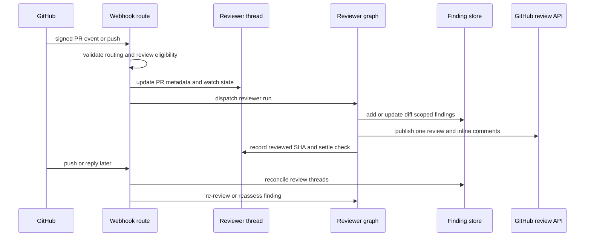
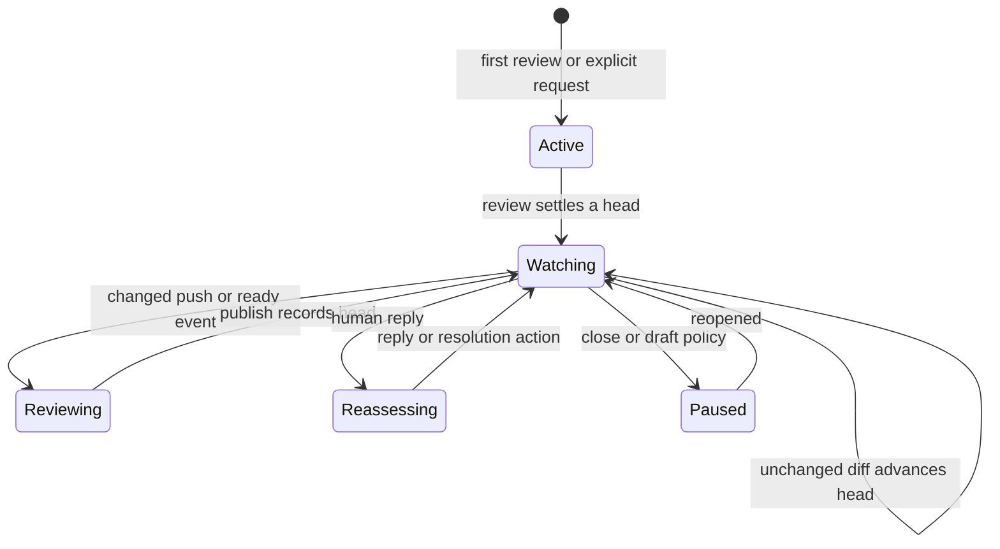

# Pull-request review workflow

Open SWE treats a pull request as a durable review record, not a sequence of unrelated model calls. The `reviewer` graph investigates a diff and publishes findings; the optional review scout produces a walkthrough of the change; GitHub events reconcile the evolving review after pushes and replies; and the review UI reads the same state. For the graph's composition, see [Reviewer and Analyzer Architecture](../architecture/reviewer-and-analyzer.md). For a user-driven review request and subsequent merge workflow, see [Invocation Workflow](invocation.md) and [Human Review and Merge](human-review-and-merge.md).

## Admission and trigger paths

`POST /webhooks/github` is the signed ingress. It records the delivery, invalidates a referenced PR in the UI, rejects unsupported events or PR actions, and schedules accepted work as a FastAPI background task. A repository must be assigned to a workspace; an unreadable workspace assignment returns `503` so GitHub retries rather than silently dropping work.

Automatic review is deliberately opt-in. The enabled-review repository list defaults to empty and its lookup fails closed: if the store cannot be read, the webhook skips automated review. `opened` and `ready_for_review` begin a first review only after that gate and the public-repository organization gate. A draft additionally needs the author's effective `review_draft_prs` setting. Pushes are also gated by opt-in.

An explicit request reaches `trigger_pr_review_from_ref` from the dashboard or the request tool. It fetches PR metadata and a suitable App token, rejects drafts, initializes the canonical reviewer thread with `watch=True`, posts a transient in-progress comment, and dispatches `assistant_id="reviewer"`. The request can retain a Slack thread so the initial review completion can be reported there. The dashboard can also request a re-review directly and independently launch a review scout.

```mermaid
sequenceDiagram
  participant GH as GitHub
  participant Hook as Webhook route
  participant Thread as Reviewer thread
  participant Graph as Reviewer graph
  participant Store as Finding store
  participant API as GitHub review API
  GH->>Hook: signed PR event or push
  Hook->>Hook: validate routing and review eligibility
  Hook->>Thread: update PR metadata and watch state
  Hook->>Graph: dispatch reviewer run
  Graph->>Store: add or update diff scoped findings
  Graph->>API: publish one review and inline comments
  Graph->>Thread: record reviewed SHA and settle check
  GH->>Hook: push or reply later
  Hook->>Store: reconcile review threads
  Hook->>Graph: re-review or reassess finding
```
This sequence shows the durable reviewer thread coordinating GitHub-triggered review work and persisted findings.

## Durable state and the reviewer run

`reviewer_thread_id(owner, repo, pr_number)` is UUIDv5 over `"{owner}/{repo}/pr/{pr_number}/reviewer"`. Webhooks, dashboard reads, and the reviewer derive this same identifier, so changing its formula would orphan live review state. The LangGraph thread carries PR identity, `head_sha`, `last_reviewed_sha`, `watch`, status-comment and check-run IDs, and run status. A `PullRequest` record links published review completion back to that reviewer thread and head.

Findings now belong to the pull request in PostgreSQL, with `pull_request_finding_state` linking that PR to the reviewer thread. The first access migrates legacy findings from thread metadata. A finding retains location, side, severity, confidence, lifecycle status, fingerprint, diff hunk, GitHub identities, resolution information, and human/bot interactions. Evaluation runs are intentionally separate: their findings are in-memory and scoped to that benchmark run, avoiding contention with the durable PR record.

Before model calls, `PrepareReviewerRunMiddleware` mints and caches a repo-scoped GitHub App token and prepares a replaceable per-thread sandbox checkout. It materializes a unified diff and computes changed lines per file and side. First review uses the merge-base PR range; re-review uses the exact two-dot range from `last_reviewed_sha` to the new head. If a compare diff cannot be obtained after history changed, preparation falls back to the current PR diff. The reviewer receives only review-oriented tools—finding, diff, publication, reply, and resolution tools—not authoring tools. It can use a reviewer subagent for a disjoint review pass.

PR title/body and existing review-thread bodies are author-controlled input. The reviewer wraps them as escaped data blocks, constrains GitHub logins, and neutralizes closing tags before including them in its prompt. Workspace organization guidance, repository style, base-commit `AGENTS.md` guidance, trusted skills, and approval policy can refine review criteria; the policy is read at the base commit so the PR cannot rewrite the policy governing itself.

## Diff-scoped findings and publication

`add_finding` normalizes a one-ended range, requires a real generated title, validates severity, confidence, side, and line ordering, and rejects a line range not wholly in the changed-line set for its `LEFT` or `RIGHT` side. File-level findings are allowed by the data model but cannot produce an inline GitHub comment; current review flow disables out-of-diff publication. The tool captures an overlapping hunk when available, drops suggestions longer than four lines while retaining the finding, and deduplicates open findings by a stable fingerprint. A missing reviewer thread returns a structured do-not-retry result rather than inviting an agent loop.

Publication only considers open, in-diff findings at or above its severity threshold (default `medium`), ordered by severity and then file/line, with a cap of six. Confidence is retained for analysis, rather than used as a publication gate. The reviewer must submit a ranking containing every candidate exactly once; that rank becomes durable finding state. Re-reviews limit publication to new findings first seen at the current head and findings without a recorded GitHub comment ID, preventing duplicate inline comments.

`publish_review` resolves the live head from thread metadata because a push may arrive while a run still has a frozen configuration. It posts one GitHub review with a summary marker and inline comments marked with finding identity, location, severity title, explanation, and optional suggestion block. After GitHub accepts a review, it records review/comment/thread identity in a consolidated finding update, then resolves GitHub threads for findings that were resolved in the new review state. A GitHub `422` unresolved-anchor response causes one filtered retry after stale anchors are removed; otherwise it returns an actionable error rather than blindly retrying.

Empty behavior is intentional: an eval is dry-run and posts nothing. When a previous Open SWE summary exists and a re-review has no new inline finding, publication suppresses another empty summary but still resolves fixed threads, records the reviewed SHA, and settles its check. A GitHub authorization failure invalidates the cached thread token and asks for re-authentication.

## Watch, reconciliation, and checks

A reviewer thread watches later changes until the PR closes. `reopened` enables watch; `closed` disables it; converting to draft disables it only when draft review is not enabled for the author. A push must find an enabled repository, open PR for the branch, canonical watched reviewer thread, and a head different from `last_reviewed_sha`. If the delta is provably unchanged, Open SWE advances `last_reviewed_sha`, carries a stored walkthrough forward when possible, and posts and completes a fresh **No new changes to review** check on the new head.

For a changed push, the service reconciles live GitHub review threads before dispatching a `re_review=True` run, refreshes PR metadata and head SHA, and creates a new in-progress **Open SWE Review** check. The dispatch prompt requires reconciliation of existing findings before net-new findings are published. `ready_for_review` uses the same re-review behavior when an earlier SHA exists, but skips work when that SHA equals the head.

Reconciliation prefers the hidden finding marker, then recorded GitHub thread or comment identity. It backfills publication identities, marks findings surfaced, records the most recent non-bot reply after the bot comment as a `needs_reassessment` interaction, and changes an open finding to resolved only if every matched thread is resolved. An outdated thread is terminal for synchronization but does not count as resolved. Writes occur only when reconciliation changed state.

A registered user's reply to an Open SWE inline comment is routed ahead of ordinary mention handling. It reconciles first, matches the parent comment to a finding, records the reply, and dispatches a focused `finding_reply` reviewer event. The graph can answer in the GitHub thread or resolve it with an explanatory note.

```mermaid
stateDiagram-v2
  [*] --> Active: first review or explicit request
  Active --> Watching: review settles a head
  Watching --> Reviewing: changed push or ready event
  Reviewing --> Watching: publish records head
  Watching --> Reassessing: human reply
  Reassessing --> Watching: reply or resolution action
  Watching --> Watching: unchanged diff advances head
  Watching --> Paused: close or draft policy
  Paused --> Watching: reopened
```
This state diagram summarizes watch state and the paths that preserve one PR's findings across review runs.

An automatic first review or watched changed push creates and tracks a GitHub check run. `publish_review` settles it using the finding count. The tracked ID is cleared only after GitHub accepts completion; otherwise the intended conclusion is persisted for retry. The after-agent middleware closes an uncompleted review as `neutral`, or retries the stashed real result, so an agent or infrastructure failure does not masquerade as a code failure. The transient in-progress PR comment is deleted after a successful publication path.

## Dashboard, scout, and review chat

The review API requires repository access for every PR-level read or mutation. It lists reviewer threads newest first, filters them by accessible repository (and optionally PR author), reads findings in batches, and reports `running`, `error`, or `idle` from LangGraph thread and latest-run state. A detail response combines live GitHub PR details and checks, durable findings, review error, assessment, and optional scout walkthrough; a PR with no reviewer thread still renders as an unreviewed PR. Findings are shown as bugs only when severity is high/critical and confidence high; other non-low findings are investigation flags.

The dashboard also exposes enabled-review-repository administration, diff and file-content views, review styles, reviewer evaluations, scout launch/dismissal, manual re-review, assessment feedback, and normal GitHub pending-review/comment/submit operations. The review-chat endpoint is a distinct, per-user main-agent PR thread, not the reviewer thread: it opens or finds a PR-fix conversation and proxies commands, stream events, state, and history only after both repository and thread access checks.

## Operations and focused tests

Enable a repository explicitly through the enabled-review-repositories API; GitHub App installation alone does not enable automatic reviews. When a review appears stuck, inspect the reviewer thread's latest run status, `head_sha`/`last_reviewed_sha`, watch flag, and tracked check-run state; also verify GitHub App token availability and sandbox preparation. Do not retry a tool result reporting a missing reviewer thread.

`tests/reviewer/` concentrates on the behaviors that protect this workflow: automatic gating and draft readiness, watched-push short circuits, unified-diff parsing and diff fetch tools, finding persistence and validation, publication selection/retry/settlement, reconciliation, reviewer preparation and outcomes, review API state, scout/session behavior, and per-user review chat.
