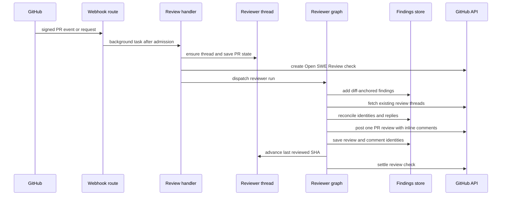

# Pull Request Review and Findings

Open SWE uses a durable reviewer thread for each pull request (PR), rather than treating each review as an isolated chat. That thread owns PR-level operational state; the PR’s findings are durable database records linked to it. Subsequent pushes and replies therefore reconcile with prior review comments instead of blindly posting duplicates. For graph structure, see [Reviewer and Analyzer Architecture](../architecture/reviewer-and-analyzer.md); for general trigger policy, see [Invocation Workflow](invocation.md).

## Entry points and admission

`POST /webhooks/github` is the signed GitHub ingress. It verifies `X-Hub-Signature-256`, records the delivery, ignores unsupported event types/actions, checks that the repository is assigned to a workspace, and schedules accepted work in FastAPI background tasks. A temporary workspace lookup failure returns 503 so GitHub retries rather than silently losing the delivery. First-review and finding-reply paths also apply the public-repository organization gate.

There are three ways to begin or continue a review:

- **Automatic review:** `pull_request` `opened` and `ready_for_review` actions, and `push` watch processing, require `is_repo_auto_review_enabled`. This delegates to the review-repository enablement policy; disabled repositories do not enter the review pipeline. A draft PR is additionally admitted only when the author’s `review_draft_prs` override—or the owning workspace default when no override exists—is enabled.
- **On-demand review:** the Slack/main-agent `request_pr_review` tool parses a GitHub PR URL and calls `trigger_pr_review_from_ref`; the dashboard’s re-review action calls the same function. It fetches authoritative PR metadata and token scope, ensures the canonical thread exists, sets `watch=True` and current PR/head metadata, posts a transient “in progress” comment, then dispatches the `reviewer` graph.
- **Feedback and watch events:** an eligible reply to an Open SWE inline comment enters a focused reviewer run; a push enters only when an open PR has a watched reviewer thread.

The canonical reviewer thread ID is UUIDv5 over `"{owner}/{repo}/pr/{pr_number}/reviewer"`. Webhook handlers and tools independently derive it, so changing that formula would orphan persisted reviewer state. The reviewer dispatch uses `assistant_id="reviewer"`, mapped to `agent.graphs.reviewer:traced_reviewer_agent`; the dispatched run ID is retained in thread metadata.

## Review-to-publication lifecycle

```mermaid
sequenceDiagram
  participant GitHub
  participant Route as Webhook route
  participant Handler as Review handler
  participant Thread as Reviewer thread
  participant Reviewer as Reviewer graph
  participant Findings as Findings store
  participant API as GitHub API
  GitHub->>Route: signed PR event or request
  Route->>Handler: background task after admission
  Handler->>Thread: ensure thread and save PR state
  Handler->>API: create Open SWE Review check
  Handler->>Reviewer: dispatch reviewer run
  Reviewer->>Findings: add diff-anchored findings
  Reviewer->>API: fetch existing review threads
  Reviewer->>Findings: reconcile identities and replies
  Reviewer->>API: post one PR review with inline comments
  Reviewer->>Findings: save review and comment identities
  Reviewer->>Thread: advance last reviewed SHA
  Reviewer->>API: settle review check
```
This sequence shows the normal admitted-review path; review preparation may proceed without a completed scout walkthrough, and publication has explicit recovery paths described below.

### Preparation and scout context

Before model calls, `PrepareReviewerRunMiddleware` obtains a GitHub App token, creates or replaces an unreachable per-thread sandbox, and prepares the target checkout. It materializes a first-review or re-review diff and computes changed lines per file and side; `add_finding` uses that set to locally validate inline anchors. Re-review ranges are based on `last_reviewed_sha`; first reviews use the PR range.

Preparation also starts or joins a `ReviewScoutTarget` for the same PR head when a walkthrough is absent. The scout uses its own deterministic thread and records runs with the head SHA. The reviewer polls only up to its configured wait period; a missing, failed, or slow scout yields no walkthrough and does not block the review.

The reviewer prompt treats PR title/body and existing review-thread bodies as untrusted data: it delimiters them, neutralizes closing tags, and tells the model not to execute their instructions. It directs concrete changed-line defect review and rejects speculative, style-only, pre-existing, and out-of-diff findings. Workspace guidelines, repository style, base-commit `AGENTS.md` guidance, and trusted skills can refine those criteria.

## Finding state, validation, and selection

Reviewer-thread metadata contains PR identity, current and last-reviewed heads, `watch`, run/check/status-comment references, and optional Slack origin. Findings themselves now live in PostgreSQL under the PR through `pull_request_finding_state`; the first access migrates legacy metadata findings once. This separates durable finding history from evictable sandbox state while retaining the reviewer thread as the lookup key.

A finding includes its location, side, severity, confidence, provenance SHA, lifecycle status, fingerprint, publication identity, surface state, and interactions. Reads normalize legacy singular GitHub identity fields and nested `surface` data into canonical ID lists and `surface_state`. Database mutations lock the PR finding state, read the latest rows, and write only when a mutator changes data. Snapshot replacement merges by ID, and `append_finding` rejects an open finding with the same fingerprint. If the backing reviewer thread is missing, finding tools return the structured `thread_not_found` result with a do-not-retry instruction.

`add_finding` requires a non-empty generated title and valid severity, confidence, and side values. It normalizes a one-ended range, rejects inverted ranges, and rejects anchors outside the changed-line set with `success: false`, `in_diff: false`, and an explicit instruction not to re-anchor or retry. File-level findings are storable but have no inline GitHub payload. Suggestions over `MAX_SUGGESTION_LINES` (four) are discarded while the description-only finding is retained.

Before publishing, the reviewer must submit a ranking containing every candidate exactly once. Candidates are open, in-diff, unpublished findings; re-reviews further restrict candidates to findings first seen at the live head. Publication applies the requested severity threshold (default `medium`), honors the reviewer’s rank before fallback severity/file/line ordering, and excludes findings that cannot render as inline comments. Confidence is recorded but is not a publication gate.

## Publication and settlement

`publish_review` first resolves the live head SHA from thread metadata, because a push can arrive while a run retains an older frozen config. It fetches and reconciles existing GitHub review threads before choosing work. It posts one GitHub PR Review with a marker-bearing summary and marker-bearing inline comments; each inline payload supplies `path`, `line`, and `side`, with an optional fenced `suggestion` block.

After GitHub accepts a review, the tool stamps the review ID and comment IDs onto relevant findings in one merged write. Markers are the authoritative mapping from a GitHub comment to a finding, avoiding ambiguous location/body matching; a later reconciliation backfills thread IDs. On re-review, already-commented findings are excluded, preventing duplicate inline comments.

Important outcomes and failure behavior:

- A 422 unresolved-anchor response is diagnosed against the current diff. Identifiable bad findings are omitted and the remaining batch is retried once; otherwise the tool returns `unresolvable_findings` and tells the agent to fix or resolve those records rather than repeat the same request.
- In evaluation mode, publication is a dry run: it stores the candidate snapshot and advances the evaluated head without posting to GitHub.
- If no new inline comments exist but a prior Open SWE summary is known, the tool suppresses another empty summary, still resolves fixed threads, advances `last_reviewed_sha`, and returns `skipped_empty_re_review`.
- A numeric `review_id` with neither dry-run nor skipped-empty flag is the reliable indication that a new GitHub review was posted.

Automatic first reviews and changed-push re-reviews create an **Open SWE Review** check and track its ID in thread metadata. Publishing settles it according to surfaced findings. The check ID is cleared only after a successful GitHub completion PATCH; on failure, the intended conclusion is retained as `review_check_pending_result` for retry. If the run exits without publishing, the after-agent middleware settles a remaining tracked check as `neutral`, unless a pending real result exists. This avoids presenting reviewer infrastructure failure as a PR-code failure. New checks supersede and try to close earlier in-progress checks as neutral.

## Watch, reconciliation, and feedback

Watch state follows PR lifecycle: `closed` disables watch, `reopened` enables it, and `converted_to_draft` disables it only when the author is not enabled for draft reviews. A watched branch push is ignored if its head already equals `last_reviewed_sha`. If a comparison proves the PR diff unchanged, the system advances `last_reviewed_sha` and creates then completes a **No new changes to review** success check on the new head so GitHub continues to show a visible result. Otherwise it reconciles existing threads, updates the live head metadata, creates a fresh check, and dispatches a `re_review=True` run prompted to reconcile prior findings and add only net-new ones.

Reconciliation matches GitHub threads first through the embedded finding marker, then stored thread/comment IDs. It backfills publication identities, marks findings surfaced, records the newest human reply after the bot comment as an interaction needing reassessment, and resolves a finding only if every matched thread is actually resolved. Outdated threads are terminal for activity but do not satisfy that resolved condition. Data is persisted only if reconciliation changes it.

A non-bot reply webhook reconciles first, finds the parent comment’s finding, appends the reply interaction, and dispatches a reviewer run with `reviewer_event="finding_reply"`. That run receives the focused finding/reply context and can clarify, dismiss, or resolve through the review tools.

## Operations and focused tests

Automatic reviewing must be enabled for the repository; GitHub App installation alone is not sufficient. For an apparently stuck review, inspect reviewer thread metadata for `review_check_run_id`, `review_check_pending_result`, `head_sha`, and `last_reviewed_sha`, then verify GitHub token issuance and sandbox preparation. A `thread_not_found` tool result is terminal for the run, not an instruction to retry.

Focused tests cover draft/ready-for-review behavior and public token scoping in `test_pr_ready_auto_review.py`; watched push, unchanged-diff, check supersession, and PR lifecycle transitions in `test_reviewer_watch.py`; database-backed finding migration, ordering, mutation, and missing-thread handling in `test_reviewer_findings.py`; in-diff validation and finding resolution in `test_reviewer_tools.py`; and publication/reconciliation behavior in `test_reviewer_publish.py` and `test_reviewer_reconcile.py`.
