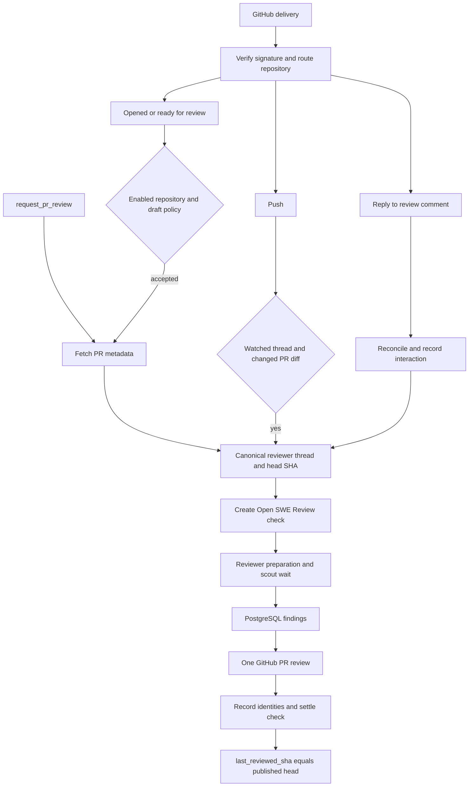

# Pull Request Review and Finding Publication

Open SWE treats review as a durable, per-pull-request workflow rather than a sequence of unrelated comments. The `reviewer` graph owns inspection and publication, while the `review-scout` graph can first turn the diff into a persisted walkthrough. Findings are stored against the PR in PostgreSQL; the reviewer thread retains routing and transient run state. Later pushes, lifecycle changes, and replies use the same deterministic reviewer thread. For neighboring flows, see [Reviewer and Analyzer Architecture](../architecture/reviewer-and-analyzer.md), [Invocation Workflow](invocation.md), and [Scheduling and Baby-sit](scheduling-and-baby-sit.md).

## Triggers and admission

GitHub enters through `POST /webhooks/github`. The route verifies `X-Hub-Signature-256`, records the delivery, rejects unsupported event/action combinations, checks that the repository belongs to a workspace, and schedules accepted work as a FastAPI background task. A workspace-lookup outage returns HTTP 503 so GitHub retries rather than silently losing work.

There are two first-review paths:

- **Automatic review** accepts `pull_request` `opened` and `ready_for_review` only when the repository is in the enabled-review-repositories list. Repositories are disabled by default, and an unavailable store safely behaves as disabled. The public-repository organization gate is also enforced at ingress. Draft PRs require the author's effective `review_draft_prs` setting; the individual setting takes precedence over the workspace setting.
- **On-demand review** uses the main-agent `request_pr_review` tool, which parses a canonical GitHub PR URL and preserves the active Slack thread when present. `trigger_pr_review_from_ref` fetches authoritative PR metadata and refuses a draft, missing SHA, unavailable token, or uncreatable reviewer thread. It marks the thread watched, writes the PR/head metadata, posts an in-progress comment, and dispatches the reviewer.

All PR review work addresses `reviewer_thread_id(owner, repo, pr_number)`, UUIDv5 over `"{owner}/{repo}/pr/{pr_number}/reviewer"`. That formula is a cross-process persistence and routing contract: altering it would leave existing reviewer state unreachable. Runs dispatch with `assistant_id="reviewer"`, which maps to `openswe.graphs.reviewer:traced_reviewer_agent`.

```mermaid
flowchart TD
  Hook["GitHub delivery"] --> Verify["Verify signature and route repository"]
  Manual["request_pr_review"] --> Meta["Fetch PR metadata"]
  Verify --> First["Opened or ready for review"]
  Verify --> Push["Push"]
  Verify --> Reply["Reply to review comment"]
  First --> Gate{"Enabled repository and draft policy"}
  Gate -->|"accepted"| Meta
  Meta --> Thread["Canonical reviewer thread and head SHA"]
  Push --> Watch{"Watched thread and changed PR diff"}
  Watch -->|"yes"| Thread
  Reply --> Reassess["Reconcile and record interaction"]
  Reassess --> Thread
  Thread --> Check["Create Open SWE Review check"]
  Check --> Reviewer["Reviewer preparation and scout wait"]
  Reviewer --> Findings["PostgreSQL findings"]
  Findings --> Publish["One GitHub PR review"]
  Publish --> Settle["Record identities and settle check"]
  Settle --> Reviewed["last_reviewed_sha equals published head"]
```
The flow converges on one reviewer thread and uses the thread's live `head_sha` and `last_reviewed_sha` as the important idempotency boundaries.

## Context preparation and the review-scout dependency

Before its first model call, `PrepareReviewerRunMiddleware` obtains and caches a GitHub App token for the thread, prepares a replaceable per-thread sandbox, and checks out the target PR. Replacement is intentional: a reviewer sandbox holds only a checkout re-derived for every run, so an unreachable old sandbox must not permanently block reviews for that PR.

The middleware materializes the review range and computes a per-file, per-side changed-line set. First reviews use the PR diff; re-reviews use the range from `last_reviewed_sha` to the current head. It concurrently loads PR title/body, existing GitHub review threads, organization and repository guidance, base-commit `AGENTS.md` material, and the approval policy. Author-controlled PR descriptions and review-thread bodies are XML-delimited and closing tags are neutralized before inclusion in the prompt; the reviewer is meant to treat them as data, not instructions.

For non-evaluation, non-reply reviews, the reviewer also awaits a `ReviewScoutTarget` walkthrough for the exact `(owner, repo, PR, head SHA)`. The scout has its own deterministic thread and durable run. It reuses a run already active for that head; otherwise it checks out the PR, partitions the diff into ordered steps, and persists the walkthrough in PostgreSQL. The reviewer waits at most `SCOUT_WAIT_SECONDS` (600 seconds); on scout failure, timeout, missing database, or missing SHAs it continues without the walkthrough. A later head supersedes older scout work, and walkthrough lookup is head-specific, so stale explanations are not injected into a new review.

## Findings: ownership and validation

The reviewer graph exposes review-specific tools (`fetch_review_diff`, `add_finding`, `update_finding`, `list_findings`, `publish_review`, and thread reply/resolution tools), not code-authoring tools. A finding has a stable ID, fingerprint, location and diff side, severity/confidence, lifecycle status, source SHAs, publication identities, interaction history, and ranking. New findings are stored under the PR in PostgreSQL; legacy metadata findings are copied on first access. Reviewer-thread metadata remains the owner of PR identity, `head_sha`, `last_reviewed_sha`, `watch`, current run/check IDs, and optional Slack origin.

Finding writes use a locked, fresh read-modify-write transaction. Snapshot replacement merges by finding ID instead of deleting concurrently added records, and appending deduplicates open findings by a normalized location/description fingerprint. A missing reviewer thread produces a structured `thread_not_found` tool result that tells the model not to retry.

`add_finding` requires a meaningful generated title; validates severity, confidence, side, and range ordering; and normalizes a single supplied endpoint to a one-line range. When a changed-line set is available, it rejects an anchor outside the diff with `success: false`, `in_diff: false`, and a do-not-retry message. File-level findings are allowed but cannot become inline GitHub comments. Suggestions longer than `MAX_SUGGESTION_LINES` (4) are removed while the descriptive finding remains.

## Publication and idempotency

Before publication, the reviewer must supply a complete, duplicate-free ranking of every candidate finding. The tool stores that rank. Publication chooses only open, in-diff, unpublished findings at or above the requested severity threshold (default `medium`); rank wins ordering, then severity and location provide stable fallback ordering. On a re-review, a candidate must also have first appeared at the live head SHA. This prevents reposting a comment already surfaced on GitHub.

`publish_review` resolves the effective head SHA from live thread metadata, not merely the run configuration: a push may have arrived while a run was active. It reconciles GitHub threads before choosing findings, renders one PR Review with inline `path`/`line`/`side` comments, and includes a hidden finding marker in every inline body. The summary body has its own Open SWE marker, links to the review UI and optional trace, and can show an advisory assessment. After GitHub accepts the review, the tool records the review ID and marker-matched comment IDs together, then backfills GraphQL thread IDs as needed. This identity recording makes later reply matching and resolve-on-fix safe.

A normal review advances `last_reviewed_sha`, links the PR to the reviewer thread, clears the transient in-progress comment, and settles its check. Important non-posting or recovery outcomes are deliberate:

- Evaluation runs are dry runs: they select and snapshot findings but do not write a GitHub review.
- An empty re-review where an Open SWE summary already exists does not post another “no issues” summary; it can still resolve fixed threads and advance `last_reviewed_sha`.
- A GitHub 422 unresolved-anchor response causes the tool to identify and drop invalid anchors, retry the remaining batch once, and return `unresolvable_findings` with a fix-or-resolve hint rather than blindly retrying.
- A 401 invalidates the cached thread token and returns a re-authentication error.

## Pushes, reconciliation, and feedback

Watch mode begins with a first or requested review. `closed` disables watching, `reopened` enables it, and `converted_to_draft` disables it only if the author's effective draft-review preference is off. A push is considered only for an auto-review-enabled repository, an open PR on that branch, and a watched canonical reviewer thread.

If the push head equals `last_reviewed_sha`, nothing runs. If comparison proves that the PR diff is unchanged, Open SWE advances `last_reviewed_sha`, carries any walkthrough forward when PostgreSQL is available, and creates then completes a **No new changes to review** success check on the new head. GitHub displays checks for the current head, so this replacement check keeps the review visible without spending a reviewer run.

For a changed diff, the handler reconciles live review threads, stores the new PR metadata and `head_sha`, creates a fresh in-progress check for that head, and dispatches a `re_review=True` run. The prompt directs the reviewer to reconcile old findings, add only net-new findings, and call `publish_review`. A `ready_for_review` transition follows the same re-review model when a prior reviewed SHA differs, but skips dispatch when it is identical.

Reconciliation associates tracked findings with GitHub threads by hidden marker first, then stored thread or comment identity. It backfills missing identities and marks findings surfaced; records only the latest human reply after the bot comment as an interaction requiring reassessment; and sets a finding to resolved only when every matched thread is resolved. Outdated threads are terminal for synchronization but do not by themselves resolve a finding. State is written only when it changed.

A non-bot reply to an Open SWE review comment is routed before ordinary mention processing. The handler reconciles first, identifies the finding from the parent comment ID, appends a `human_reply` interaction flagged `needs_reassessment`, and dispatches the reviewer with `reviewer_event="finding_reply"`. This gives the reviewer the reply and current thread context to clarify, dismiss, or resolve the finding rather than treating feedback as a new general-purpose agent request.

## Review checks and operations

Automatic first reviews and changed-diff re-reviews create an **Open SWE Review** check and retain `review_check_run_id` in reviewer-thread metadata. Publishing computes the conclusion and completes that check. The ID is cleared only after GitHub accepts the completion PATCH; on failure, the intended result is kept as `review_check_pending_result` for a later retry.

The `settle_review_check_on_exit` after-agent middleware prevents a check from remaining in progress when the reviewer crashes, reaches a model limit, or cannot prepare its sandbox. It retries a stored real completion result when one exists; otherwise it completes the check as `neutral`, because an incomplete reviewer run is infrastructure failure rather than a defect in PR code.

To operate automatic review, explicitly add repositories to the enabled-review-repositories store; GitHub App installation alone does not opt a repository in. For a stuck review, inspect the canonical thread's `head_sha`, `last_reviewed_sha`, `watch`, `review_check_run_id`, and `review_check_pending_result`, then investigate GitHub token scope, checkout/sandbox availability, and scout completion separately. A `thread_not_found` tool response is terminal for that run.

## Focused tests

`tests/reviewer/` exercises the meaningful boundaries: auto-review and draft gates in `test_pr_ready_auto_review.py`; watched push, unchanged-diff, and check behavior in `test_reviewer_watch.py`; finding persistence and tool validation in `test_reviewer_findings.py` and `test_reviewer_tools.py`; reconciliation in `test_reviewer_reconcile.py` and `test_reconcile_sweep.py`; publication, ranking, retry, and outcome behavior in `test_reviewer_publish.py` and `test_reviewer_outcomes.py`; and scout checkout/diff-step ownership in `test_review_scout_git.py`.
