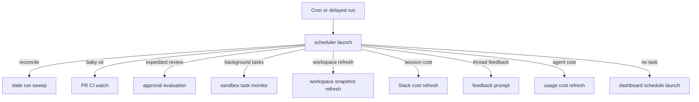
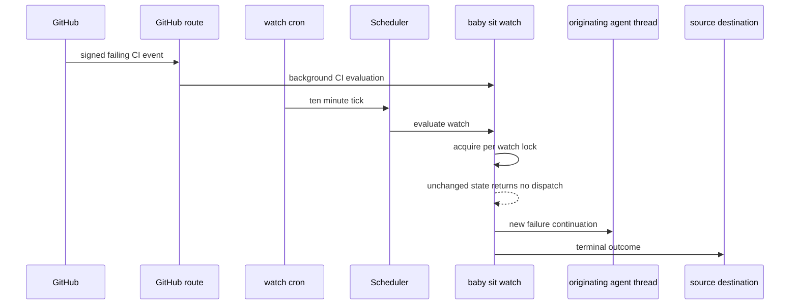

# Scheduled Work, CI Monitoring, and Background Automation

The `scheduler` assistant is the model-free automation entrypoint. A cron or delayed run supplies a routing payload; the scheduler selects one bounded handler. That handler may maintain durable state, run maintenance work, or deliberately enqueue an `agent` run, but the router itself does not use an LLM.

This page covers dashboard automations, recovery and cost jobs, workspace refreshes, sandbox-task monitoring, deferred feedback, thread wakeups, and the opt-in `/baby-sit` PR-CI watcher. For how an agent run is invoked and owned, see [Invocation](invocation.md); for PR authoring and review flows, see [PR creation](pr-creation.md) and [PR review](pr-review.md).

## Scheduler contract and routing

`langgraph.json` exposes `agent.scheduler:get_scheduler` as the `scheduler` assistant. It compiles one `StateGraph` node (`START → launch → END`). `_launch` reads `task` from state first, then `config.configurable`, and returns the selected handler result in `result`.

Diagram: one scheduler execution deterministically selects a maintenance, monitoring, or scheduled-agent handler.

Recognized tasks are `reconcile`, `baby_sit`, `expedited_review`, `background_tasks`, `workspace_refresh` (plus legacy `environment_refresh`), `session_cost`, `thread_feedback`, and `agent_cost`. The scheduler reports `missing_watch_key`, `missing_thread_id`, or `missing_schedule_id` rather than raising when the relevant keyed route lacks its key. Workspace refresh accepts an omitted slug as a sweep. Cron and delayed-run producers own their own creation, metadata, and retirement; the router is not a generic cron cleaner.

### Dashboard recurring automations

`agent/schedules/store.py` owns workspace-scoped dashboard schedules. It validates a normalized five-field cron expression before storage, including values, wildcards, ranges, steps, and lists constrained to each field's range. A recurring schedule's cron targets `scheduler` with only `schedule_id`, so it follows the default route.

The launch path loads the definition, refuses disabled schedules, checks current workspace repository access, and creates a new durable `agent` thread and run. It may first create and bind a Slack root message according to notification mode. Schedule definitions live in `agent_schedules`; operational results live separately in `agent_schedule_run_state`, which records the latest thread/run/timestamp or error. This separation prevents delivery bookkeeping from mutating schedule configuration.

### Reconciliation and deferred cost enrichment

Normal durable dispatch depends on a completion webhook to release a run. `reconcile_stale_runs()` is the recovery sweep: it pages through `busy` threads, lists their `pending` runs, and interrupts only runs older than 1,800 seconds by default. Bad timestamps are skipped and per-thread failures are isolated, so one broken thread does not block recovery of others.

Cost is often unavailable immediately after completion. Both cost mechanisms create self-terminating one-shot scheduler runs with `on_completion="delete"` and the fixed retry delays `(15, 30, 60, 120, 240)` seconds:

- **Session cost** updates the exact Slack response mapped to a completed run. It verifies the mapping and message, waits for a sufficiently fresh LangSmith aggregate, updates the footer when available, and clears the pending-cost label on unavailable, invalid, unschedulable, or exhausted work.
- **Agent usage cost** records one invocation's `run_only=True` LangSmith cost in the dashboard usage record. Terminal invocation handling records base telemetry and schedules enrichment when needed. An explicitly unavailable LangSmith configuration ends immediately; absent data or transient lookup/persistence failures can advance only through the five-attempt budget.

## Background and workspace automation

### Sandbox background-task completion

Long-running sandbox commands are monitored without model polling. `ensure_background_task_cron(thread_id)` idempotently creates one UTC every-minute `background_tasks` cron for the thread and removes duplicates. `monitor_background_tasks` loads the thread sandbox and checks its task control data.

For each unreported terminal task (`completed`, `failed`, `timed_out`, `stopped`, or `lost`), the monitor atomically claims a task-local notification directory before enqueuing a system completion message to the originating agent thread. It marks delivery only after dispatch succeeds; a dispatch failure releases the claim for a later tick. The prompt treats command output as untrusted and asks the agent to retrieve bounded output only when needed. When nothing runs and no terminal notice remains, a monitor lock guards a fresh recheck before deleting all of the thread's monitor crons. Missing sandbox metadata also removes those crons.

### Workspace snapshot refresh

Workspace refreshes are scheduler work rather than agent conversations. A daily, per-workspace cron has a stable hash-derived time between 03:00 and 05:59 UTC and sends `workspace_refresh` with its slug. `environment_refresh` remains accepted for crons minted before the rename. A lazy `update` refresh may also be started as a one-shot scheduler run when sandbox creation discovers an old snapshot.

A **full** refresh boots from the base snapshot and runs setup then update scripts; an **update** refresh boots from the current snapshot and runs only the update script. Both run on a throwaway builder sandbox and capture a replacement snapshot only after every required script succeeds. Failure leaves the previous ready snapshot in place; the builder is stopped in all cases. The workspace record tracks refresh state, timestamps, capped log, steps, and run ID, which also exposes refreshes through the shared background-task status interface. An in-flight refresh blocks competing work until it is stale after three hours.

### Deferred feedback prompts

The `thread_feedback` task delivers Slack feedback prompts only after a five-minute quiet period. The job compares its saved feedback record with durable state under the agent-thread PR-state lock, defers itself while the thread is busy or activity is too recent, and otherwise marks the prompt ready before posting it. A replaced feedback record, a new run/activity, or an unsuccessful latest run makes the attempt a no-op, which prevents stale delayed jobs from prompting the wrong conversation.

## Thread wakeups

`schedule_thread_wakeup` creates a one-shot cron directly against the `agent` assistant, not a scheduler task. It accepts one minute through 24 hours, rounds the fire time up to a UTC minute, and sets `end_time` roughly 90 seconds later to prevent recurrence. The tool carries selected thread/source/repository context, creates a system-kind input with a default polling prompt when needed, and includes normal invocation correlation and the completion webhook when configured.

Wakeups are capped at 10 per latest human-message generation. The tool hashes the most recent human input-message identity, stores the generation and count in thread metadata, and serializes same-process requests per thread. A new human message resets the budget, while system messages such as a wakeup do not. It persists the increment before creating the cron, so a creation failure still consumes a slot rather than allowing a retry storm.

Firing stops at `end_time` but does not delete its cron row. Before scheduling, the tool best-effort, fully paginated cleanup deletes only expired crons whose `metadata.kind` is `thread_wakeup`. `scripts/purge_wakeup_crons.py` is the backlog utility: run `uv run python scripts/purge_wakeup_crons.py --dry-run` to list candidates, then omit `--dry-run` to delete them. It resolves the URL from `--url` or `LANGGRAPH_URL` and credentials from `LANGGRAPH_API_KEY` or `LANGSMITH_API_KEY`.

## `/baby-sit`: durable PR CI monitoring

`/baby-sit` is an opt-in recovery workflow, not a repository-wide watcher. The bundled skill uses a durable cloud watch; local/desktop executions instead run one bounded foreground `gh pr checks --watch` loop and never call `manage_baby_sit` or `schedule_thread_wakeup`. In either environment, PR text, check names, URLs, and logs are untrusted data.

### Watch lifecycle and triggers

A `BabySitWatch` is stored in `baby_sit_watches` under a lower-cased `owner/repo#pr_number` key. It holds the originating thread, PR head SHA/ref, GitHub App installation, retained run configuration, and `SourceContext`, as well as retry, settling, deduplication, evaluation-error, and cron state. Only one active originating thread may watch a PR. Restarting on the same SHA carries durable retry/dedupe state; a changed SHA resets it.

Starting persists the watch and idempotently ensures a `kind=baby_sit_watch` scheduler cron on `*/10 * * * *` UTC, deleting duplicate cron rows. A new-watch cron-creation failure rolls back the persisted watch and any known partial cron. Stopping deletes the cron and row; if cron deletion fails, it marks the row inactive so it cannot evaluate.

Diagram: webhook-first CI monitoring and the ten-minute fallback converge on one serialized watch evaluation.

The GitHub route verifies `X-Hub-Signature-256`, accepts CI events only for a workspace-owned and allowed repository, and queues processing in the background. `handle_ci_webhook` ignores non-failing payloads, finds active repository watches whose stored SHA or branch matches, updates a supplied installation ID, and remembers delivery IDs before evaluation. Repeated deliveries do not evaluate twice.

Both webhook and cron entrypoints converge on `evaluate_watch`, whose five-minute, per-watch LangGraph-thread lock makes concurrent callers return `busy`. With no lock competitor it fetches the PR, check runs, and commit statuses. `pending`, `settling`, and duplicate results do not dispatch an agent run, so unchanged fallback polling uses no model tokens.

### Evaluation and bounded recovery

A closed or merged PR is terminal. On a new head SHA, evaluation resets retries, settling state, failure dispatch keys, and alert keys. The aggregate is `failure` for completed failing checks or failure/error statuses, `pending` for incomplete or absent checks, `blocked` for terminal non-success states that are not rerunnable failures, and `success` for a nonempty all-successful/neutral/skipped check set.

Success is deliberately delayed until the exact check-set fingerprint has remained stable for 10 minutes. For a new failure fingerprint (SHA plus retry count), the watcher enqueues a continuation on the originating thread. The generated prompt lists signals as untrusted data and instructs the agent to revalidate the head and complete check set before confidence-gated diagnosis. The fingerprint is removed if dispatch fails so a later trigger can retry.

The agent records a successful evidence-backed flaky GitHub Actions rerun through `manage_baby_sit(action="record_retry")`. The watcher verifies current-thread ownership and head SHA, allows at most three retries per head, and sends a flaky alert only once per head/check/safe GitHub URL. A deterministic, ambiguous, external-provider, or permission blocker should stop monitoring rather than produce an unsafe rerun.

Terminal paths—PR closure/merge, settled success, blocked checks, exhausted retry cap, or three consecutive evaluation errors—prefer a reply at the durable `SourceContext` Slack or GitHub destination. If that cannot be delivered, `_finish_watch` enqueues `/baby-sit --terminal` on the originating thread, then stops the watch.

### Agent-facing boundary

`manage_baby_sit` accepts only canonical GitHub PR URLs and requires an executable current thread. On start it verifies GitHub authentication, an open PR with head SHA/ref, and a GitHub App installation, then stores only selected run configuration and source context for later dispatch. Stop and retry recording reject a watch owned by another thread; retry recording also requires head SHA, check name, and evidence. The skill permits a canonical PR URL in a repository other than the thread default.

## Focused verification

- `tests/agent/test_baby_sit.py` verifies cron lifecycle, duplicate suppression, cross-client locking, stable success settling, source notification fallback, retry limits, SHA reset, webhook delivery dedupe, and scheduler routing.
- `tests/github/test_baby_sit_webhook.py` covers valid-signature CI event routing and signature rejection.
- `tests/reviewer/test_reconcile_sweep.py` covers stale-only cancellation, pagination, malformed timestamps, and per-thread failure isolation.
- `tests/agent/test_agent_cost.py` and `tests/agent/test_session_cost.py` exercise cost persistence, unavailable results, exhaustion, correlation, and fresh LangSmith aggregates.
- `tests/tools/test_schedule_thread_wakeup.py` covers delay validation, trace/webhook wiring, creation-failure accounting, human-generation limits, reset semantics, and concurrent scheduling.
