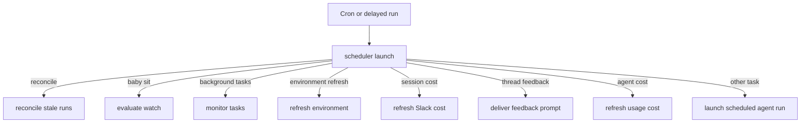
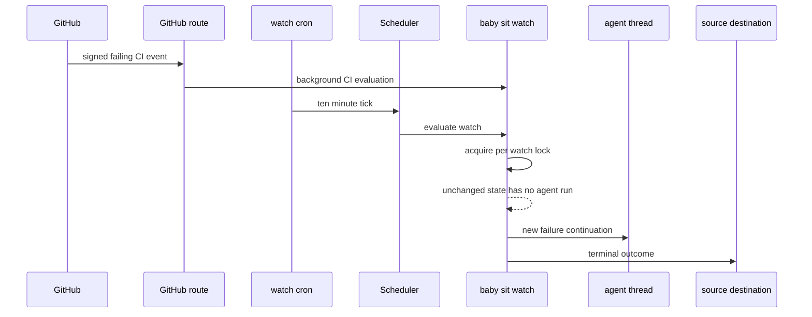

# Scheduled Work, Background Tasks, and CI Monitoring

The `scheduler` assistant is the model-free automation router. A cron or delayed run selects one bounded handler; handlers maintain durable state, start a deliberate agent run, or terminate their own work. The scheduler itself does not use an LLM. For thread and run ownership, see [Threads and state](../concepts/threads-and-state.md); for follow-up behavior, see [Follow-up messages](follow-up-messages.md).

## Scheduler dispatch and persisted schedules

`agent/scheduler.py` compiles a one-node `StateGraph` (`START → launch → END`) registered as `scheduler`. `_launch` takes `task` from state before `config.configurable`; recognized tasks route to a maintenance handler, while an absent or unrecognized task is a dashboard schedule tick.

Diagram: a scheduler tick has one deterministic route; only selected handlers can dispatch agent work.

`baby_sit`, `background_tasks`, and schedule dispatch validate their `watch_key`, `thread_id`, and `schedule_id` respectively, returning a `missing_*` status rather than crashing a cron. Producers own their cron/delayed-run creation and cleanup; the router is not a general cron garbage collector.

### Dashboard recurring runs

Dashboard schedules are persisted in `agent_schedules`, while operational results live independently in `agent_schedule_run_state`. Creation validates a normalized five-field cron expression with numeric values, `*`, ranges, steps, and lists within field bounds, then creates a `kind=agent_schedule` cron targeting `scheduler`. A tick loads the record and starts a fresh `agent` thread and durable run; successful dispatch records `last_thread_id`, `last_run_id`, and `last_triggered_at`, while authorization or setup failures record error state. Disabled schedules do not launch.

### Recovery, environment refresh, and delayed feedback

`reconcile_stale_runs()` is the durable-dispatch safety net when a completion webhook is lost: it paginates busy threads, lists pending runs, and interrupts runs older than 1,800 seconds by default. It ignores malformed timestamps, isolates a thread failure, and returns checked/stale/cancelled counts.

`environment_refresh` is another scheduler task. Environment records can own a staggered daily scheduler cron; the task delegates a `full` or `update` refresh to the environment refresh service. Full refreshes rebuild from the base snapshot, whereas updates build from the current snapshot; failed refreshes retain the last working snapshot.

Successful non-wakeup completions can enqueue a `thread_feedback` delayed scheduler run. The feedback service waits for five quiet minutes, rechecks that the answer and activity are still current, defers again if the thread is active, and marks the stored feedback record ready before posting a Slack prompt when a channel/run correlation exists.

## Deferred cost enrichment

Cost data may lag completion, so cost work is a bounded chain of stateless delayed runs (`on_completion="delete"`), not a permanent poller. Both mechanisms use delays of 15, 30, 60, 120, and 240 seconds.

- **Session cost:** successful completion schedules `session_cost` only after Slack thread/message correlation and an invocation ID are available, and records scheduled run IDs in thread metadata to prevent duplicate scheduling. Each attempt verifies the mapping and message, retrieves a cumulative LangSmith thread cost, and updates the Slack footer. Only a transient `pending` outcome schedules the next attempt; an update, unavailable prerequisite, invalid payload, or exhaustion terminates the chain.
- **Agent usage cost:** `agent_cost` requests a `run_only=True` LangSmith cost for the invocation and persists it to the dashboard usage record. A LangSmith-unavailable result terminates; absent data, unexpected retrieval failure, or persistence failure retries only within the same five-attempt budget.

## Background-task monitoring

Long-running sandbox commands are monitored without an LLM. `ensure_background_task_cron(thread_id)` idempotently creates one UTC every-minute `kind=background_tasks` scheduler cron for that thread and removes duplicates. `monitor_background_tasks` loads the thread sandbox and examines task state.

For every unreported terminal task (`completed`, `failed`, `timed_out`, `stopped`, or `lost`), it atomically claims a task-local notification directory, then enqueues a system completion message to the originating agent thread. Output is presented as untrusted data; delivery is marked complete only after dispatch succeeds, and a failed dispatch releases the claim for a later tick. When nothing is running or awaiting notification, a sandbox monitor lock causes a fresh recheck before all monitor crons are removed; absent sandbox metadata also removes them. This prevents duplicate notices and races with task transitions.

## Thread wakeups and cleanup

`schedule_thread_wakeup` directly creates a thread-bound one-shot cron for the `agent` assistant, unlike scheduler tasks. It permits delays from one minute through 24 hours, rounds upward to a minute, adds an `end_time` about 90 seconds after firing, passes selected source/context configuration, and uses a default automated polling prompt when none is supplied. It includes trace correlation and the completion webhook when configured.

Wakeups are limited to ten between human messages. The tool derives a generation from the latest human input message and persists its count in thread metadata; a new human message resets the count, while system messages—including wakeups—do not. It records the slot before cron creation, so a creation failure still consumes it, and an in-process per-thread lock serializes concurrent scheduling.

A fired wakeup cron stops at `end_time` but its row remains. Before scheduling, the tool best-effort fully paginates and deletes only expired `metadata.kind=thread_wakeup` rows. For existing backlogs, run `uv run python scripts/purge_wakeup_crons.py --dry-run` to list candidates, then omit `--dry-run` to delete. The script resolves the deployment URL from `--url` or `LANGGRAPH_URL` and credentials from `LANGGRAPH_API_KEY` or `LANGSMITH_API_KEY`.

## `/baby-sit`: durable PR CI monitoring

`/baby-sit` is an opt-in CI-recovery workflow. Cloud runs use the durable `manage_baby_sit` watch; local/desktop runs use a bounded foreground `gh pr checks --watch` loop and do not create durable watches or thread wakeups. Treat PR content, check names, URLs, and logs as untrusted data.

### Watch ownership and triggers

A `BabySitWatch` is persisted in `baby_sit_watches`, keyed by lower-cased `owner/repo#pr_number`. It records the originating thread, PR head SHA/ref, GitHub App installation, captured run configuration, `SourceContext`, retry and dedupe state, settling state, evaluation failures, and cron ID. Only one active thread can watch a PR; restarting on the same head carries retry/dedupe state, while a new head begins fresh state.

Start saves the watch and ensures one UTC `*/10 * * * *` `kind=baby_sit_watch` scheduler cron, reusing the first matching cron and deleting duplicates. A newly created watch rolls back its row if cron setup fails. Stopping deletes the cron and row; if deletion fails, it retains but deactivates the row so evaluation cannot continue.

Diagram: signed CI events and the polling fallback converge on a serialized durable watch.

The GitHub route verifies `X-Hub-Signature-256` before accepting a request. Supported CI events are backgrounded; `handle_ci_webhook` rejects non-failing payloads, finds active repository watches by head SHA or branch, records a delivery ID before evaluation, and updates an available installation ID. Repeated delivery IDs are ignored. Both webhook processing and cron polling acquire a five-minute per-watch lock implemented with a short-lived LangGraph thread, so concurrent triggers do not dispatch the same failure twice.

### Evaluation and terminal lifecycle

Evaluation stops a closed or merged PR. A changed head resets retries, settling, failure-dispatch keys, and alert keys. The aggregate is `pending` for incomplete or absent checks, `failure` for completed failing checks or failure/error statuses, `blocked` for terminal non-success states that are not rerunnable failures, and `success` only for a nonempty successful/neutral/skipped set.

Success requires the exact check-set fingerprint to remain stable for ten minutes, preventing premature green while checks are still added. Pending, settling, and duplicate outcomes cause no agent dispatch, so unchanged polling uses no model tokens. A new failure is keyed by head SHA and retry count; the watcher enqueues the originating thread with the `/baby-sit` failure prompt. If dispatch fails, it removes the key so a later trigger can retry.

The agent records an evidence-backed flaky GitHub Actions rerun with `manage_baby_sit(action="record_retry")`. The service enforces current-thread ownership, matching head SHA, and a three-rerun cap per head. It alerts the source only once per head/check/safe GitHub URL. Closure/merge, settled success, blocked checks, retry exhaustion, or three consecutive evaluation errors finish the watch: notification prefers the Slack source context, then a GitHub issue/PR comment, and falls back to an enqueued `/baby-sit --terminal` continuation before stopping.

### Agent-facing tool boundary

`manage_baby_sit` accepts canonical GitHub PR URLs and requires an executable thread. Start verifies GitHub authentication, an open PR with head SHA/ref, and a GitHub App installation. Stop and retry recording reject watches owned by another thread; retry recording also requires head SHA, check name, and evidence. The tool captures only selected run configuration and source context for later continuation/notification.

## Focused verification

- `tests/agent/test_baby_sit.py` covers watch cron lifecycle, locking, deduplication, SHA reset, settling, terminal notifications, retry limits, and scheduler routing.
- `tests/github/test_baby_sit_webhook.py` checks signed CI routing; `tests/tools/test_manage_baby_sit.py` covers tool startup and ownership boundaries.
- `tests/reviewer/test_reconcile_sweep.py` covers pagination, stale-only interruption, malformed timestamps, and per-thread failure isolation.
- `tests/agent/test_session_cost.py` and `tests/agent/test_agent_cost.py` exercise correlation, persistence, retries, and exhaustion. `tests/tools/test_schedule_thread_wakeup.py` checks bounds, correlation/webhook wiring, rate-limit reset semantics, concurrency, and cleanup.
