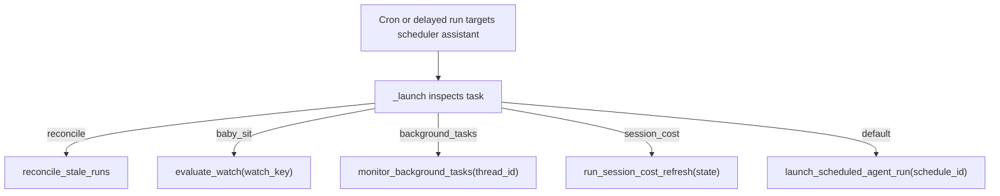
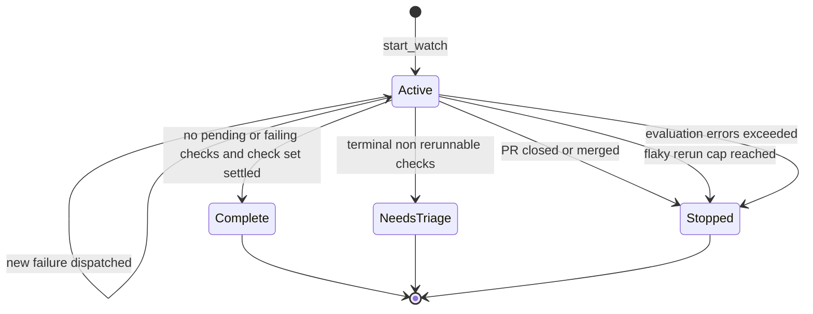
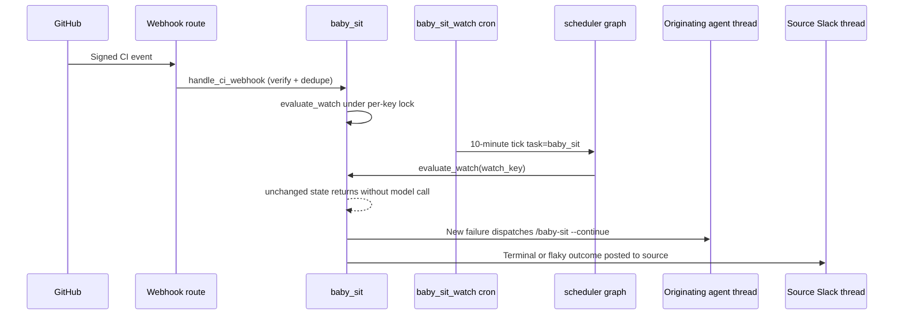

# Scheduling, Cron & Baby-Sit CI Monitoring

This page documents two related mechanisms:

- The **scheduler graph** (`agent/scheduler.py`), a tiny LangGraph assistant whose
  only job is to receive a cron/run tick and dispatch it to the correct handler.
- The **`/baby-sit` PR CI monitoring flow**, an opt-in, durable watch that keeps
  an eye on a pull request until CI is green, driven by signed GitHub CI webhooks
  with a deterministic per-watch cron fallback that needs no model call while
  state is unchanged.

Both build on the same durable-dispatch contract used everywhere else in the
system; see [workflows/invocation](invocation.md) for how runs are created and
completed, [workflows/pr-creation](pr-creation.md) for how agent PR work is
driven, and [architecture/reviewer-and-analyzer](../architecture/reviewer-and-analyzer.md)
for the analyzer's per-repo nightly continual-learning cron referenced below.

## The scheduler graph

`agent/scheduler.py` compiles a single-node `StateGraph` (`START → launch → END`)
registered as the `scheduler` assistant in `langgraph.json`. Every cron and
delayed run that the system creates targets this assistant; the graph's `_launch`
node inspects the incoming `task` (from graph state or `config.configurable`) and
fans it out to the appropriate handler. It is deliberately model-free — none of
its branches invoke an LLM.

The recognized tasks are:

- `reconcile` → `reconcile_stale_runs()` (cancel stale `pending` runs).
- `baby_sit` → `evaluate_watch(watch_key)` (evaluate one PR CI watch).
- `background_tasks` → `monitor_background_tasks(thread_id)` (poll sandbox
  background commands).
- `session_cost` → `run_session_cost_refresh(state)` (refresh a Slack cost
  footer).
- default (no matching task) → `launch_scheduled_agent_run(schedule_id)`
  (a dashboard-managed recurring agent run).

If the branch's required key (`watch_key`, `thread_id`, `schedule_id`) is missing
or the wrong type, `_launch` returns a `missing_*` status instead of raising, so a
malformed tick degrades to a no-op rather than a crashing cron.

Diagram: the scheduler graph's single `launch` node fans one cron tick out to one
of five deterministic handlers.

Each producer registers its own cron against the `scheduler` assistant and tags
the cron with a `metadata.kind` so it can be searched and de-duplicated later —
`baby_sit_watch` per active watch (`agent/baby_sit.py`), `background_tasks` per
sandbox-bearing thread (`agent/background_tasks.py`), and `session_cost_refresh`
as a one-shot delayed run (`agent/session_cost.py`).

### Scheduled agent runs (dashboard)

`agent/dashboard/schedules.py` owns user-defined recurring agent runs. Cron
strings are validated up front by `normalize_cron_schedule`, which requires a
five-field expression and range-checks each field (with steps, ranges, and lists
supported). When a schedule's cron fires, the tick has no `task`, so the
scheduler falls through to `launch_scheduled_agent_run(schedule_id)`, which loads
the stored schedule record and launches a fresh agent run, recording
`last_thread_id` / `last_run_id` / `last_triggered_at` (or `last_error`) in a
separate run-state namespace.

### Reconcile stale runs

`reconcile_stale_runs()` is the safety net for the durable-dispatch contract:
completion normally arrives via a platform webhook, but if that webhook never
fires (crash, lost delivery) a run can sit in `pending` forever and hold its
thread `busy`. The sweep paginates every `busy` thread, lists its `pending` runs,
and cancels (with `action="interrupt"`) those older than `max_age_seconds`
(default 1800s / 30 min). Per-thread work is wrapped in try/except so one bad
thread never aborts the sweep, and it returns counts of threads checked, stale
runs found, and runs cancelled.

### Session-cost refresh

After an agent run completes, `agent/completion.py` schedules a stateless,
delayed `session_cost` run so the Slack response footer can be updated once
LangSmith cost data is available. `run_session_cost_refresh` performs one bounded
attempt against the mapped Slack message; on a transient `pending` result it
enqueues the next attempt with a backoff, capped by a fixed retry-delay list.
This is a self-terminating chain of one-shot delayed runs rather than a
standing cron.

## `/baby-sit`: durable PR CI monitoring

The `/baby-sit` skill (`agent/bundled_skills/baby-sit/SKILL.md`) lets an agent
monitor a pull request until CI is green, diagnose failures, and rerun only
evidence-backed flaky GitHub Actions jobs. On cloud runs it creates a **durable
watch** through the `manage_baby_sit` tool; local/desktop runs instead use a
bounded foreground `gh pr checks --watch` loop and never touch the durable
machinery.

### Watch state and lifecycle

Each watch is a `BabySitWatch` persisted in the `baby_sit_watches` store, keyed by
`owner/repo#pr_number` (lower-cased). A watch is created (or reactivated) by
`start_watch`, which binds it to the originating agent `thread_id`, the PR's head
SHA/ref, the GitHub App installation id, a captured `run_config`, and a
`SourceContext` (Slack thread, Linear issue, or GitHub issue). A PR may be watched
from only one agent thread at a time — `start_watch` rejects a second thread
trying to watch an already-active PR. When the head SHA is unchanged, retry
counters and dedupe state are carried over; when it differs they reset.

`start_watch` calls `_ensure_watch_cron`, which idempotently creates (or reuses,
deleting duplicates) a per-watch LangGraph cron tagged `kind=baby_sit_watch`. If
cron creation fails for a brand-new watch, the store row and any partial cron are
rolled back. `stop_watch` deletes the cron and the store row (marking the watch
inactive if the cron delete fails).

Diagram: the terminal outcomes an evaluated watch can reach; each terminal state
notifies the source and deletes the watch.

### Two triggers: webhooks and the deterministic cron fallback

A watch is evaluated on two independent triggers, and both funnel into the same
`_evaluate_watch` under a per-key lock so at most one evaluation runs at a time:

1. **Signed GitHub CI webhooks (immediate).** The GitHub webhook route
   (`agent/webhooks/github_routes.py`) verifies every request's
   `X-Hub-Signature-256` HMAC before processing. CI events
   (`check_run`, `check_suite`, `workflow_run`, `status`) reach
   `handle_ci_webhook`, which ignores non-failing payloads
   (`is_failing_ci_payload`), matches active watches for the repo by head SHA or
   branch, de-duplicates by the webhook `delivery_id`, and evaluates each match
   immediately.
2. **Per-watch cron (deterministic fallback).** The `baby_sit_watch` cron fires on
   the fixed `*/10 * * * *` schedule (~every 10 minutes), giving a deterministic
   fallback if a webhook is lost or delayed. When CI state is unchanged, an
   evaluation returns a status such as `pending`, `settling`, or `duplicate`
   without dispatching an agent run, so the fallback consumes **no model tokens**
   for unchanged state.

`_evaluate_watch` acquires a short-lived lock thread, refetches the PR, resets
retry/dedupe state on a head-SHA change, and lists check runs and commit statuses
to compute an aggregate state (`pending`, `failure`, `blocked`, or `success`).

Diagram: webhooks trigger immediate evaluation while the per-watch cron provides
a deterministic fallback; both converge on one locked evaluation that dispatches
diagnosis or posts an outcome.

### New failures resume the originating thread

On a genuinely new failing state, `_evaluate_watch` computes a per-head failure
fingerprint and skips dispatch if that fingerprint was already dispatched
(dedupe). Otherwise it resumes the **originating agent thread** by dispatching a
`/baby-sit --continue` run whose prompt lists the failing signals as explicitly
untrusted data and instructs the agent to verify the head and complete check set
itself before acting. That resumed run performs the confidence-gated diagnosis:
it may rerun failed jobs only when evidence supports a transient/flaky diagnosis,
and never treats a single unexplained failure as flaky.

### Flake reruns are capped and de-duplicated

Flaky reruns are bounded per head SHA by `MAX_RETRIES_PER_HEAD` (3). After a
successful rerun, the agent calls `manage_baby_sit` with action `record_retry`,
which increments the durable retry count (rejecting the call if the head changed
or the cap is reached) and posts a **flaky-CI Slack alert only on the first
occurrence** of a given check/URL for that head (deduped via `alert_keys`). Once
the cap is exhausted the watch stops with a message. Because the retry-recording
tool owns the flaky alert, the skill instructs the agent not to duplicate it.

### Terminal outcomes and settling

`_finish_watch` posts the terminal message to the source and stops the watch.
Terminal outcomes include: the PR was closed or merged; there are no pending or
failing checks (**success**, but only after the exact check set has been stable
for `CHECK_SET_SETTLE_MINUTES` (10 min) to avoid a premature green); terminal
checks that are neither successful nor rerunnable (**needs owner triage**); the
flaky rerun cap was hit; or `MAX_EVALUATION_ERRORS` (3) consecutive evaluation
failures (e.g. missing GitHub token or unreachable CI). Notification prefers the
`SourceContext` destination (Slack thread reply, else Linear/GitHub comment); if
none is reachable it falls back to dispatching a `/baby-sit --terminal` run on the
originating agent thread.

## Background-task monitoring

`agent/background_tasks.py` provides model-free monitoring for long-running
sandbox background commands. `ensure_background_task_cron` idempotently registers
a `kind=background_tasks` cron on the `* * * * *` (every-minute) schedule bound to
the owning thread. Each tick runs `monitor_background_tasks(thread_id)`, which
inspects the thread's sandbox, and for each terminal task it hasn't yet reported,
atomically claims the notification (via a `mkdir` lock in the sandbox), dispatches
a completion message onto the originating thread, and marks it delivered. When no
task is running or pending, it deletes its own cron so monitoring self-terminates.

## Thread wakeups

`agent/tools/schedule_thread_wakeup.py` lets an agent schedule a **one-shot
re-trigger of its own thread** after a delay (1 minute to 24 hours) — useful for
polling on something that isn't webhook-driven. It builds a five-field cron that
fires once at the target minute and carries an `end_time` (~90s past the fire) so
it does not re-fire; the run is created against the `agent` assistant (not the
scheduler graph) with a default polling prompt and selected passthrough config
keys. To prevent runaway self-scheduling, at most
`_MAX_WAKEUPS_BETWEEN_USER_MESSAGES` (10) wakeups may be scheduled between human
messages — the budget is keyed to the latest human message "generation" and
resets when a new human message arrives (system-kind messages do not reset it).
Because a wakeup cron's row is never removed by firing, `schedule_thread_wakeup`
opportunistically purges expired `thread_wakeup` crons (matched conservatively on
`kind` plus a past `end_time`) before creating a new one.

## Tests that matter

- `tests/agent/test_baby_sit.py` covers the ten-minute per-watch cron lifecycle,
  the installation-token fallback, failure-dispatch dedupe until a retry is
  recorded, single-dispatch under concurrent evaluations, waiting for a stable
  check set before signalling success, terminal-notification fallback to the
  originating thread, capping/deduping flake alerts, head-change retry reset,
  webhook delivery dedupe, and the scheduler's `baby_sit` routing.
- `tests/github/test_baby_sit_webhook.py` and `tests/tools/test_manage_baby_sit.py`
  exercise the signed webhook path and the tool surface.
- `tests/tools/test_schedule_thread_wakeup.py` covers delay validation, cron
  creation with trace/completion-webhook wiring, the ten-wakeup budget and its
  reset on a new human message, and expired-cron purging.
