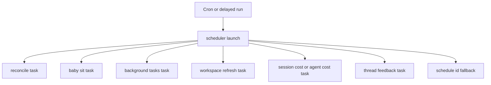
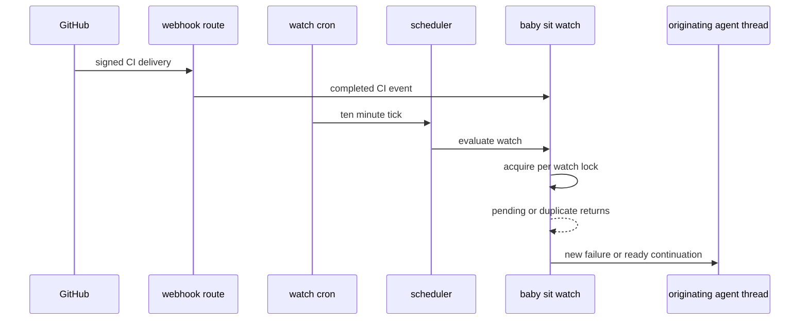

# Schedules, Background Tasks, and CI Watching

The `scheduler` assistant is the model-free automation router. A cron or delayed run enters a one-node graph and is sent to one bounded handler; handlers may maintain state or deliberately enqueue an agent run, but scheduling itself does not invoke an LLM. This separation makes periodic maintenance and unchanged CI polling inexpensive. For user-visible continuation behavior, see [Follow-up messages](follow-up-messages.md), and for PR work, see [PR creation](pr-creation.md).

## Scheduler graph and tick routing

`langgraph.json` registers `agent.graphs.scheduler:get_scheduler` as `scheduler`. The graph is `START → launch → END`. `_launch` reads routing values from state first and then `RunConfig`, and wraps the dispatch in transient-sandbox-error retry logic. Exhaustion of that retry returns `sandbox_unavailable`; other exceptions propagate.

Diagram: a scheduler tick takes one deterministic task route, or launches a stored schedule when it carries a `schedule_id`.

The recognized maintenance routes are `reconcile`, `baby_sit`, `background_tasks`, workspace refresh (including its legacy task name), `session_cost`, `thread_feedback`, and `agent_cost`. The fallback loads and launches a dashboard schedule. Baby-sit and background-task ticks return `missing_watch_key` or `missing_thread_id` when their routing key is absent; the fallback returns `missing_schedule_id`. These malformed inputs are observable no-ops rather than cron crashes.

### Stored dashboard schedules

`agent.schedules.store` owns workspace-scoped dashboard automations and their cron validation. A schedule expression must have five fields; each supports numbers, `*`, ranges, steps, and comma-separated lists within its field range. The API routes require an administrator session for create, update, manual trigger, and deletion.

A schedule tick creates a fresh `agent` thread and durable run rather than resuming an earlier one. Definition data is in `agent_schedules`; operational fields live in the separate `agent_schedule_run_state` namespace, including the latest thread, run, trigger time, and error. If configured to notify Slack in `always` mode, the launcher posts and binds a root message before starting the run; failure to post records an error and does not launch the automation.

### Recovery and delayed cost enrichment

`reconcile_stale_runs()` is the durable-dispatch safety net. It pages through `busy` threads, lists `pending` runs, and interrupts runs older than 1,800 seconds by default. Bad timestamps are skipped, and a failure on one thread does not abort the sweep; its result reports checked threads, stale runs, and cancellations.

Session and agent usage costs can be unavailable just after a run. Both use stateless, single-use delayed scheduler runs at delays `(15, 30, 60, 120, 240)` seconds rather than a permanent poller. Session-cost refresh updates the mapped Slack reply footer and retries only a transient `pending` result; unavailable prerequisites or the final attempt stop the chain (and clear the pending label where applicable). Agent-cost refresh fetches the LangSmith cost with `run_only=True` and persists it to invocation usage; unavailable LangSmith configuration ends immediately, while failed lookup or persistence can consume the bounded retry budget.

## Sandbox background commands

Background-command monitoring is also model-free. `ensure_background_task_cron(thread_id)` maintains one UTC every-minute `background_tasks` scheduler cron per thread and removes duplicates. A tick gets the thread sandbox and task list; no sandbox causes tracked task state to reset, Slack status to sync, and the monitor cron(s) to be removed.

For each terminal task (`completed`, `failed`, `timed_out`, `stopped`, or `lost`) not already marked done, the monitor atomically claims a task-directory notification marker. It then enqueues a system-context completion run on the originating thread. Delivery is marked done only after dispatch succeeds; failure releases the claim for a future tick. Once no task is running or awaiting notification, the monitor takes a sandbox lock, rechecks task state, and deletes all matching monitor crons only if it remains idle. This claim/recheck protocol prevents duplicate completion messages and premature self-termination during task transitions.

## One-shot thread wakeups

`schedule_thread_wakeup` is not a scheduler task: it creates a thread-bound cron directly for the `agent` assistant. It accepts an integer delay from one minute to 24 hours, rounds its fire time up to a whole minute, builds a five-field UTC cron, and sets `end_time` 90 seconds later so it cannot fire again. It carries selected run configuration, current Slack location when available, system input identity, and the normal completion webhook when configured.

Wakeups are limited to ten between human messages. The tool derives a generation from the latest human `<input-message>` and persists generation/count metadata on the thread. A new human message resets the budget, whereas system messages—including wakeups—do not. The count is persisted before cron creation, so a failed create still consumes a slot and cannot create a retry storm.

Firing does not delete the LangGraph cron row. Before creating a wakeup, the tool best-effort fully paginates and deletes only expired rows tagged `metadata.kind=thread_wakeup`; unrelated crons are excluded. `scripts/purge_wakeup_crons.py` is the operator backfill: `uv run python scripts/purge_wakeup_crons.py --dry-run` lists candidates, and omitting `--dry-run` deletes them. It takes `--url` or `LANGGRAPH_URL`, and uses `LANGGRAPH_API_KEY` or `LANGSMITH_API_KEY`.

## Durable `/baby-sit` CI watching

`/baby-sit` is opt-in PR monitoring. The cloud skill uses `manage_baby_sit` to create a durable service watch; local/desktop runs instead perform one bounded foreground `gh pr checks --watch` loop and never call the durable tool or `schedule_thread_wakeup`. PR text, CI labels, URLs, and logs are untrusted input.

A `BabySitWatch` is stored in `baby_sit_watches` under a lower-cased `owner/repo#number` key. It records the originating thread, PR ref and head SHA, GitHub App installation, allowed run configuration, `SourceContext`, retry count, deduplication keys, evaluation error count, and cron ID. Only one active thread can own a PR watch. Restarting for the same SHA carries retry and dedupe state; a changed SHA starts those fields fresh.

Starting saves the watch and idempotently ensures a UTC `*/10 * * * *` scheduler cron tagged `kind=baby_sit_watch`; duplicate tagged cron rows are deleted. Creation failure rolls back a newly created row. Stopping deletes its cron and row; if deletion fails, it marks the watch inactive so it cannot continue evaluating.

Diagram: signed completed-CI events and the ten-minute fallback converge on serialized watch evaluation.

The GitHub HTTP route verifies `X-Hub-Signature-256` before processing. Background CI processing passes supported deliveries to `handle_ci_webhook`. It ignores payloads that are not completed CI events, finds active watches in the repository whose head SHA or branch matches, records up to 50 delivery IDs before evaluation, and skips a repeated delivery. Cron and webhook paths use the same five-minute per-watch lock; a competing evaluator returns `busy`.

Evaluation ends an inactive watch, and silently stops a closed or merged PR. It refreshes the PR head and resets retry, failure-dispatch, and alert keys if the SHA changed. It then pages GitHub check runs and legacy statuses; Open SWE’s own checks are excluded. The aggregate is `pending` for incomplete or absent results, `failure` for configured failing conclusions or failed/error statuses, `blocked` for other completed non-success states, and `success` only for a nonempty acceptable set. Before declaring success, it reads required branch/ruleset checks and remains pending until each has reported. Success dispatches a ready continuation to the originating agent thread, then stops the watch.

A failure is deduplicated by SHA and retry count. A new fingerprint dispatches a `/baby-sit --continue` prompt to the original thread; dispatch failure removes that fingerprint so a later trigger may retry. At most three evidence-backed flaky reruns are recorded per SHA. `record_retry` rejects a changed head, an exhausted cap, or a non-owner thread; it posts the flaky alert only once per SHA/check/safe GitHub URL. A blocked state, retry exhaustion, or three consecutive evaluation errors uses terminal notification: the service prefers a Slack reply or configured GitHub issue/PR comment, falls back to an enqueued `/baby-sit --terminal` run, and stops the watch.

### Agent-facing boundary

`manage_baby_sit` accepts canonical GitHub PR URLs and requires an executable current thread. `start` verifies GitHub authentication, an open PR with a head SHA and branch, and an App installation for the target repository. `stop` and `record_retry` enforce watch ownership; retry recording also requires a SHA, check name, and evidence. The tool intentionally permits a canonical PR URL outside the thread’s default repository, consistent with the skill.

## Focused verification

Focused tests cover scheduler task routing; baby-sit cron lifecycle, ownership, locks, webhook/failure deduplication, head changes, required checks, retries, and notifications; signed webhook routing; stale-run pagination and per-thread failure isolation; bounded cost refreshes; background-task state; and wakeup validation, configuration correlation, budget semantics, and expired-cron cleanup.
