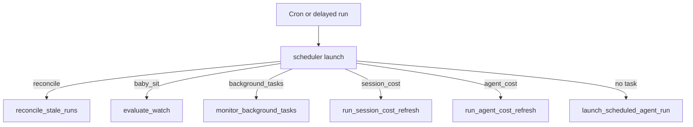
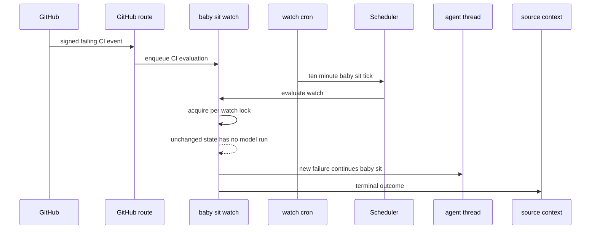

# Scheduling, Background Work, and CI Monitoring

This workflow is the system's model-free automation layer. The `scheduler` assistant receives cron ticks and delayed runs, then routes each tick to one bounded handler. It does not decide what work to perform with an LLM; handlers either maintain durable state, dispatch a deliberately new agent run, or finish their own lifecycle.

The principal consumers are dashboard schedules, stale-run reconciliation, deferred cost enrichment, sandbox background-task monitoring, and the opt-in `/baby-sit` pull-request watch. For run and thread ownership, see [Threads and state](../concepts/threads-and-state.md); for user-facing follow-ups, see [Follow-up messages](follow-up-messages.md); and for PR work itself, see [PR creation](pr-creation.md).

## Scheduler dispatch

`agent/scheduler.py` compiles a one-node `StateGraph` (`START → launch → END`), exposed as `scheduler` through `langgraph.json`. `_launch` reads `task` from the state first and then `config.configurable`, invoking exactly one handler:

Diagram: one scheduler tick selects one deterministic maintenance or dispatch handler.

The recognized task values are `reconcile`, `baby_sit`, `background_tasks`, `session_cost`, and `agent_cost`. An unrecognized or absent task is the dashboard-schedule path. The keyed branches return `missing_watch_key`, `missing_thread_id`, or `missing_schedule_id` rather than raising if their required routing key is absent. This makes malformed ticks observable no-ops instead of cron-wide failures.

A producer owns creation, tagging, and removal of its cron or delayed run. In particular, watches use `kind=baby_sit_watch`, background monitors use `kind=background_tasks`, and cost refreshes are one-shot delayed scheduler runs with `on_completion="delete"`. This ownership is important: the scheduler is a router, not a generic cron garbage collector.

### Dashboard recurring runs

`agent/dashboard/schedules.py` owns user-defined recurring agent automations. It normalizes and validates a five-field cron expression before storage, accepting numeric values, `*`, ranges, steps, and lists within field-specific bounds. A dashboard tick has no recognized task, so it falls through to `launch_scheduled_agent_run(schedule_id)`.

The launch path loads the schedule record, creates a fresh `agent` thread/run with system/automation input context, and stores scheduling results separately from the definition. Its run-state namespace retains `last_thread_id`, `last_run_id`, and `last_triggered_at`, or error information. Keeping run state separate allows schedule configuration and operational status to evolve independently.

### Stale-run reconciliation

Normal durable dispatch relies on the completion webhook to release a run. `reconcile_stale_runs()` is the recovery sweep when a completion is lost: it paginates `busy` threads, lists each thread's `pending` runs, and interrupts runs older than `max_age_seconds` (1,800 seconds by default). It skips malformed timestamps, isolates errors per thread, and returns counts for checked threads, stale runs, and cancellations. Thus a damaged or unavailable thread does not prevent other blocked threads from recovering.

### Deferred cost enrichment

Costs can lag run completion in LangSmith, so both cost mechanisms use a bounded, stateless delayed-run chain rather than a permanent poller:

- **Session cost** updates the mapped Slack response footer. On a successful agent completion, the completion handler schedules a `session_cost` attempt only when it has a Slack thread, message correlation, and a `prepare_run_id`; it records scheduled run IDs in thread metadata to avoid scheduling the same run twice. A refresh verifies the mapped Slack message and waits for a fresh LangSmith aggregate. A `pending` result schedules the next delay in `(15, 30, 60, 120, 240)` seconds; an update, unavailable prerequisite, or exhausted final attempt stops the chain.
- **Agent usage cost** writes one run's cost to the dashboard usage record. `agent_cost` uses the same five-delay budget, asks LangSmith for `run_only=True` cost, and persists it with `record_agent_run_cost`. Configuration/unavailability ends without retries where appropriate; unavailable data or persistence/lookup failure otherwise advances only until the fixed retry budget is exhausted.

## Background-task monitoring

Long-running sandbox commands are monitored without an LLM. `ensure_background_task_cron(thread_id)` idempotently keeps one every-minute `background_tasks` cron for a thread (and removes duplicate cron rows). The scheduler calls `monitor_background_tasks(thread_id)`, which loads the thread's sandbox and lists task state.

For each unreported terminal task (`completed`, `failed`, `timed_out`, `stopped`, or `lost`), the monitor atomically claims a per-task sandbox directory before dispatching a completion message back to the originating thread with `multitask_strategy="enqueue"`. The message treats command output as untrusted and directs the agent to retrieve bounded output only if needed. It marks delivery only after dispatch succeeds; on failure it releases the claim for a later tick. If no task is running and no terminal notification remains pending, a sandbox monitor lock triggers a fresh recheck before all of that thread's monitor crons are deleted. Missing sandbox metadata also removes them. These checks prevent duplicate notifications and avoid deleting a monitor while a concurrent task transition is being discovered.

## Thread wakeups

`schedule_thread_wakeup` is distinct from scheduler tasks: it creates a thread-bound, one-shot cron directly against the `agent` assistant. It accepts delays from one minute through 24 hours, rounds the fire time to a minute, and supplies an `end_time` about 90 seconds later so the cron cannot recur. The wakeup carries selected source/repository/context configuration and uses a default automated polling prompt when none is supplied. When configured, it also includes the normal completion webhook and trace correlation.

Wakeups are intentionally rate limited. The tool hashes the latest human input-message identity and persists a count in thread metadata; no more than 10 wakeups can be created in that human-message generation. A new human message resets the count, while system messages—including wakeups—do not. The budget is recorded before cron creation, so a creation failure still consumes a slot rather than allowing retry storms.

A fired cron row remains in LangGraph even after `end_time`. Before scheduling, the tool best-effort purges only expired `metadata.kind=thread_wakeup` rows, fully paginating first; it does not touch unrelated crons. `scripts/purge_wakeup_crons.py` is the operational backfill utility for an accumulated deployment backlog. Run `uv run python scripts/purge_wakeup_crons.py --dry-run` to list candidates, then omit `--dry-run` to delete them; it resolves the URL from `--url` or `LANGGRAPH_URL` and credentials from `LANGGRAPH_API_KEY` or `LANGSMITH_API_KEY`.

## `/baby-sit`: durable PR CI monitoring

`/baby-sit` is an opt-in CI-recovery workflow, not a general repository watcher. Cloud runs create a durable watch through `manage_baby_sit`; local/desktop runs use one bounded foreground `gh pr checks --watch` loop and never call the durable watch or `schedule_thread_wakeup`. The skill requires fresh PR/check state and treats PR content, check labels, URLs, and logs as untrusted data.

### Durable watch ownership

A `BabySitWatch` is stored under the lower-cased `owner/repo#pr_number` key in `baby_sit_watches`. It binds a PR's head SHA/ref, GitHub App installation, originating agent thread, selected run configuration, and `SourceContext`; its durable fields also hold retries, check-set settling, failure-dispatch keys, webhook deliveries, alerts, evaluation errors, and cron ID.

Only one active originating thread may watch a PR. Starting from another thread is rejected. Restarting the same PR on the same head retains retry and dedupe state; a different head starts that state over. Start saves the watch then ensures one `*/10 * * * *` UTC scheduler cron, reusing a matching cron and deleting duplicates. For a new watch, a cron-creation failure rolls back its row and any partial cron. Stopping normally removes its cron and row; if cron deletion fails, the row is retained but marked inactive so it cannot evaluate again.

### Two triggers, one lock

Diagram: immediate signed CI events and the polling fallback converge on one serialized watch evaluation.

The GitHub route verifies `X-Hub-Signature-256` before accepting a request. CI events (`check_run`, `check_suite`, `workflow_run`, and `status`) are processed in the background. `handle_ci_webhook` ignores non-failing payloads, selects active watches in the repository whose stored SHA or branch matches, updates a supplied installation ID, and records a delivery ID before evaluating; repeated deliveries do not cause a second evaluation.

The ten-minute cron is the deterministic fallback for lost or delayed webhooks. `evaluate_watch` obtains a five-minute per-watch lock implemented as a short-lived LangGraph thread. A concurrent trigger returns `busy`; otherwise it fetches the PR and current check/status sets. Pending, settling, and duplicate states return without dispatching an agent run, so unchanged cron polling consumes no model tokens.

### Evaluation, dispatch, and terminal results

Evaluation first stops a closed or merged PR. A head-SHA change resets retries, settling, failure-dispatch keys, and alert keys. The aggregate is `failure` when a completed failing check or failing/error commit status exists; `pending` while checks are incomplete or absent; `blocked` for completed, non-successful states that are not rerunnable failures; and `success` only for a nonempty all-successful/neutral/skipped set.

A success is deliberately not immediate: the exact check-set fingerprint must remain unchanged for 10 minutes before the watch reports completion. This avoids declaring green while CI is still adding checks. A new failing state is deduplicated by a SHA-and-retry-count fingerprint. If not already dispatched, the service resumes the originating thread with `/baby-sit --continue`, an explicit warning that failures and fetched logs are untrusted, and instructions to verify the head and complete check set before confidence-gated diagnosis. If dispatch itself fails, the fingerprint is removed so a future trigger can retry.

The agent may rerun only evidence-backed flaky GitHub Actions failures. After a successful rerun it calls `manage_baby_sit(action="record_retry")`; the service checks ownership, head SHA, and a three-retry-per-head cap, then increments durable state. It posts the flaky-CI alert only once per head/check/safe GitHub URL. Deterministic, ambiguous, external-provider, and permission failures should instead stop the watch and report a blocker.

`_finish_watch` handles completion, closure/merge, blocked checks needing owner triage, retry exhaustion, and three consecutive evaluation errors. It prefers the `SourceContext` destination—Slack reply, then Linear or GitHub comment—and falls back to a queued `/baby-sit --terminal` run on the originating agent thread if that notification cannot be delivered. It then stops the watch.

### Agent-facing guardrails

`manage_baby_sit` accepts only canonical GitHub PR URLs and requires an executable thread. It rejects a PR outside the thread's configured repository. Starting verifies GitHub authentication, an open PR with head SHA/ref, and a GitHub App installation; stopping and retry recording enforce that the watch belongs to the current thread. `record_retry` additionally requires a head SHA, check name, and concise evidence.

## Focused verification

- `tests/agent/test_baby_sit.py` covers watch cron lifecycle, per-key concurrency, failure and webhook deduplication, SHA reset, settling before success, fallback notification, retry cap, and scheduler routing.
- `tests/github/test_baby_sit_webhook.py` checks that supported CI events reach background processing only with a valid signature. `tests/tools/test_manage_baby_sit.py` exercises configured-repository enforcement and watch startup context.
- `tests/reviewer/test_reconcile_sweep.py` covers stale-only cancellation, pagination, malformed timestamps, and per-thread failure isolation.
- `tests/agent/test_session_cost.py` and `tests/agent/test_agent_cost.py` verify cost correlation, persistence, bounded retries, and final exhaustion. `tests/tools/test_schedule_thread_wakeup.py` verifies delay bounds, trace/webhook wiring, budget reset semantics, and cleanup behavior.
