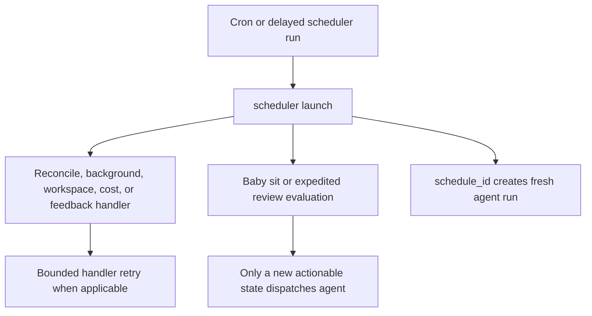
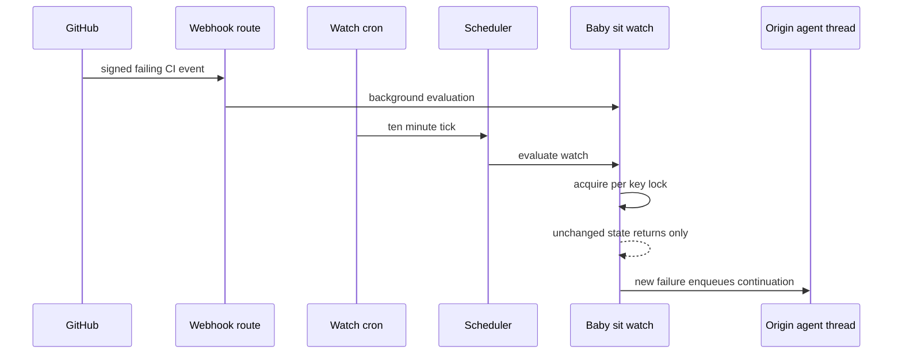

# Scheduling, Background Work, and CI Watching

The `scheduler` is an automation router, not the coding-agent graph. It is a single-node LangGraph `StateGraph` (`START → launch → END`) registered as the `scheduler` assistant. Its node performs no LLM work: each tick selects one bounded handler, which may maintain state, create a deliberately separate agent run, or schedule another bounded delayed attempt. The coding `agent` is invoked only by routes whose producer explicitly dispatches it.

## Dispatch boundary

`_launch` obtains `task` from the input state first, then `config.configurable`. It routes `reconcile`, `baby_sit`, `expedited_review`, `background_tasks`, `workspace_refresh` (and legacy `environment_refresh`), `session_cost`, `thread_feedback`, and `agent_cost`. With no recognized task, it launches the dashboard schedule named by `schedule_id`.

Diagram: a scheduler tick deterministically reaches one maintenance, watch, or scheduled-agent path; it does not enter the coding-agent graph by default.

Keyed routes return `missing_watch_key`, `missing_thread_id`, or `missing_schedule_id` rather than raising when their routing key is absent. Producers own the crons and delayed runs they create and their cleanup; the scheduler is not a generic cron garbage collector. This separation keeps polling and recovery inexpensive and makes model invocation an explicit, auditable transition.

### Dashboard schedules and run recovery

Dashboard schedule definitions live separately from their run state. A recurring automation accepts only a normalized five-field cron: numeric values, `*`, ascending ranges, steps, and lists are range-checked before storage. Its cron targets `scheduler` with `schedule_id`; `launch_scheduled_agent_run` rejects missing records and non-`schedule` triggers, then creates a fresh `agent` thread/run. The separate run-state record exposes the latest thread, run, trigger time, and error without mutating the definition.

The `reconcile` task is the durable-dispatch safety net. It pages through busy threads, lists pending runs, and interrupts only runs older than 1,800 seconds by default. Timestamp problems and failures for one thread are isolated, and the sweep reports checked, stale, and cancelled counts. Thus a lost completion webhook cannot hold unrelated automation hostage.

## Deferred work: costs, feedback, and workspace refresh

### Cost enrichment

Cost data can arrive after a run finishes. Session cost refreshes update the correlated Slack response footer; agent-cost refreshes write the invocation's run-only LangSmith cost to the usage record. Both create stateless delayed runs for `scheduler` with `on_completion="delete"` and use delays of 15, 30, 60, 120, and 240 seconds.

A session refresh retries only transient `pending` outcomes (for example, a not-yet-available trace or Slack update); invalid correlation and unavailable prerequisites terminate and clear its pending indicator. Agent cost treats an unavailable LangSmith result as terminal, while lookup or persistence failures consume the same finite retry budget. Neither mechanism leaves a permanent poller.

### Feedback prompts

The `thread_feedback` delayed task waits for a quiet, successful agent thread before making a feedback prompt ready. It compares the stored feedback event with the current record under the agent-thread state lock, defers for another five minutes if the thread is busy or activity moved, and skips obsolete/non-successful work. A matching ready event can then post the Slack prompt. This prevents an old completion from prompting while the conversation continues.

### Workspace snapshots

A workspace's daily refresh cron is deterministically staggered between 03:00 and 05:59 UTC from its slug and routes as `workspace_refresh`. A `full` refresh starts from the base snapshot and runs setup then update; an `update` starts from the current snapshot and runs only update. Lazy updates are independently queued when a snapshot is stale, subject to in-flight and interval guards.

Refresh marks workspace progress, uses a throwaway builder sandbox, captures only after every script succeeds, then stops the builder. Failure leaves the prior ready snapshot in place and records status/log/error; stale `refreshing` state eventually stops blocking a new attempt. A refresh run is self-deleting and recorded on the workspace so task-status polling can identify the current job.

## Background commands and thread wakeups

`ensure_background_task_cron(thread_id)` idempotently maintains one UTC every-minute `background_tasks` scheduler cron per thread and deletes duplicates. Monitoring lists sandbox tasks without an LLM. For an unreported terminal task it atomically creates a sandbox claim, enqueues a system completion message to the originating agent thread, and atomically marks delivery; dispatch failure releases the claim for a later tick. When no running task or undelivered terminal notification remains, it rechecks under a sandbox monitor lock before deleting the monitor crons. Missing sandbox metadata also removes the crons.

`schedule_thread_wakeup` is different: it creates a one-shot, thread-bound cron directly for the `agent` assistant. It accepts 1 minute through 24 hours, rounds to a minute, attaches an `end_time` about 90 seconds after firing, propagates selected source/context configuration, and uses a system polling prompt by default. It records a per-thread budget before cron creation: at most ten wakeups per latest human-message generation. System wakeups do not reset that generation, while a new human message does; a failed creation still consumes the reserved slot, preventing retry storms.

Fired wakeup rows remain stored after `end_time`. Before a new wakeup, best-effort cleanup fully pages `metadata.kind=thread_wakeup` and deletes only rows with expired end times. The operational script `uv run python scripts/purge_wakeup_crons.py --dry-run` audits the same class of rows; omit `--dry-run` to delete. It takes the deployment URL from `--url` or `LANGGRAPH_URL`, and credentials from `LANGGRAPH_API_KEY` or `LANGSMITH_API_KEY`.

## `/baby-sit`: durable CI watching

`/baby-sit` is opt-in pull-request CI monitoring. Cloud runs use `manage_baby_sit` to create the durable watch; local and desktop runs instead use a bounded foreground `gh pr checks --watch` loop and do not create a watch or wakeup.

### Watch state and triggers

A `BabySitWatch`, keyed as lowercase `owner/repo#pr_number` in `baby_sit_watches`, binds the originating agent thread, PR head SHA/ref, GitHub App installation, captured run configuration, and source context. It also persists retries, check-set settlement, dispatch/delivery/alert dedupe keys, evaluation errors, and cron ID. One active PR watch may belong to only one thread. Restarting for the same head carries state; a new head starts retry and dedupe state over.

Starting stores the watch, then idempotently ensures exactly one UTC `*/10 * * * *` `baby_sit_watch` cron (deleting duplicates). For a brand-new watch, cron-creation failure rolls back persisted state and any known partial cron. If stopping cannot delete the cron, the watch is marked inactive so a later tick cannot evaluate it.

Diagram: signed webhook delivery and the ten-minute fallback converge at the same per-watch lock, so unchanged CI does not trigger a model run.

The GitHub route verifies `X-Hub-Signature-256` before processing. A failing CI delivery is matched to active watches by repository plus head SHA or branch, and its delivery ID is durably deduplicated. Both webhook and cron paths acquire the same short-lived lock thread; concurrent evaluation returns `busy`. The polling fallback therefore consumes no model tokens for pending, settling, or duplicate state.

### Evaluation safeguards and completion

Evaluation fetches the PR plus check runs and commit statuses. A closed/merged PR stops the watch. A head change resets retry count, settlement, failure-dispatch keys, and alert keys. Completed failing checks/statuses produce `failure`; incomplete or absent checks are `pending`; terminal non-success/non-neutral/non-skipped checks are `blocked`; and a nonempty successful set must remain exactly unchanged for ten minutes before it counts as success.

A failure is deduplicated by head SHA and retry count. Only a new fingerprint resumes the originating thread with `/baby-sit --continue`; its prompt presents failing signals as untrusted data and asks for confidence-gated diagnosis. If dispatch fails, the fingerprint is removed to permit a later retry. An evidence-backed flaky rerun must call `record_retry`, which verifies watch ownership and matching head, enforces the three-retry-per-head cap, and posts only one alert per head/check/safe GitHub URL.

Terminal outcomes—closure/merge, settled success, blocked checks requiring triage, retry exhaustion, or three consecutive evaluation errors—notify the original `SourceContext` destination (Slack first, otherwise GitHub context) and fall back to a queued `/baby-sit --terminal` run on the origin thread. The watch is then stopped. `manage_baby_sit` is the agent-facing guardrail: it requires a canonical PR URL and executable thread, validates open PR/head/App installation on start, and enforces ownership for stop and retry recording.

## Focused verification

- `tests/tools/test_schedule_thread_wakeup.py` covers delay validation, config/webhook correlation, human-message budget reset, parallel scheduling, failed creation accounting, and conservative paginated cleanup.
- `tests/agent/test_baby_sit.py` exercises watch lifecycle, locking, deduplication, settlement, retries, terminal notification, and scheduler routing; `tests/github/test_baby_sit_webhook.py` covers signed CI routing.
- `tests/reviewer/test_reconcile_sweep.py` checks pagination, stale-only interruption, malformed timestamps, and per-thread isolation. Cost tests cover bounded retry and exhaustion behavior.
