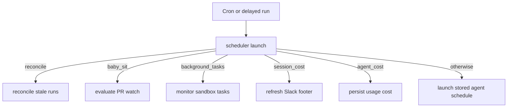
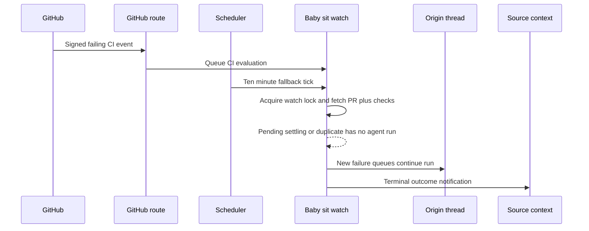

# Scheduling, Background Work, and CI Monitoring

Scheduling is deliberately split between a small, model-free dispatch graph and the producers that own each job's state and lifecycle. The scheduler is not an agent: it receives a LangGraph cron or delayed-run tick and calls one handler. A handler only resumes an `agent` thread when new work merits a model call.

## Scheduler routing

`agent.scheduler` is registered as the `scheduler` assistant. Its graph is one node, `START → launch → END`; `_launch` gets `task` and its arguments from graph state or `config.configurable`. It routes reconciliation, baby-sit, background-task, Slack session-cost, and usage-cost jobs explicitly. An unrecognized or absent task is a dashboard schedule tick and launches the stored schedule. Missing required identifiers return a `missing_*` result rather than raising.

Diagram: one deterministic scheduler tick selects exactly one maintenance or automation handler.

### Dashboard recurring runs

The dashboard owns workspace schedules in `agent_schedules`; their run history is kept separately in `agent_schedule_run_state`. Creation validates a normalized five-field cron expression, creates a cron targeted at `scheduler`, and rolls back the store record if cron creation fails. Schedule changes or re-enabling create a replacement cron before deleting the old one; disabling and deletion remove the cron.

When a schedule fires, `launch_scheduled_agent_run` loads the record. It declines disabled schedules and verifies that the schedule owner still has access to its configured repository. A successful launch creates a fresh automation thread and durable `agent` run, optionally establishes a Slack root thread, and records the latest thread, run, timestamp, or launch error in the separate run-state record. This isolation means user-editable schedule configuration is not overwritten by operational status.

### Stale-run reconciliation

Normal durable runs rely on completion handling to release a busy thread. `reconcile_stale_runs` is the recovery sweep for a lost completion: it pages through busy threads, lists pending runs, and interrupts those older than 1,800 seconds by default. It skips unparsable timestamps, isolates errors per thread, and returns thread, stale-run, and cancellation counts. Deploy a periodic `task=reconcile` tick to make this safety net effective; the router alone does not register one.

## Delayed and background work

### One-shot thread wakeups

`schedule_thread_wakeup` is the agent-facing fallback for a future poll when no webhook-driven workflow exists. It accepts an integer delay from one minute through 24 hours, rounds the target to a UTC minute, and creates a thread-bound cron for the `agent` assistant—not `scheduler`. The cron includes a system polling prompt (or the supplied prompt), selected source/repository/context configuration, normal run preparation, an optional completion webhook, and an `end_time` 90 seconds after firing. The end time makes the five-field cron single-fire in practice.

Wakeups are deliberately bounded: the tool records a count in thread metadata and permits at most ten between human input-message generations. A new human message changes the generation and resets the count; a system message does not. It records the budget before creating the cron, so a metadata failure prevents scheduling. Fired cron rows remain, therefore each scheduling request makes a best-effort, paginated purge of only `metadata.kind=thread_wakeup` rows whose `end_time` is past.

### Sandbox background-task monitoring

Starting sandbox background commands can arrange an every-minute, thread-specific `background_tasks` scheduler cron. Registration searches by kind and thread, reuses one cron, and deletes duplicates. On a tick, monitoring loads the thread's sandbox; a missing sandbox removes monitoring crons.

For terminal command states (`completed`, `failed`, `timed_out`, `stopped`, or `lost`), the monitor atomically claims a task notification using a sandbox directory, dispatches a system completion message to the originating agent thread with enqueue semantics, then persists delivery by renaming the claim. If dispatch fails, it releases the claim for a later tick. Once no command is running and no terminal notification remains, a second sandbox lock and fresh task listing guard deletion of the monitoring cron against races.

### Deferred cost enrichment

Cost availability can lag run completion, so both cost paths form bounded chains of stateless delayed runs targeting `scheduler`, each deleted on completion. For a successful Slack-connected agent run, completion schedules `session_cost`; it looks up the run-to-Slack-message mapping, obtains the LangSmith thread aggregate, and updates the Slack usage footer. Missing trace data or a failed Slack fetch/update is `pending` and schedules the next delay from `(15, 30, 60, 120, 240)` seconds; unavailable/invalid data and exhaustion stop the chain.

Separately, after-agent usage middleware records token telemetry and schedules `agent_cost` for a completed prepared run. The handler asks LangSmith for that run's cost (`run_only=True`) and persists it in dashboard usage data. Transient lookup or persistence failure consumes the same bounded retry sequence; an explicitly unavailable LangSmith integration stops without retrying.

## Durable `/baby-sit` CI watches

The `/baby-sit` skill uses durable watches in cloud runs. Local/desktop execution instead uses a bounded foreground `gh pr checks --watch` loop and must not call the durable watch or wakeup tools. The agent-facing `manage_baby_sit` tool validates a canonical GitHub PR URL, requires the current executable thread, and prevents a configured repository from watching a different repository. Starting also verifies an open PR, its head SHA/ref, GitHub authentication, and an installed GitHub App; stop and retry recording enforce watch ownership by the current thread.

A `BabySitWatch` is persisted in `baby_sit_watches`, keyed as lower-case `owner/repo#number`. It retains the originating thread, PR head identity, App installation, a safe subset of run configuration, source destination context, cron id, retry and settling state, bounded failure/webhook/alert dedupe lists, and consecutive evaluation errors. Only one active originating thread may watch a PR. Reusing the same head carries retry and dedupe state; a changed head resets it.

Starting a watch creates or reuses one UTC `*/10 * * * *` `baby_sit_watch` cron targeted at `scheduler`; duplicates are deleted. A new watch is rolled back if cron setup fails. `stop_watch` deletes the store row only when no `cron_id` is recorded; when a cron id is present it attempts deletion and returns, leaving the watch row active after a successful deletion. If that deletion fails, it marks the row inactive so subsequent evaluation cleans it up. This current asymmetry means operators should treat a successful cron deletion as insufficient evidence that the durable watch record is gone.

Diagram: signed CI events provide prompt evaluation while the cron supplies recovery polling; both use the same locked watch evaluation.

### Event processing, evaluation, and completion

`POST /webhooks/github` checks the raw-body `X-Hub-Signature-256` HMAC before it accepts any event; an absent webhook secret is also rejected. For allowlisted repositories, `check_run`, `check_suite`, `workflow_run`, and `status` events are queued as FastAPI background work and forwarded to `handle_ci_webhook`. It ignores payloads that do not represent failing CI, finds active watches by repository plus head SHA or branch, updates an installation id when supplied, and remembers up to 50 delivery ids before evaluation.

The webhook path and the cron path both use a per-watch LangGraph thread lock with a five-minute TTL. A lock collision returns `busy`, preventing concurrent evaluation and duplicate failure dispatch. Evaluation fetches the PR and current check runs plus commit statuses, then aggregates them as `pending`, `failure`, `blocked`, or `success`. It resets retry/settling/failure and alert dedupe state when the fetched PR head changes. Three consecutive failures to obtain token, PR, head, or CI status finish the watch with a permissions/access warning; a successful evaluation resets this error counter.

A failure is dispatched only once for each head SHA and retry count. The resulting `/baby-sit --continue` run is enqueued on the originating thread, and its prompt labels names, URLs, and fetched logs as untrusted data, requiring verification and evidence before a rerun. Dispatch failure removes the fingerprint so a later evaluation can retry delivery.

Success is intentionally delayed: the exact check/status set must remain unchanged for ten minutes before completion is announced. A closed or merged PR, settled success, blocked terminal checks, retry-cap exhaustion, and repeated evaluation failure are terminal outcomes. The watch first posts to its `SourceContext`—Slack, then Linear, then a GitHub issue/comment target—and otherwise queues `/baby-sit --terminal` on the originating thread; it then stops the watch.

### Flaky-job policy

The monitoring service never classifies a failure as flaky itself. It supplies a confidence-gated prompt; after an evidence-backed GitHub Actions rerun, the agent calls `record_retry`. The operation is locked, requires the same owner thread and head SHA, and caps retries at three per head. It sanitizes the check/evidence and accepts a details link only from `https://github.com/`. The first distinct check-and-URL alert for that head is sent to the source; later identical alerts are suppressed. A later evaluation after the cap terminates the watch if CI remains failing.

## Focused tests

- `tests/agent/test_baby_sit.py` exercises cron lifecycle, lock contention, webhook-delivery dedupe, failure dispatch/retry behavior, settling, terminal fallback, and scheduler routing.
- `tests/github/test_baby_sit_webhook.py` verifies all supported CI event types reach the background handler without a mention but still require a valid signature.
- `tests/tools/test_manage_baby_sit.py` covers start context and configured-repository enforcement; `tests/tools/test_schedule_thread_wakeup.py` covers validation, cron construction, wakeup budgets, and conservative expiry cleanup.
- `tests/reviewer/test_reconcile_sweep.py` covers stale-run paging, age handling, cancellation, and failure isolation.
