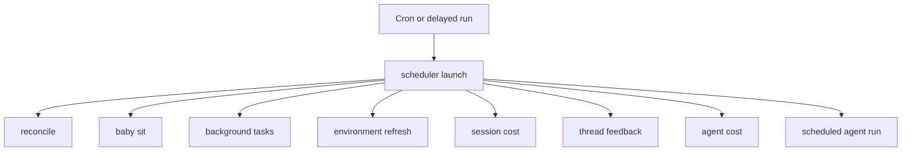
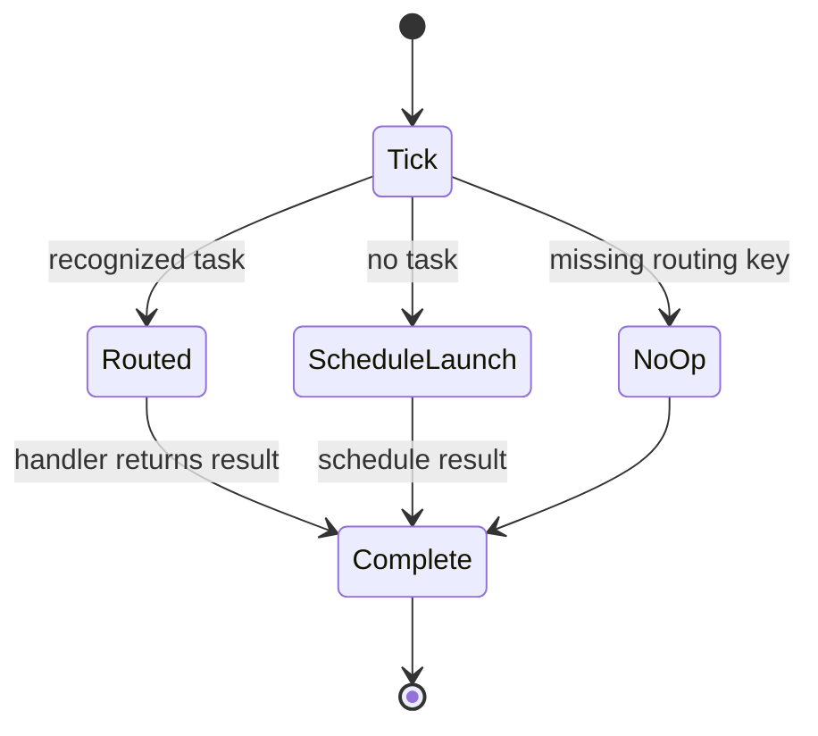
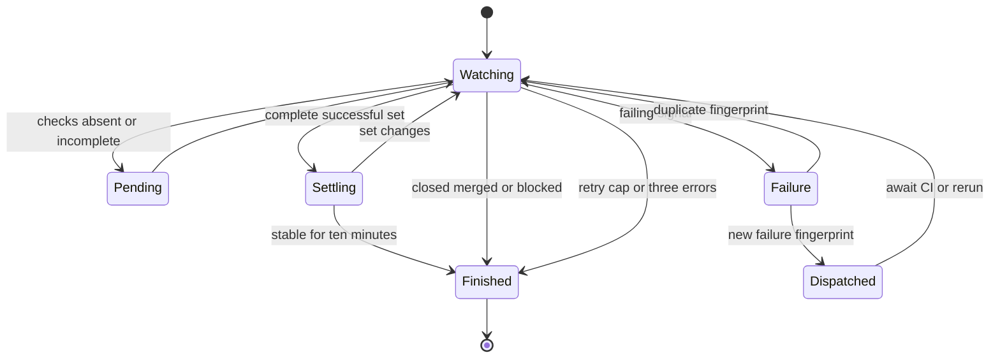

# Schedules, Background Tasks, and CI Monitoring

This is the model-free automation layer. The `scheduler` assistant receives a cron tick or a delayed run and deterministically invokes one bounded handler; it does not use an LLM to decide the work. Producers own their own cron creation and cleanup. The scheduler is therefore a dispatch boundary, while persistence, retry policy, and lifecycle rules belong to the individual workflow.

For invocation and thread semantics, see [Invocation](invocation.md); for user follow-ups, see [Follow-up messages](follow-up-messages.md); and for review flows, see [PR review](pr-review.md).

## Scheduler graph and dispatch

`agent/scheduler.py` compiles the single-node `StateGraph` `START → launch → END`, registered as `scheduler` in `langgraph.json`. `_launch` reads routing fields from state first and then the run configuration. Known tasks invoke exactly one handler; a tick with no recognized task is a dashboard schedule launch.

Diagram: each scheduler invocation selects one explicit maintenance or agent-dispatch path.

The keyed paths are `reconcile`, `baby_sit`, `background_tasks`, `environment_refresh`, `session_cost`, `thread_feedback`, and `agent_cost`. Missing `watch_key`, `thread_id`, or a fallback `schedule_id` produces a `missing_*` result instead of raising. The environment task accepts an optional slug and selects `update` only when `refresh_kind` is `update`; all other values mean `full`.

Diagram: scheduled execution is a one-tick, one-handler lifecycle; invalid keyed ticks degrade to observable no-ops.

### Dashboard recurring automations

`agent/schedules/store.py` owns workspace-scoped recurring schedules. Creation and updates normalize a five-field cron expression and range-check each field, including lists, ranges, and steps. A stored schedule creates a `kind=agent_schedule` cron targeting `scheduler`; creation is rolled back if cron creation fails. Updating a changed/enabled schedule creates the replacement before best-effort deletion of the old cron, while disabling and deletion remove its cron and delete the definition (and run state).

On a tick, `launch_scheduled_agent_run(schedule_id)` loads the definition, rejects a disabled schedule, and verifies workspace access to its repository. It creates a fresh system-owned automation thread and durable `agent` run, optionally first opening a Slack root thread. Definition and operational history are separate: `agent_schedule_run_state` records `last_thread_id`, `last_run_id`, `last_triggered_at`, or a timestamped error. This separation lets the dashboard report an automation's result without mutating its desired configuration.

### Reconciliation, cost, and feedback maintenance

- **Reconciliation.** Durable dispatch normally relies on the completion webhook to release a busy thread. `reconcile_stale_runs()` pages through busy threads, lists pending runs, and interrupts those older than 1,800 seconds by default. It skips malformed timestamps, isolates failures per thread, and returns checked, stale, and cancelled counts.
- **Cost enrichment.** Session cost refresh updates the mapped Slack reply footer; agent cost refresh writes a run-only LangSmith cost to an invocation usage record. Both create one-shot scheduler runs with `on_completion="delete"`, use the fixed delays `(15, 30, 60, 120, 240)`, and terminate on success, unavailable prerequisites, or exhaustion. A pending lookup, retrieval failure, or persistence failure can advance only through that bounded chain.
- **Feedback prompts.** Feedback scheduling persists a record per agent thread and uses a delayed `thread_feedback` scheduler run. The handler checks the record has not been superseded, waits until the thread is quiet for five minutes after a successful answer, and re-enqueues itself until due. It then marks the prompt ready and, when Slack correlation exists, posts the Slack feedback prompt. New activity, a changed latest run, a failed run, or a completed/dismissed record prevents an obsolete prompt.

## Background-task monitoring

Long-running sandbox commands are monitored without a model. `ensure_background_task_cron(thread_id)` idempotently maintains one UTC every-minute `kind=background_tasks` cron per thread and removes duplicates. `monitor_background_tasks` obtains the sandbox from thread metadata; missing metadata removes monitor crons.

For every unreported terminal task (`completed`, `failed`, `timed_out`, `stopped`, or `lost`), it atomically claims the task's sandbox directory before enqueuing a system completion message to the originating thread. It marks delivery only after dispatch succeeds; a failure releases the claim for a later tick. When there are no running tasks or undelivered terminal messages, it locks, re-lists tasks, and deletes the monitor crons only if the second check remains idle. That recheck prevents a concurrent transition from losing its notification.

## Environment snapshot refresh

Environment refreshes also route through `scheduler`. Each environment can own an idempotently registered daily `environment_refresh` cron, staggered deterministically from its slug between 03:00 and 05:59 UTC. A **full** refresh boots a throwaway builder from the base snapshot, runs setup and update scripts, and captures a new snapshot. A lazy **update** refresh boots from the current snapshot and runs only its update script when a new sandbox detects an image older than one hour.

The environment record prevents concurrent refreshes and treats a `refreshing` state older than three hours as stale. A capture occurs only after every selected script exits successfully. Results and capped logs are written to the environment record; failed refreshes retain the previous working snapshot. The builder is stopped after capture rather than explicitly deleted, allowing the platform's delete-after-stop policy to reclaim it.

## Thread wakeups

`schedule_thread_wakeup` is separate from scheduler tasks: it directly creates a thread-bound, one-shot cron for the `agent` assistant. Delays must be between one minute and 24 hours; the fire time is rounded up to a minute and `end_time` is 90 seconds later so the cron cannot recur. The input is a system automation message using a default polling prompt unless a nonblank prompt is supplied. Selected repository, source, identity, Slack, Linear, and schedule configuration is passed through; normal durable-run correlation and the completion webhook are included when configured.

Wakeups are limited to ten per latest human input-message generation. The tool derives that generation from the newest human message, stores generation and count in thread metadata, and serializes in-process scheduling per thread. A system wakeup does not reset the budget; a new human message does. The count is written before cron creation, so an attempted creation that fails still consumes a slot rather than enabling a retry storm.

Fired cron rows remain stored after their `end_time`. Before creating a wakeup, the tool best-effort paginates and deletes only expired crons with `metadata.kind=thread_wakeup`; it cannot select dashboard or analyzer crons. `scripts/purge_wakeup_crons.py` provides the operational backfill: `uv run python scripts/purge_wakeup_crons.py --dry-run` lists candidates, while omitting `--dry-run` deletes them. It resolves the deployment URL from `--url` or `LANGGRAPH_URL`, and credentials from `LANGGRAPH_API_KEY` or `LANGSMITH_API_KEY`.

## `/baby-sit`: durable PR CI monitoring

`/baby-sit` is an opt-in CI recovery watch, not a general repository watcher. In cloud runs the skill uses `manage_baby_sit` to create a durable watch; local and desktop runs use one bounded foreground `gh pr checks --watch` loop and do not call durable watch or wakeup tools.

A `BabySitWatch` is persisted in `baby_sit_watches` under lower-cased `owner/repo#pr_number`. It captures the originating thread, PR URL and head SHA/ref, GitHub App installation, selected run configuration, source context, retry/deduplication state, evaluation-error count, and cron ID. Only one active thread may own a PR watch. Restarting on the same head carries retry and dedupe state; a new head resets it. Starting saves the watch, then idempotently finds or creates one UTC `*/10 * * * *` `kind=baby_sit_watch` scheduler cron, deleting duplicate rows. A brand-new watch is rolled back if cron creation fails.

`manage_baby_sit` accepts canonical GitHub PR URLs and requires an executable current thread. Starting validates GitHub authentication, an open PR with head SHA/ref, and a GitHub App installation. Stop and retry recording are ownership-checked, and `record_retry` requires a SHA, check name, and evidence.

### CI triggers and state transitions

A GitHub webhook must pass `X-Hub-Signature-256` verification before routing. Supported CI events are queued in the HTTP background task and `handle_ci_webhook` ignores non-failing payloads. It finds active watches in the event repository whose saved SHA or branch matches, records a delivery ID before evaluation, and ignores a repeated delivery. The ten-minute cron is the fallback for missed or delayed webhooks.

Both trigger paths acquire the same five-minute per-watch LangGraph-thread lock. Concurrent work returns `busy`; unchanged pending, settling, or duplicate states never dispatch a model run.

Diagram: webhook-first and polling evaluation share one durable watch state machine.

Evaluation stops a closed or merged PR. It fetches the PR and its check runs and commit statuses; a head change clears retry, settling, dispatch, and alert state. A state is `failure` for completed failing checks or failure/error statuses; `pending` for missing or incomplete checks; `blocked` for terminal non-success states that are not rerunnable failures; and `success` only for a nonempty successful, neutral, or skipped check set. Even success must retain the exact check-set fingerprint for ten minutes before completion, avoiding a premature green while CI adds checks.

A new failure is deduplicated per head SHA and retry count. The watch enqueues `/baby-sit --continue` on the originating thread with failure signals explicitly treated as untrusted data. If dispatch fails, its fingerprint is removed to permit a later retry. Evidence-backed flaky reruns call `record_retry`; it rejects ownership/head mismatches and caps retries at three per head. The first occurrence of a check and safe GitHub URL per head sends a flaky-CI source notification; subsequent duplicates do not.

Terminal outcomes include closure/merge, settled success, blocked checks needing triage, retry exhaustion, and three consecutive evaluation failures. `_finish_watch` first tries the source context's Slack destination and otherwise a GitHub issue/PR comment, then falls back to an enqueued `/baby-sit --terminal` run on the originating thread. It stops the watch afterward; if cron deletion fails, the record remains inactive so it cannot evaluate again.

## Focused verification

Focused tests cover scheduler routing; baby-sit cron lifecycle, locking, SHA reset, webhook and failure deduplication, settling, terminal delivery, and retry limits; signed CI routing; reconciliation pagination and failure isolation; bounded session and agent cost refresh; and wakeup bounds, correlation, cleanup, and per-human-message limits. In particular, `tests/tools/test_schedule_thread_wakeup.py` verifies the ten-wakeup cap, reset only after a new human message, and that budget recording precedes cron creation.
