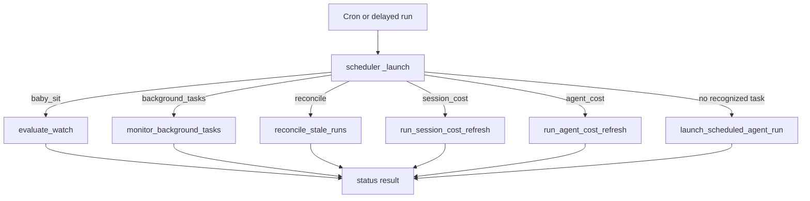
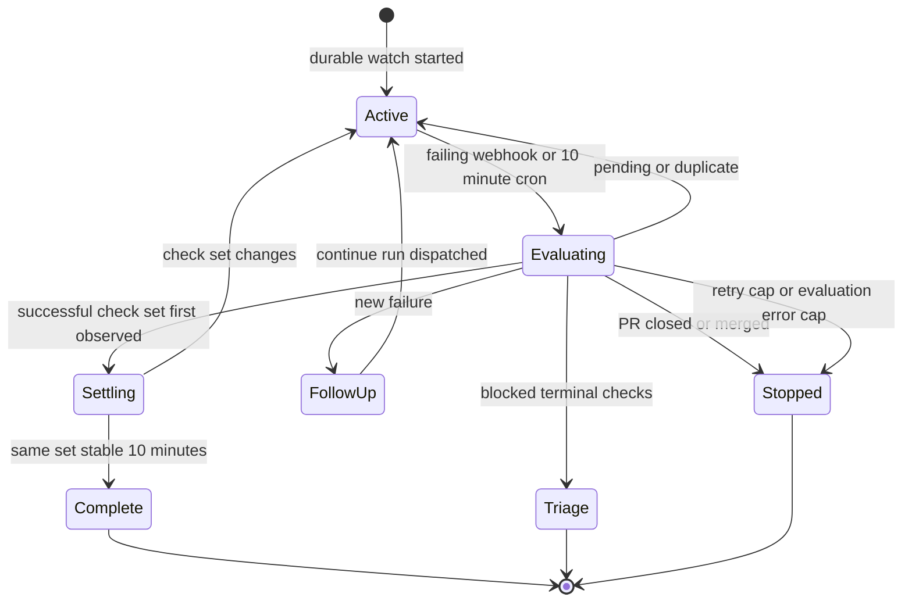

# Scheduling, CI monitoring, and background work

The `scheduler` assistant is the model-free dispatch point for system-owned cron and delayed work. It is distinct from a normal `agent` run: it examines a tick, runs one handler, and returns a status. The handlers either perform bounded housekeeping themselves or deliberately create/resume an agent run when reasoning is required. This separation keeps unchanged CI and background polling from consuming model tokens.

See [Threads and state](../concepts/threads-and-state.md) for thread ownership, [Invocation](invocation.md) for durable runs, and [PR creation](pr-creation.md) and [PR review](pr-review.md) for the work that can lead into CI monitoring.

## Scheduler entrypoint and routing

`langgraph.json` registers `agent.graphs.scheduler:get_scheduler` as `scheduler`. The graph is a single `START → launch → END` node. `_launch` takes `task` and its parameters from state first and then `config.configurable`; it does not call an LLM.

Diagram: deterministic task-kind routing in the scheduler graph.

`baby_sit` requires `watch_key`, `background_tasks` requires `thread_id`, and the fallback schedule path requires `schedule_id`; absent values return `missing_watch_key`, `missing_thread_id`, or `missing_schedule_id` rather than raising. `session_cost` and `agent_cost` validate their complete payloads in their respective handlers. This makes malformed operational ticks observable no-ops instead of failed cron executions.

### User schedules

The dashboard stores recurring schedules in `agent_schedules` and creates their crons against `scheduler`, tagged `kind=agent_schedule`. `normalize_cron_schedule` accepts exactly five fields, normalizes whitespace, and validates numeric values, lists, ranges, and steps against cron-field ranges before a schedule is stored.

When a tick falls through to `launch_scheduled_agent_run`, the schedule is loaded and a **new** agent thread and durable agent run are created. Disabled schedules return `disabled`; a missing record returns `missing`. Before launching a repository-bound schedule, the system checks that the creator still has repository access. It records success or authorization/Slack-posting errors in the separate `agent_schedule_run_state` namespace, including the last thread, run, trigger time, and error. Optional Slack delivery is either a top-level thread for every run or an instruction to notify only after a concrete action.

Creating a schedule writes its record before creating the cron and deletes that record if cron creation fails. Updating an enabled schedule that changes schedule/enabled state creates the replacement cron before deleting the old one; disabling or deleting removes the cron best-effort and deletes stored schedule state.

## Safety-net and deferred work

### Stale-run reconciliation

The completion webhook normally ends durable runs. `reconcile_stale_runs` protects against a lost completion by paging through `busy` threads, listing each thread's `pending` runs, and interrupting ones older than `max_age_seconds` (default 1,800 seconds). Invalid or unparseable `created_at` values are logged and skipped. Thread search failure ends the sweep, while a failure on one thread does not prevent later threads from being considered. The returned counters (`threads_checked`, `stale_runs`, `cancelled`) are the operational summary.

### Cost refreshes

Two deferred, bounded retry chains use one-shot `scheduler` runs with `on_completion="delete"` and delays of 15, 30, 60, 120, and 240 seconds:

* On successful agent completion, the completion handler schedules `session_cost` only for a mapped Slack response and de-duplicates scheduling per run in thread metadata. The handler waits for a LangSmith aggregate and the Slack message, then updates the Slack usage footer. Missing mappings or unavailable data terminate as `unavailable`; transient absence retries until exhausted.
* The `after_agent` usage middleware records token usage and schedules `agent_cost` when recording succeeded. That handler requests run-only LangSmith cost and persists it to the dashboard usage record. A persistence or transient retrieval failure retries; a permanently unavailable LangSmith result terminates without retry.

These jobs retain no standing cron: each attempt creates at most its successor, so they stop after an update, an unavailable result, scheduling failure, or retry exhaustion.

## Durable `/baby-sit` PR CI watches

Cloud `/baby-sit` uses `manage_baby_sit` to create a durable `BabySitWatch`; local/desktop skill runs use a bounded foreground `gh pr checks --watch` loop instead. The tool requires a canonical GitHub PR URL and an executable thread, rejects a PR outside the thread's configured repository, verifies the PR is open and has a head SHA/ref, and requires a GitHub App installation. `stop` and `record_retry` additionally cannot act on a watch owned by another agent thread.

A watch is stored under lower-cased `owner/repo#pr_number` in `baby_sit_watches`. It records its owning agent thread, PR head SHA/ref, installation ID, selected run configuration, source context, retry and dedupe state, evaluation error count, and cron ID. One active watch per PR is enforced across agent threads. Restarting a watch on the same head carries retry, settle, and dedupe state; a new head starts those values afresh.

`start_watch` saves the watch then ensures exactly one `kind=baby_sit_watch` scheduler cron. It searches by metadata, keeps one existing cron and deletes duplicates, otherwise creates a UTC `*/10 * * * *` cron carrying `task=baby_sit` and the key. If creation fails for a brand-new watch, the new store row and any partial cron are rolled back. Stopping removes the cron and record; if cron deletion fails it retains an inactive row so future evaluation can clean it up.

### CI monitoring and follow-up lifecycle

Diagram: a watch is evaluated by either trigger, dispatches a reasoning follow-up only for a new failure, and stops after a notified terminal outcome.

The GitHub route rejects unsigned requests: it requires `GITHUB_WEBHOOK_SECRET` and compares `X-Hub-Signature-256` to an HMAC over the raw request body. After the repository allowlist gate, CI events are handed to `process_github_ci_event` in background work. `handle_ci_webhook` accepts only completed failing `check_run`, `check_suite`, or `workflow_run` payloads, or failed/error legacy `status` payloads. It identifies active watches for the repository by head SHA or branch, remembers delivery IDs (bounded to 50), and evaluates each unprocessed match.

Webhook and cron paths converge under a five-minute per-watch lock implemented as a TTL LangGraph thread. A lock conflict returns `busy`; therefore simultaneous triggers do not concurrently dispatch the same failure. Evaluation fetches the PR and, on head change, resets retry count, settle state, failure-dispatch keys, and alert keys. It reads both latest GitHub check runs and legacy commit statuses; Open SWE's own check names are filtered from check runs. API/permission trouble is an evaluation error, and three consecutive errors produce a terminal notification and stop the watch.

The aggregate is `pending` when checks are unfinished or none exist, `failure` for configured failing conclusions/statuses, `blocked` for non-success terminal states that are not rerunnable failures, and `success` otherwise. Success must have the exact check/status set unchanged for `CHECK_SET_SETTLE_MINUTES` (10 minutes), avoiding a premature green while checks are still appearing. `pending`, `settling`, `duplicate`, and `busy` only return statuses; they do not create an agent run.

For a failure, the durable fingerprint is head SHA plus retry count. It is recorded before dispatch and removed if dispatch fails, providing at-most-once follow-up for that state while allowing retry after a dispatch failure. A new fingerprint queues `/baby-sit --continue` on the originating thread. Its prompt treats check names, URLs, and logs as untrusted data and requires the agent to verify the current head and full check set before deciding whether a failure is flaky.

A successful flaky rerun must call `record_retry`. It confirms ownership and unchanged head, caps retries at `MAX_RETRIES_PER_HEAD` (3), and increments persistent count under the same watch lock. The first occurrence of a check name/URL per head can post a flaky alert; `alert_keys` suppress repeats. At the cap, the next failing evaluation stops the watch.

Terminal outcomes are PR closure/merge, settled success, blocked checks needing owner triage, retry cap, and the evaluation-error cap. `_finish_watch` prefers a Slack thread, then Linear issue, then GitHub issue/PR comment from `SourceContext`; if that cannot be posted, it queues `/baby-sit --terminal` on the originating thread. It then stops the watch regardless of notification success.

## Background commands and thread wakeups

`ensure_background_task_cron(thread_id)` creates or reuses one UTC, every-minute `kind=background_tasks` scheduler cron for a thread and removes duplicate cron rows. `monitor_background_tasks` loads that thread's sandbox. If no sandbox is recorded it deletes monitors. For terminal command states (`completed`, `failed`, `timed_out`, `stopped`, `lost`), it uses an atomic sandbox-directory claim before queuing a completion message on the source thread. It marks delivery durable only after dispatch succeeds; failures release the claim for retry. Once neither a running task nor an undelivered terminal task remains, a second monitor lock and fresh task listing prevent a race before deleting the cron.

`schedule_thread_wakeup` is the alternative for work that must be checked later but has no event source. It schedules a thread-bound `agent` cron, not a scheduler tick, at a rounded UTC minute after a 1-minute to 24-hour delay. The cron has an end time 90 seconds after firing, an automation system input with a default polling prompt if none was given, completion-webhook wiring when configured, and selected source/repository/context configuration copied through.

Wakeups are limited to 10 between human messages. The tool derives a generation from the most recent human input, keeps generation/count in thread metadata, and serializes a thread's local updates with a lock; a system-generated wakeup does not reset the budget. It records the budget before creating the cron, so a cron creation failure consumes one allowance. Fired cron rows are not automatically deleted, so each scheduling attempt best-effort purges expired `kind=thread_wakeup` rows across pages, selecting only rows with a past `end_time`.

## Focused verification

The relevant tests are `tests/agent/test_baby_sit.py`, `tests/github/test_baby_sit_webhook.py`, `tests/tools/test_manage_baby_sit.py`, `tests/tools/test_schedule_thread_wakeup.py`, and `tests/agent/test_agent_schedules.py`. They are the focused regression surface for deduplication and locking, watch lifecycle and terminal notification, signature-routed webhook behavior, wakeup budget and expired-cron cleanup, and schedule validation/launch behavior.
