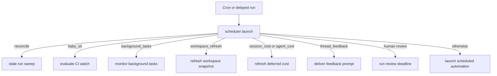
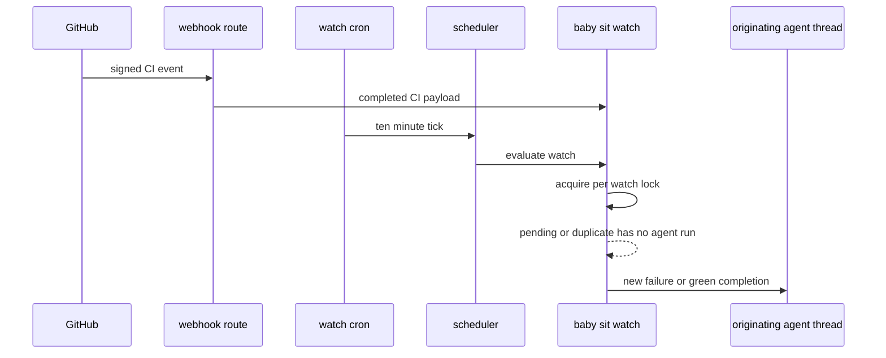

# Scheduling, Monitoring, and Background Work

Open SWE uses the `scheduler` assistant as a deterministic maintenance and dispatch boundary. Cron ticks and delayed runs enter a one-node graph; the node selects a bounded handler or launches a configured automation. It does not use an LLM itself. Producers own their own cron/run lifecycle, including tagging and cleanup. For thread/run ownership, see [Threads and state](../concepts/threads-and-state.md); for user follow-ups, see [Follow-up messages](follow-up-messages.md).

## Scheduler routing

The `scheduler` graph is registered in `langgraph.json` and runs `START → launch → END`. `_launch` reads `task` from state before runtime configuration. It retries transient sandbox-attachment failures for a bounded elapsed time; an exhausted transient failure becomes `sandbox_unavailable`, while other exceptions still propagate.

```mermaid
flowchart TD
  Tick["Cron or delayed run"] --> Launch["scheduler launch"]
  Launch -->|"reconcile"| Reconcile["stale run sweep"]
  Launch -->|"baby_sit"| Watch["evaluate CI watch"]
  Launch -->|"background_tasks"| Background["monitor background tasks"]
  Launch -->|"workspace_refresh"| Workspace["refresh workspace snapshot"]
  Launch -->|"session_cost or agent_cost"| Cost["refresh deferred cost"]
  Launch -->|"thread_feedback"| Feedback["deliver feedback prompt"]
  Launch -->|"human review"| Review["run review deadline"]
  Launch -->|"otherwise"| Schedule["launch scheduled automation"]
```

Diagram: one tick reaches exactly one model-free maintenance handler or the stored automation launcher.

The keyed handlers validate their routing data where needed: baby-sit and legacy expedited-review ticks require `watch_key`, background monitors require `thread_id`, and review deadlines require both request ID and step. The automation fallback requires `schedule_id`; missing values return a status rather than crashing the cron. Workspace refresh accepts the current `workspace_refresh` task plus the legacy `environment_refresh` spelling, and accepts the legacy `environment_slug` state key.

### Recurring automations

`openswe/schedules/store.py` owns stored automations. It normalizes a five-field cron expression and validates field bounds, lists, ranges, and steps before storage. When the scheduler receives a tick without a recognized task, it calls `launch_scheduled_agent_run(schedule_id, trigger_id)`. The launcher resolves the stored record and the fired schedule trigger; absent records cause orphan cron cleanup, and mismatched/replaced triggers do not launch an agent. A valid trigger starts a fresh agent schedule run rather than continuing the scheduler run.

## Recovery and deferred enrichment

### Stale durable runs

Durable dispatch normally depends on a completion webhook to release a busy thread. `reconcile_stale_runs` is the safety net for lost completion: it pages through busy threads, lists pending runs, and interrupts runs older than 1,800 seconds by default. Invalid timestamps are skipped, search failure ends the sweep, and per-thread exceptions are isolated. Its returned `threads_checked`, `stale_runs`, and `cancelled` counts make the outcome observable.

### Cost refreshes

LangSmith costs can arrive after an agent finishes. Session and agent-usage costs therefore use stateless, delayed scheduler runs with five attempts at 15, 30, 60, 120, and 240 seconds, each configured for deletion when complete.

- **Session cost** requires a valid run-to-Slack-message mapping. It fetches cumulative and run-only thread cost, updates the Slack footer, and clears the pending-cost marker when the result is unavailable or retry budget is exhausted. A transient unavailable trace or Slack update schedules the next attempt.
- **Agent cost** obtains `run_only=True` cost for an invocation and persists it to analytics usage. Missing/invalid payload and explicitly unavailable LangSmith access terminate; a missing snapshot or persistence/other failure uses the remaining bounded attempts.

### Feedback prompts

A delayed `thread_feedback` scheduler run supports post-answer and post-merge feedback. The feedback record is kept per thread. Before marking it ready or posting its Slack prompt, the handler verifies that the record still matches, that the latest run succeeded and the thread is not busy, and that there has been five minutes of quiet. If activity is still recent it reschedules itself for the remaining delay; changed activity, a different answer run, or a non-success run skips the prompt.

## Background-task monitoring

Sandbox commands have two completion paths: an opt-in runner callback, or—when callbacks are not enabled for the triggering person—a per-thread `background_tasks` scheduler cron every minute. `ensure_background_task_cron` idempotently reuses one tagged cron and removes duplicates.

The monitor reconciles only tasks belonging to the thread, updates tracked running/finished state, and handles terminal `completed`, `failed`, `timed_out`, `stopped`, and `lost` tasks. It atomically claims a task directory before enqueueing a system-originated completion run on the owning thread. It marks delivery durable only after dispatch; a dispatch failure releases the claim so a later tick can retry. Once neither running work nor undelivered terminal work remains, it obtains a sandbox monitor lock, rechecks state, and deletes the thread's monitor crons. A missing thread or sandbox also leads to cleanup.

## Workspace refresh

Workspace refresh work is also routed through the scheduler. Each workspace can have a staggered daily cron between 03:00 and 05:59 UTC; `ensure_refresh_cron` stores the cron ID on the workspace. A full refresh boots a disposable builder from the base snapshot, runs setup then update scripts, and captures only if all succeed. An update refresh boots from the current snapshot and runs only the update script.

New sandbox creation can enqueue an update once a snapshot is at least an hour old, provided no plausible refresh is in flight and the previous attempt is old enough. Refreshes run as self-deleting background scheduler runs and expose their run ID on the workspace record. A failed refresh preserves the previous ready snapshot; the builder is stopped after work/capture so platform reclamation, rather than direct deletion, removes it.

## Thread wakeups

`schedule_thread_wakeup` creates a thread-bound one-shot cron directly against the `agent` assistant, not through a scheduler task. It accepts one to 1,440 minutes, rounds its fire time to a minute, and sets an `end_time` roughly 90 seconds later. The wakeup uses a system input message, carries selected repository/source/context settings, and includes the normal completion webhook when configured.

A thread can create at most 10 wakeups between human messages. The tool derives a generation from the latest human input message and stores the generation plus count in thread metadata; system wakeups do not reset it. It records the count before cron creation, so a failed create consumes a slot. A per-process lock serializes concurrent scheduling for a thread.

Fired cron rows remain after `end_time`. Before scheduling, the tool best-effort deletes only expired `metadata.kind=thread_wakeup` crons, paginating before deletion. `cancel_thread_wakeups(thread_id)` separately removes all current wakeup crons for that thread without touching other cron kinds.

## `/baby-sit`: durable CI watch

`/baby-sit` is an opt-in pull-request CI workflow. A cloud agent uses `manage_baby_sit` to persist a watch; the watch is keyed as lower-cased `owner/repo#number` and contains the originating thread, head SHA/ref, GitHub App installation, selected run configuration, source context, retry/deduplication state, and cron ID. Only one active thread can own a PR watch. A restart on the same SHA carries state; a new SHA resets retries, dispatch keys, and alert keys.

Starting a watch saves it and ensures one UTC `*/10 * * * *` scheduler cron tagged `baby_sit_watch`; duplicates are removed. A first-time start rolls its store row and any partial cron back if cron creation fails. The agent-facing tool requires a canonical PR URL, an executable thread, GitHub authentication, an open PR with head details, and an App installation; stop and retry recording enforce watch ownership.

```mermaid
sequenceDiagram
  participant GH as GitHub
  participant Route as webhook route
  participant Cron as watch cron
  participant Sched as scheduler
  participant Watch as baby sit watch
  participant Agent as originating agent thread

  GH->>Route: signed CI event
  Route->>Watch: completed CI payload
  Cron->>Sched: ten minute tick
  Sched->>Watch: evaluate watch
  Watch->>Watch: acquire per watch lock
  Watch-->>Watch: pending or duplicate has no agent run
  Watch->>Agent: new failure or green completion
```

Diagram: signed webhook delivery is immediate, while the cron is the fallback; both converge on the same serialized evaluation.

The GitHub route verifies `X-Hub-Signature-256`; supported CI delivery is handled in background. `handle_ci_webhook` ignores incomplete/non-actionable payloads, finds active watches by repository plus head SHA or branch, records a bounded delivery-ID history, updates installation ID when supplied, and evaluates each matched watch under its five-minute short-lived lock. Cron evaluation takes the same lock, so concurrent triggers return `busy` rather than dispatching twice.

Evaluation stops inactive, missing, closed, or merged watches. It obtains current PR, checks, and commit statuses; a head change clears per-head retry and dedupe state. Pending or absent checks return without an agent run. Before a green PR is handed back to the agent, required checks for the base branch must all be reported. Completed failing checks or failure/error statuses resume the originating thread with an untrusted-signal-aware baby-sit failure prompt; the fingerprint of head SHA plus retry count prevents duplicate dispatch, and is removed if dispatch fails. Terminal blocked checks, retry exhaustion at three reruns per head, or three consecutive evaluation errors finish the watch.

A successful flaky rerun is recorded through `record_retry`, which requires the owning thread and current SHA, caps retries at three, and emits the flaky alert only once per head/check/safe GitHub URL. A green watch dispatches a ready run then stops. Other terminal outcomes try to notify the original source context; if notification is unavailable, `_finish_watch` enqueues `/baby-sit --terminal` on the originating agent thread and stops the watch.

## Focused verification

`tests/agent/test_scheduler.py` covers scheduler dispatch including workspace refresh. `tests/agent/test_baby_sit.py` exercises lifecycle, concurrent evaluation, webhook delivery deduplication, ready dispatch, terminal fallback, retry cap, and SHA reset. `tests/tools/test_schedule_thread_wakeup.py` covers validation, configuration propagation, wakeup budget semantics, concurrent scheduling, cancellation, and conservative cleanup. Stale-run, session-cost, agent-cost, background-task, workspace-refresh, and GitHub webhook tests cover their corresponding bounded/recovery paths.
