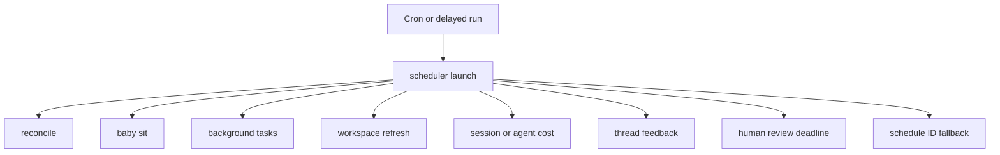
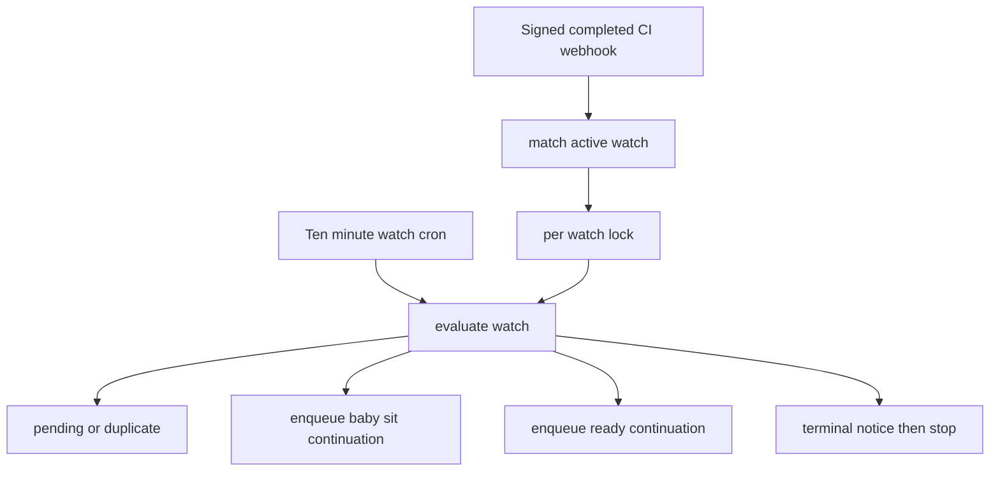

# Schedules, automations, background tasks, and baby-sit

The `scheduler` is Open SWE's model-free automation boundary. LangGraph cron ticks and delayed runs enter a one-node graph; the graph chooses one bounded handler or starts a stored automation. It does not use an LLM to decide what a tick means. Producers own their own cron/run creation and cleanup, while the scheduler owns deterministic routing and a narrow transient-sandbox retry wrapper.

For durable-run and workspace ownership details, see [Persistence, workspaces, and tasks](../architecture/persistence-workspaces-and-tasks.md). For external event admission, see [Invocation](invocation.md), and for review deadlines, see [Human review and merge](human-review-and-merge.md).

## Scheduler routing

`openswe.scheduler:get_scheduler` compiles `START → launch → END` and is registered as the `scheduler` graph. `_launch` reads `task` from serialized state first, then `RunConfig`; it returns structured results. It retries only transient sandbox connection failures for the configured bounded interval, returning `sandbox_unavailable` after exhaustion; other exceptions propagate.

```mermaid
flowchart TD
  Tick["Cron or delayed run"] --> Launch["scheduler launch"]
  Launch --> Reconcile["reconcile"]
  Launch --> Watch["baby sit"]
  Launch --> Background["background tasks"]
  Launch --> Workspace["workspace refresh"]
  Launch --> Costs["session or agent cost"]
  Launch --> Feedback["thread feedback"]
  Launch --> Review["human review deadline"]
  Launch --> Automation["schedule ID fallback"]
```

Diagram: a scheduler tick routes by its task to maintenance, a deadline, or a stored automation launch.

Recognized tasks are `reconcile`, `baby_sit`, `background_tasks`, `workspace_refresh` (and legacy `environment_refresh`), `session_cost`, `thread_feedback`, `agent_cost`, and the human-review task. Watch and background-task ticks return `missing_watch_key` or `missing_thread_id` if unkeyed; a schedule fallback returns `missing_schedule_id`; a review deadline returns `missing_request`. The legacy workspace form accepts `environment_slug`, and all workspace refreshes select `full` unless `refresh_kind` is exactly `update`.

## Stored schedules and event automations

The dashboard schedule API is authenticated for listing and admin-gated plus audit-logged for create, update, test-trigger, and delete. A schedule has a prompt, an explicit workspace, and one or more discriminated triggers: cron schedule, GitHub event, Slack event, or Linear event. Cron validation normalizes a five-field expression and range-checks fields while supporting lists, ranges, and steps.

A cron tick carries both `schedule_id` and, for current records, `trigger_id`. `launch_scheduled_agent_run` reloads the record rather than trusting the cron. It handles a pre-migration Store record as `pending_import`, deletes orphan cron rows when the schedule disappeared or a trigger no longer matches, and only launches after identifying the fired schedule trigger. The manual trigger follows the same launch-record route but converts authorization, missing-workspace, and startup problems into HTTP errors.

GitHub delivery processing verifies the webhook signature before it records or parses the delivery; supported webhook handling delegates matching schedule automations to background work. Schedule event delivery claims and rate limits are durable, so a repeated delivery does not create duplicate agent runs. The specific trigger matching and event prompts remain in the schedule store; the scheduler is only the cron path.

## Recovery and maintenance work

### Reconcile stuck durable runs

Durable dispatch normally frees a busy thread through its completion webhook. `reconcile_stale_runs` is the safety net for a missed completion: it paginates all busy threads, lists pending runs, and interrupts runs older than 1,800 seconds by default. Bad timestamps are skipped, each thread is isolated with `try/except`, and the result reports `threads_checked`, `stale_runs`, and `cancelled`.

### Background commands

Background-command completion is model-free and has two delivery paths: an opted-in runner callback or a per-thread polling cron for callers without callbacks. `ensure_background_task_cron` idempotently creates one UTC every-minute `background_tasks` cron and removes duplicates. The monitor reconciles only commands owned by its thread (with a compatibility rule for legacy sandbox-host commands), tracks running IDs in thread metadata, and sends each undelivered terminal result back to the originating thread as a system automation message queued behind other work.

A sandbox-directory `notify.claim` atomically reserves a terminal task before dispatch; success moves it to `notify.done`, while a failed dispatch releases the claim. Once work is idle, a monitor lock and fresh task listing prevent a racing transition from being missed before the monitor deletes all of the thread's crons. A missing thread or sandbox also causes cron cleanup.

### Delayed cost and feedback jobs

Both cost refreshers use stateless one-shot scheduler runs with `on_completion="delete"` and the same five delays: 15, 30, 60, 120, and 240 seconds.

* `session_cost` updates the mapped Slack response footer. It requires valid run/message correlation, waits if LangSmith aggregation or Slack is transiently unavailable, and clears the pending footer label when data is unavailable or its retry budget ends.
* `agent_cost` obtains the invocation's LangSmith `run_only` cost, persists usage cost, and also records a per-invocation cost key on the thread for the dashboard. Retrieval or persistence failures advance through the bounded budget; invalid payloads and an unavailable LangSmith integration stop without retry.
* `thread_feedback` waits for five minutes of quiet after a qualifying answer or merged-PR event. Under the per-thread PR-state lock it rechecks that the stored feedback record is still current, defers itself if the thread is busy or activity changed, marks it ready only when due, and then posts a Slack prompt when channel/run correlation exists.

## Workspace snapshot refreshes

A workspace refresh uses a throwaway builder sandbox and captures a snapshot only after every script succeeds. A **full** refresh starts from the base snapshot and runs setup followed by update; an **update** refresh starts from the current snapshot and runs only update. Failures record a capped log/status on the workspace but preserve the last working snapshot, and the builder is stopped in `finally` for platform reclamation.

Each workspace can own an idempotently registered daily UTC cron. Its minute and hour are derived from the workspace slug to stagger full rebuilds between 03:00 and 05:59. Separately, creation of a sandbox with a stale snapshot can enqueue an update refresh without blocking that run; in-flight and recent failed attempts suppress repeated enqueues. Refreshes stuck in `refreshing` for three hours cease to block a new attempt.

## `/baby-sit`: durable PR CI monitoring

`/baby-sit` is an opt-in durable watch for cloud runs. A watch is keyed as lower-cased `owner/repo#pr_number` in `baby_sit_watches`, binding the originating thread, PR SHA/ref, installation, run configuration, and source context. Only one active thread can watch a PR. Restarting on the same SHA retains retries and deduplication lists; a changed SHA starts those over.

Starting saves the watch and ensures exactly one UTC `*/10 * * * *` scheduler cron tagged `baby_sit_watch`; duplicate cron rows are removed. For a brand-new watch, cron-creation failure removes the persisted watch. Stopping deletes the cron and row; if cron deletion fails it retains an inactive row so it cannot execute.

```mermaid
flowchart TD
  Webhook["Signed completed CI webhook"] --> Match["match active watch"]
  Cron["Ten minute watch cron"] --> Evaluate["evaluate watch"]
  Match --> Lock["per watch lock"]
  Lock --> Evaluate
  Evaluate --> Pending["pending or duplicate"]
  Evaluate --> Failure["enqueue baby sit continuation"]
  Evaluate --> Ready["enqueue ready continuation"]
  Evaluate --> Stop["terminal notice then stop"]
```

Diagram: webhook and cron triggers converge through a short-lived per-watch lock, then either wait, enqueue an agent turn, or end the watch.

The GitHub route HMAC-verifies `X-Hub-Signature-256`. CI webhook processing accepts completed CI payloads, finds active repository watches whose SHA or branch matches, records a bounded delivery-ID dedupe list, and evaluates each under its five-minute lock. The polling cron is the fallback for absent/delayed webhooks. A concurrent evaluator returns `busy`, so only one failure dispatch occurs for a watch.

Evaluation stops a closed PR. It reads the PR and its check runs/statuses, resets retry and alert/dispatch dedupe state when the head changes, and classifies the aggregate as pending, success, blocked, or failure. Success additionally requires GitHub branch-required checks to have reported; then it queues a ready continuation and stops. Failure is deduplicated by SHA and retry count before it queues the originating thread with an untrusted-data warning. A failed dispatch removes that fingerprint so a later tick can retry.

`record_retry` is locked and verifies active-watch ownership, the current SHA, and the three-rerun-per-head cap. It persists the retry count and emits a flaky-CI notification only once for the SHA/check/safe GitHub URL. Blocked checks, retry exhaustion, missing GitHub access or data after three consecutive evaluation errors terminate the watch. Terminal notification attempts the source destination where eligible and otherwise queues `/baby-sit --terminal` on the owner thread before stopping.

## Validation focus

`tests/agent/test_scheduler.py` exercises payload preservation, legacy workspace routing, and exhausted transient sandbox handling. `tests/agent/test_baby_sit.py` covers lifecycle, failure deduplication, locking/concurrency, webhook delivery behavior, head changes, ready and terminal paths, and retry enforcement. `tests/reviewer/test_reconcile_sweep.py`, cost-refresh tests, workspace-refresh tests, and background-task tests cover the respective recovery and self-termination invariants.
