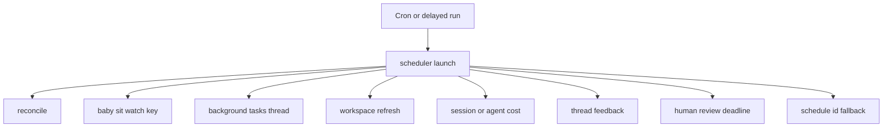
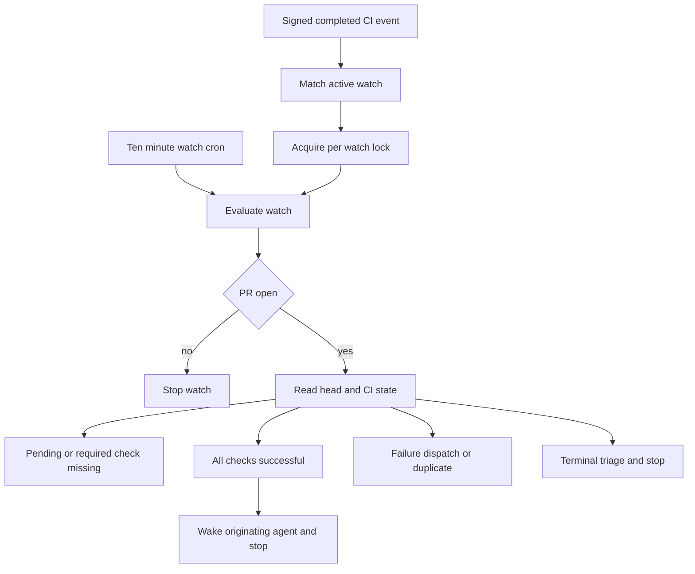

# Schedules, Watches, and Background Supervision

The `scheduler` assistant is the system's model-free automation router. Cron ticks and delayed runs enter its single `launch` node; the node selects a bounded handler or starts a deliberately new agent run. It does not use an LLM to decide what a tick means. Producers own the lifecycle of the cron or delayed run they create.

This page covers recurring dashboard automations, operational maintenance, sandbox-command supervision, thread wakeups, and the opt-in `/baby-sit` CI watch. See [Follow-up messages](follow-up-messages.md) for the user-facing continuation model and [PR creation](pr-creation.md) and [PR review](pr-review.md) for PR workflows.

## Dispatch contract

`langgraph.json` registers `agent.graphs.scheduler:get_scheduler` as `scheduler`. The graph is `START → launch → END`. `_launch` takes `task` from state first, then `config.configurable`, and wraps its chosen operation in retry handling for transient sandbox attachment failures. Exhausted transient errors return `sandbox_unavailable`; other exceptions still propagate.

```mermaid
flowchart TD
  Tick["Cron or delayed run"] --> Launch["scheduler launch"]
  Launch --> Reconcile["reconcile"]
  Launch --> Watch["baby sit watch key"]
  Launch --> Background["background tasks thread"]
  Launch --> Refresh["workspace refresh"]
  Launch --> Costs["session or agent cost"]
  Launch --> Feedback["thread feedback"]
  Launch --> Review["human review deadline"]
  Launch --> Schedule["schedule id fallback"]
```

Diagram: the deterministic scheduler dispatches one tick to its named maintenance handler, or falls back to a stored user schedule.

Recognized tasks include `reconcile`, `baby_sit`, `background_tasks`, `workspace_refresh` (and legacy `environment_refresh`), `session_cost`, `thread_feedback`, `agent_cost`, and the human-review deadline task. Keyed routes return a `missing_*` result rather than raising when their needed key is absent: watches need `watch_key`, background work needs `thread_id`, human-review work needs a request and step, and the fallback needs `schedule_id`. This makes malformed ticks observable no-ops.

## User schedules and operational work

### Dashboard schedules

Dashboard schedule definitions live in `agent_schedules`, while last-run status is maintained separately in `agent_schedule_run_state`. A recurring schedule validates and normalizes a five-field cron expression; fields accept numbers, `*`, ranges, steps, and comma lists within their field bounds. Its cron invokes `scheduler` with `schedule_id`, then the fallback launches the stored schedule only when its trigger remains `schedule`.

A launch first rejects disabled schedules, missing workspaces, and repositories unavailable to the selected workspace. Otherwise it creates a fresh `agent` thread and durable run carrying the selected workspace, repository, model settings, invocation identity, and a system automation input. If configured to notify Slack, it can create and bind a Slack root thread before launch. On a durable launch, run state records `last_thread_id`, `last_run_id`, and `last_triggered_at`; pre-launch failures record `last_error` separately from the schedule definition.

### Reconciliation and feedback

Durable dispatch normally relies on completion delivery. `reconcile_stale_runs()` is the recovery sweep for lost completion events: it paginates busy threads, lists pending runs, and interrupts only those older than its 1,800-second default. Bad timestamps are skipped, per-thread exceptions do not abort the sweep, and its result reports threads checked, stale runs, and cancellations.

The `thread_feedback` task is a delayed feedback prompt. It persists a `Feedback` record per thread and checks that the same answer remains current, the thread is no longer busy, and five minutes of quiet have elapsed. If activity or a run delays eligibility, it re-enqueues itself for the computed due time; when ready, it marks the record and optionally posts the Slack feedback prompt. Record comparison and the thread PR-state lock prevent a stale delayed tick from prompting after newer activity.

### Cost refreshes

LangSmith cost availability can lag run completion, so cost enrichment is a finite chain of stateless delayed runs, not a permanent polling cron. Both use delays of 15, 30, 60, 120, and 240 seconds and `on_completion="delete"`.

- **Session cost** is scheduled after a successful Slack-correlated agent completion, with thread metadata preventing the same run from being scheduled twice. Each attempt validates the Slack run/message mapping, reads the thread aggregate and run-only LangSmith costs, and updates the mapped Slack footer. A transient missing trace or Slack update schedules the next attempt; an unavailable prerequisite or exhausted budget clears the pending marker and stops.
- **Agent usage cost** records terminal invocation usage, then schedules `agent_cost` when cost enrichment is still needed. The handler requests only that invocation's LangSmith cost and persists it to analytics. Unavailable configuration terminates immediately; a missing trace, lookup failure, or persistence failure uses only the fixed retry budget.

### Workspace refresh ticks

A workspace has two snapshot-refresh modes. A daily per-workspace cron performs a **full** refresh: boot the base snapshot, run setup then update scripts, and capture a new snapshot. The daily time is deterministically staggered between 03:00 and 05:59 UTC. A stale snapshot can also cause a background **update** refresh, which boots the current snapshot and runs only its update script.

The scheduler accepts both current and legacy refresh task names and sends `workspace_slug` (or legacy `environment_slug`) plus `refresh_kind` to `run_workspace_refresh_tick`. With no slug, that entrypoint sweeps every workspace with a setup script. A refresh refuses unsupported/missing prerequisites and concurrent fresh work; it records progress and capped logs on the workspace. It captures only after all scripts succeed, keeps the prior working snapshot on failure, and stops the throwaway builder sandbox in all cases.

## Background commands and thread wakeups

### Background-task completion

Long-running sandbox commands can be supervised by a runner callback or, for users without callback opt-in, a per-thread `background_tasks` cron every minute. `ensure_background_task_cron` is idempotent: it keeps one tagged cron and removes duplicates. On each poll, `monitor_background_tasks` reconciles sandbox task state and atomically claims each unreported terminal task (`completed`, `failed`, `timed_out`, `stopped`, or `lost`) using its sandbox task directory.

A claim allows exactly one completion message to be enqueued onto the originating thread. Delivery is marked only after dispatch succeeds; a failed dispatch releases the claim for a later reconciliation. Once no task is running and no terminal notification remains, a sandbox monitor lock performs a fresh check before deleting all monitor crons for that thread. A missing thread or sandbox also removes the crons, preventing abandoned pollers.

### One-shot wakeups

`schedule_thread_wakeup` creates a cron directly against the `agent` assistant, rather than a scheduler task. It accepts 1 minute through 24 hours, rounds to a UTC minute, and sets an `end_time` about 90 seconds after firing so it cannot recur. The generated system input uses a default polling prompt if none is supplied and carries selected thread/source/repository configuration; it adds the normal completion webhook when configured.

Wakeups are capped at 10 between human messages. The tool derives a generation from the latest human input message and persists its generation and count in thread metadata under an in-process per-thread lock. A new human message resets the budget, but system messages (including a wakeup) do not. The count is recorded before cron creation, so a failed creation still uses a slot and cannot drive an unbounded retry loop.

A fired wakeup's cron row remains after its `end_time`. Before new work, the tool best-effort purges fully paginated, expired crons matching both `metadata.kind=thread_wakeup` and a past end time. For deployment backlogs, run `uv run python scripts/purge_wakeup_crons.py --dry-run` to list candidates, then omit `--dry-run` to delete them. The script resolves the endpoint from `--url` or `LANGGRAPH_URL`, and credentials from `LANGGRAPH_API_KEY` or `LANGSMITH_API_KEY`.

## `/baby-sit`: durable CI supervision

`/baby-sit` is an opt-in pull-request watch, not a general repository watcher. The bundled skill requires cloud runs to create a durable watch through `manage_baby_sit`; local/desktop runs instead use a bounded foreground `gh pr checks --watch` loop and do not call durable watch or wakeup tools. PR content, check names, links, and logs are untrusted data.

### Watch lifecycle and triggers

A `BabySitWatch` is stored in `baby_sit_watches` under lower-cased `owner/repo#pr_number`. It binds the originating agent thread, PR head SHA/ref, GitHub App installation, captured run configuration, and `SourceContext`, as well as retry, deduplication, delivery, alert, error, and cron state. Only one active thread can own a PR watch. Restarting on the same head carries retry and dedupe state; a changed head starts those fields anew.

Starting first saves the watch, then idempotently finds or creates one UTC `*/10 * * * *` `baby_sit_watch` scheduler cron and removes duplicate cron rows. If a brand-new watch cannot create its cron, the store row and any partial cron are rolled back. Stopping deletes its cron and row; when deletion fails, it retains an inactive row so no later evaluation can run.

```mermaid
flowchart TD
  Webhook["Signed completed CI event"] --> Match["Match active watch"]
  Cron["Ten minute watch cron"] --> Evaluate["Evaluate watch"]
  Match --> Lock["Acquire per watch lock"]
  Lock --> Evaluate
  Evaluate --> Closed{"PR open"}
  Closed -->|no| Stop["Stop watch"]
  Closed -->|yes| State["Read head and CI state"]
  State --> Pending["Pending or required check missing"]
  State --> Ready["All checks successful"]
  State --> Failure["Failure dispatch or duplicate"]
  State --> Blocked["Terminal triage and stop"]
  Ready --> Wake["Wake originating agent and stop"]
```

Diagram: webhook and cron paths serialize on the same watch lock, then either remain model-free or dispatch a single intentional continuation.

The GitHub route verifies `X-Hub-Signature-256` before processing. Its CI background processor calls `handle_ci_webhook`, which ignores events that do not represent completed CI, matches active repository watches by head SHA or branch, records each delivery ID (up to a bounded list), and evaluates matching watches. Cron and webhook evaluation use the same five-minute, short-lived lock thread; a contender returns `busy`, avoiding duplicated dispatch.

### Evaluation and outcomes

An evaluation ends immediately for a closed or merged PR. It obtains the current head and CI checks/statuses, resets retry/failure/alert state when the head changes, and classifies them as `pending`, `success`, `failure`, or `blocked`. Pending includes absent or incomplete checks. Success requires a nonempty all-successful/neutral/skipped set *and* no branch-required check absent from the reported set; it wakes the originating agent with the ready prompt and stops the watch. Unlike a model polling loop, pending and duplicate cron ticks dispatch no agent run.

A failing state is deduplicated by a hash of head SHA and retry count. On a new failure, the service enqueues a `/baby-sit --continue` run on the originating thread with a prompt that treats failure signals as untrusted and requires head/check verification before diagnosis. If that enqueue fails, the fingerprint is removed so another event can retry. Terminal non-rerunnable checks, the three-rerun-per-head cap, or three consecutive evaluation failures use `_finish_watch`: it tries the stored source context (Slack or GitHub issue) and falls back to an enqueued `/baby-sit --terminal` update, then stops the watch.

After an evidence-backed flaky GitHub Actions rerun, the agent calls `manage_baby_sit(action="record_retry")`. The service verifies active ownership and head SHA, rejects a fourth retry, increments durable state, and sends the flaky alert only once per head/check/safe GitHub URL. The tool also requires a canonical PR URL and executable thread; start verifies authentication, an open PR with head data, and an App installation, while stop and retry recording cannot operate on another thread's watch.

## Focused verification

`tests/agent/test_scheduler.py` checks cost-payload compatibility, legacy refresh dispatch, and transient sandbox exhaustion. `tests/agent/test_baby_sit.py` exercises watch startup, serialized evaluation, deduplication, required-check readiness, terminal fallback, retry caps, and head resets. `tests/tools/test_schedule_thread_wakeup.py` covers delay bounds, configuration propagation, generation-based limits, concurrent scheduling, and conservative cleanup. The reconciliation, session-cost, agent-cost, GitHub-webhook, background-task, workspace, and feedback test suites cover their corresponding boundary behavior.
